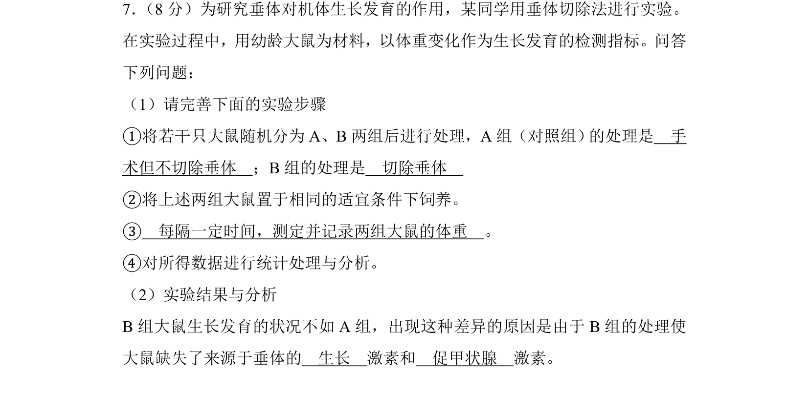
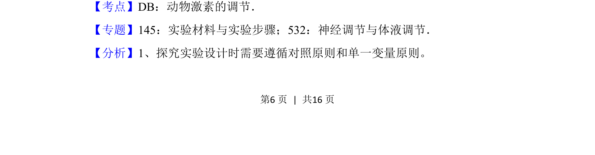
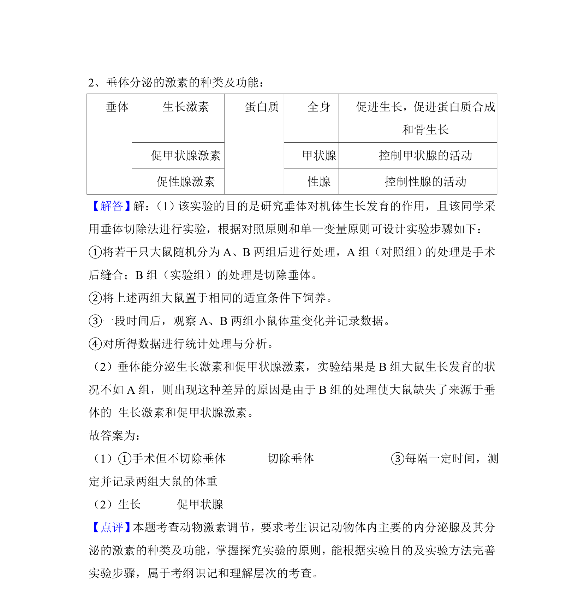

## 题面

## 摘要

该题通过垂体切除实验探究垂体对生长发育的作用，涉及激素调节与实验设计。

## 关联考点

- [[476-垂体切除|垂体切除]]
- [[337-生长激素|生长激素]]
- [[745-促甲状腺激素|促甲状腺激素]]
- [[786-动物激素调节|动物激素调节]]

## 答案与解析

> 📄 原 PDF 第 6 页：`素材/真题/吉林/2008-2024·（吉林）生物高考真题/2018年高考生物试卷（新课标Ⅱ）（解析卷）.pdf`
