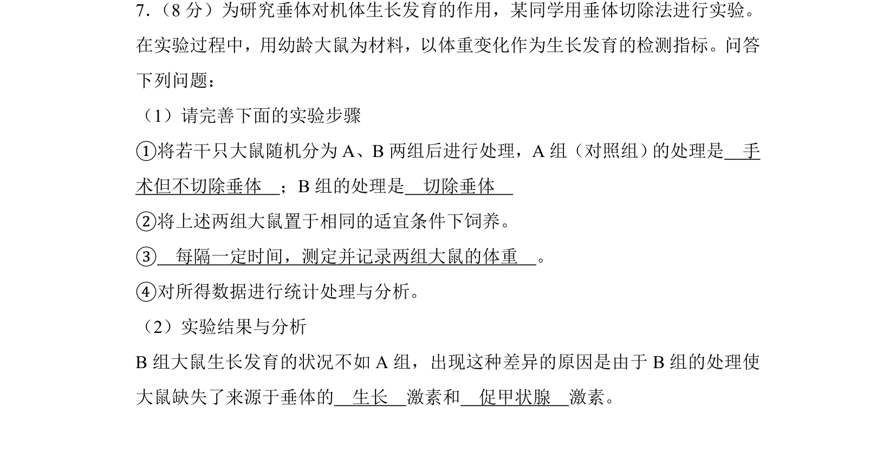
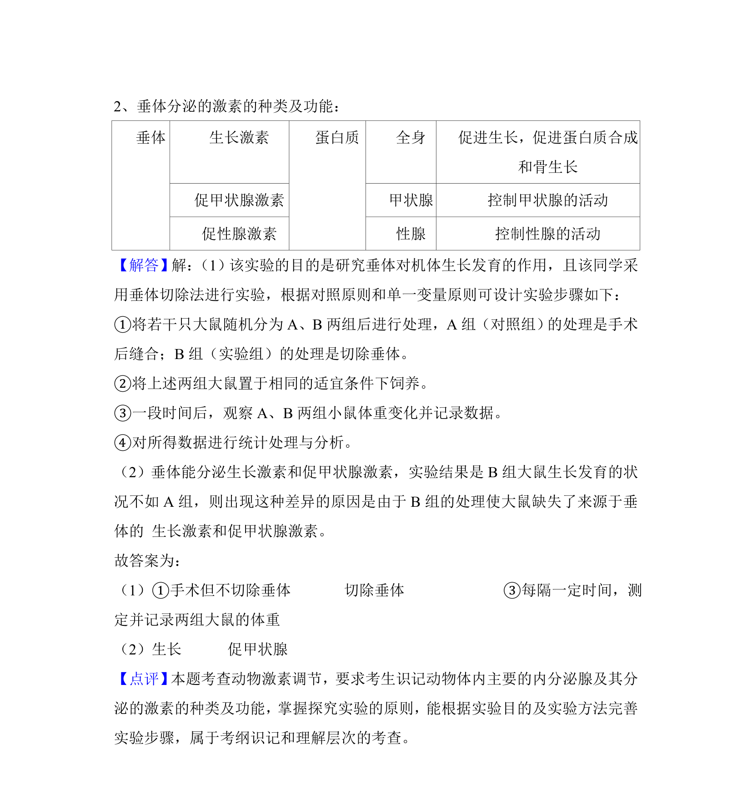

## 题面

## 摘要

该题通过垂体切除实验探究垂体对生长发育的作用，涉及激素调节与实验设计。

## 关联考点

- [[476-垂体切除|垂体切除]]
- [[337-生长激素|生长激素]]
- [[745-促甲状腺激素|促甲状腺激素]]
- [[786-动物激素调节|动物激素调节]]

## 答案与解析

> 📄 原 PDF 第 6 页：`素材/真题/吉林/2008-2024·（吉林）生物高考真题/2018年高考生物试卷（新课标Ⅱ）（解析卷）.pdf`

<!-- 题干文本-start -->
## 题干文本
7． （8分）为研究垂体对机体生长发育的作用，某同学用垂体切除法进行实验。
在实验过程中，用幼龄大鼠为材料，以体重变化作为生长发育的检测指标。问答
下列问题：
（1）请完善下面的实验步骤
①将若干只大鼠随机分为A、B两组后进行处理，A组（对照组） 的处理是　手
术但不切除垂体　；B组的处理是　切除垂体　
②将上述两组大鼠置于相同的适宜条件下饲养。
③　每隔一定时间，测定并记录两组大鼠的体重　。
④对所得数据进行统计处理与分析。
（2）实验结果与分析
B组大鼠生长发育的状况不如A组，出现这种差异的原因是由于B组的处理使
大鼠缺失了来源于垂体的　生长　激素和　促甲状腺　激素。
<!-- 题干文本-end -->

<!-- 解析文本-start -->
## 解析文本
【考点】DB：动物激素的调节．菁优网版权所有
【专题】145：实验材料与实验步骤；532：神经调节与体液调节．
【分析】1、探究实验设计时需要遵循对照原则和单一变量原则。
<!-- 解析文本-end -->
