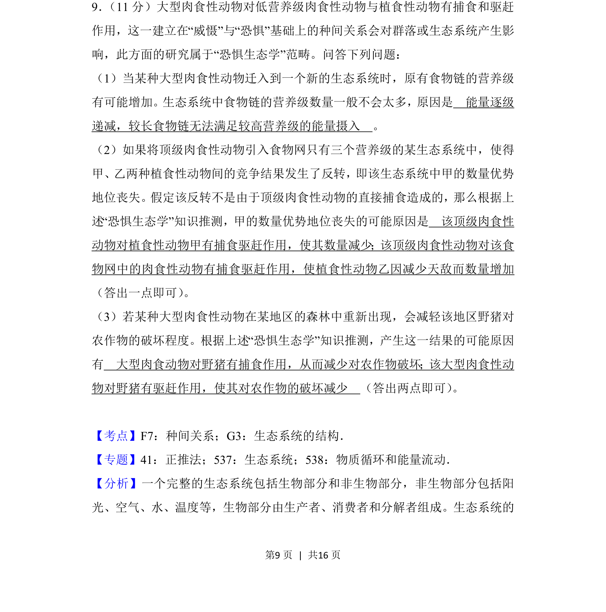
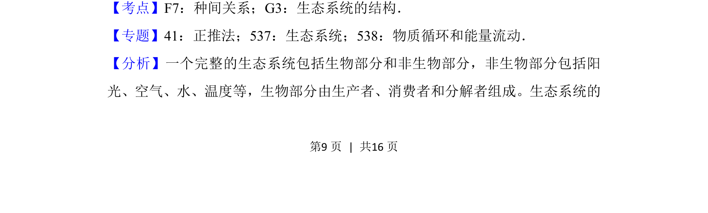
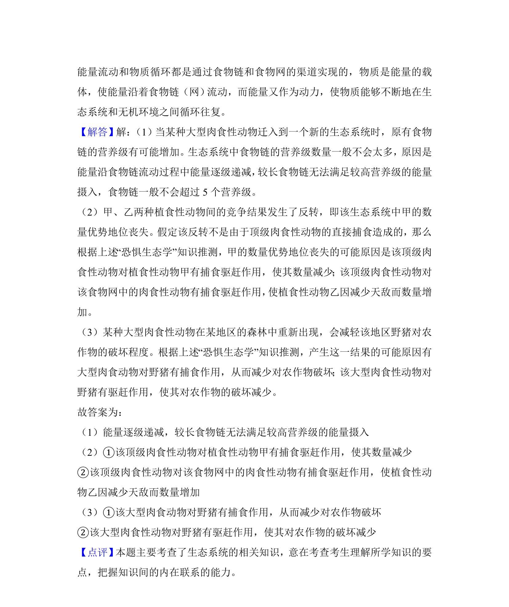

## 题面

## 摘要

本题以“恐惧生态学”为背景，考查食物链营养级、种间竞争与捕食关系对群落结构的影响。

## 关联考点

- [[022-生物因素|种间关系]]
- [[502-生态系统的结构|生态系统的结构]]
- [[772-能量流动特点|能量流动特点]]

## 答案与解析

> 📄 原 PDF 第 9 页：`素材/真题/吉林/2008-2024·（吉林）生物高考真题/2018年高考生物试卷（新课标Ⅱ）（解析卷）.pdf`

<!-- 题干文本-start -->
## 题干文本
9． （11分）大型肉食性动物对低营养级肉食性动物与植食性动物有捕食和驱赶
作用，这一建立在“威慑”与“恐惧”基础上的种间关系会对群落或生态系统产生影
响，此方面的研究属于“恐惧生态学”范畴。问答下列问题：
（1）当某种大型肉食性动物迁入到一个新的生态系统时，原有食物链的营养级
有可能增加。生态系统中食物链的营养级数量一般不会太多，原因是　能量逐级
递减，较长食物链无法满足较高营养级的能量摄入　。
（2）如果将顶级肉食性动物引入食物网只有三个营养级的某生态系统中，使得
甲、乙两种植食性动物间的竞争结果发生了反转，即该生态系统中甲的数量优势
地位丧失。假定该反转不是由于顶级肉食性动物的直接捕食造成的，那么根据上
述“恐惧生态学”知识推测，甲的数量优势地位丧失的可能原因是　该顶级肉食性
动物对植食性动物甲有捕食驱赶作用，使其数量减少；该顶级肉食性动物对该食
物网中的肉食性动物有捕食驱赶作用，使植食性动物乙因减少天敌而数量增加　
（答出一点即可） 。
（3）若某种大型肉食性动物在某地区的森林中重新出现，会减轻该地区野猪对
农作物的破坏程度。根据上述“恐惧生态学”知识推测，产生这一结果的可能原因
有　大型肉食动物对野猪有捕食作用，从而减少对农作物破坏；该大型肉食性动
物对野猪有驱赶作用，使其对农作物的破坏减少　（答出两点即可） 。
<!-- 题干文本-end -->

<!-- 解析文本-start -->
## 解析文本
【考点】F7：种间关系；G3：生态系统的结构．菁优网版权所有
【专题】41：正推法；537：生态系统；538：物质循环和能量流动．
【分析】一个完整的生态系统包括生物部分和非生物部分，非生物部分包括阳
光、空气、水、温度等，生物部分由生产者、消费者和分解者组成。生态系统的
<!-- 解析文本-end -->
