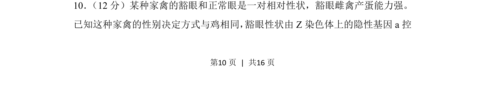

## 题面

## 摘要

该题考查伴性遗传规律，涉及ZW型性别决定和隐性基因控制的性状遗传分析。

## 关联考点

- [[276-伴性遗传|伴性遗传]]
- [[基因分离定律]]
- [[273-遗传图解|遗传图解]]

## 答案与解析

> 📄 原 PDF 第 10 页：`素材/真题/吉林/2008-2024·（吉林）生物高考真题/2018年高考生物试卷（新课标Ⅱ）（解析卷）.pdf`
