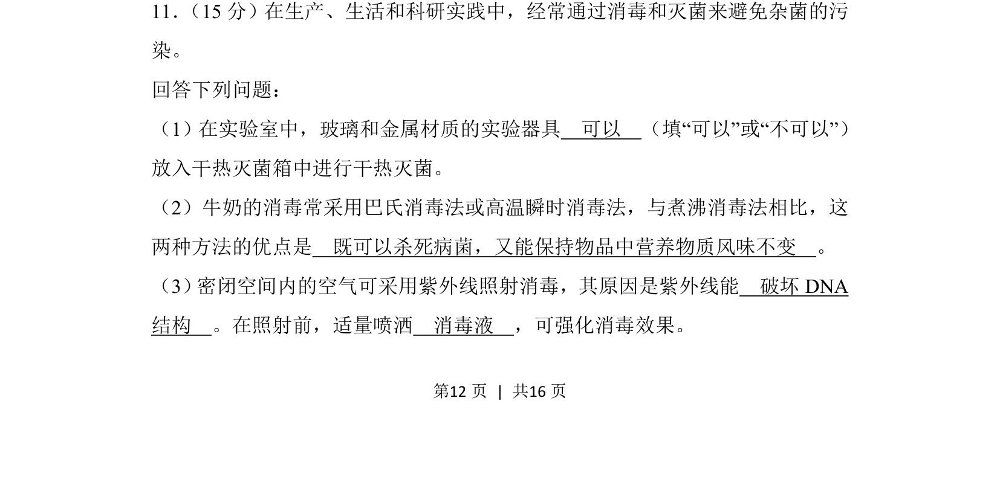
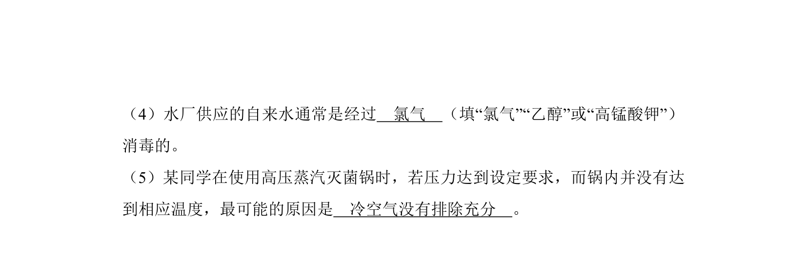
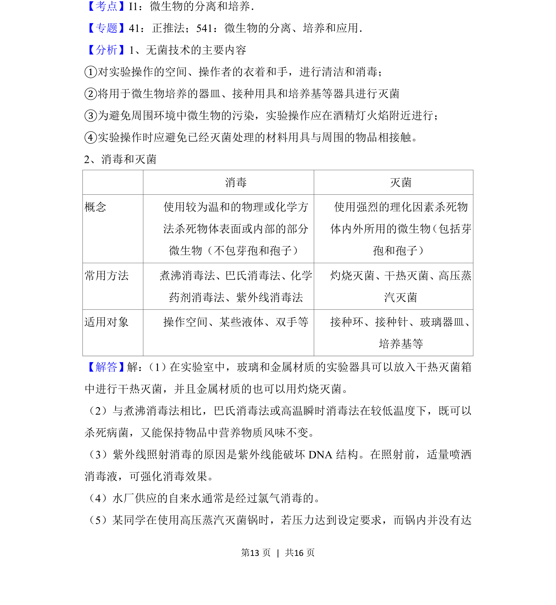
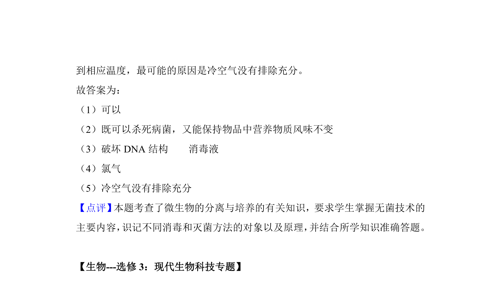

## 题面

## 摘要

本题考查实验室灭菌与消毒方法的应用，包括干热灭菌、牛奶消毒及紫外线消毒原理。

## 关联考点

- [[631-灭菌与消毒技术|灭菌与消毒技术]]
- [[428-微生物培养|微生物培养]]
- [[757-干热灭菌|干热灭菌]]
- [[592-巴氏消毒法|巴氏消毒法]]

## 答案与解析

> 📄 原 PDF 第 12 页：`素材/真题/吉林/2008-2024·（吉林）生物高考真题/2018年高考生物试卷（新课标Ⅱ）（解析卷）.pdf`
