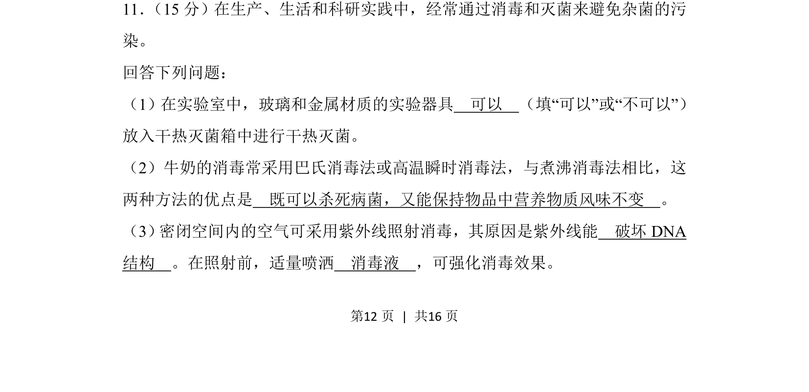
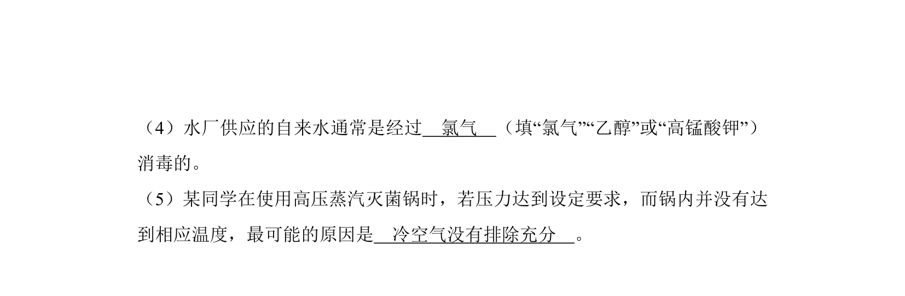
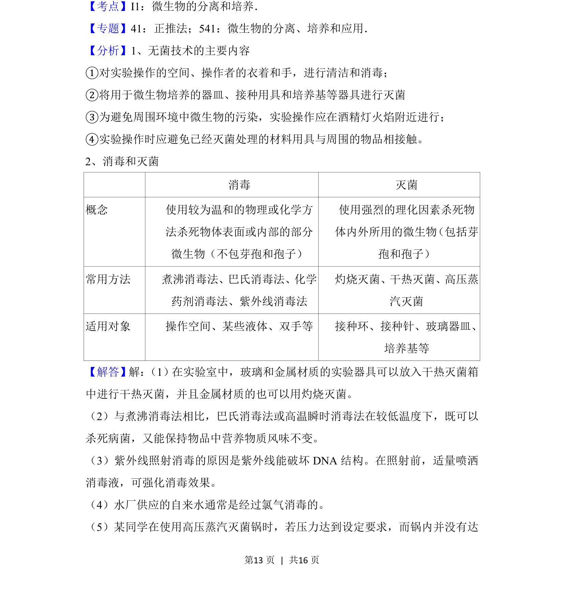
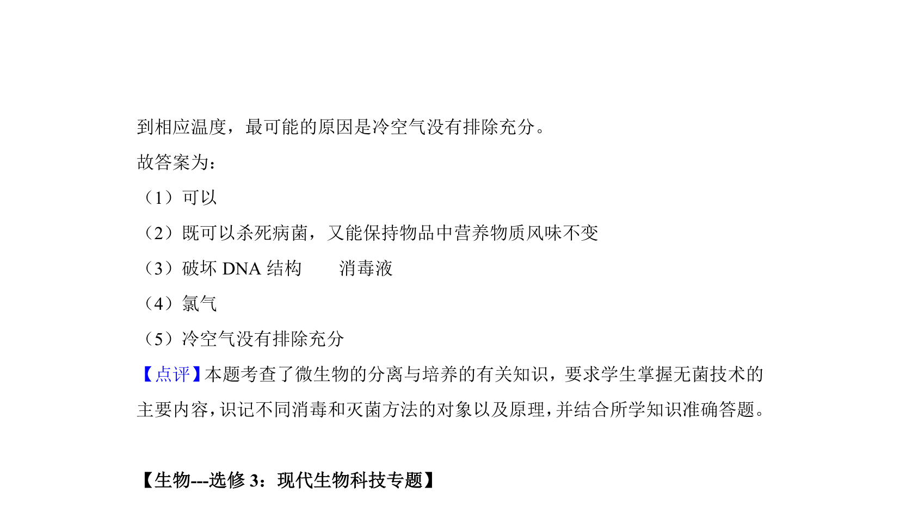

## 题面

## 摘要

本题考查实验室灭菌与消毒方法的应用，包括干热灭菌、牛奶消毒及紫外线消毒原理。

## 关联考点

- [[631-灭菌与消毒技术|灭菌与消毒技术]]
- [[428-微生物培养|微生物培养]]
- [[757-干热灭菌|干热灭菌]]
- [[592-巴氏消毒法|巴氏消毒法]]

## 答案与解析

> 📄 原 PDF 第 12 页：`素材/真题/吉林/2008-2024·（吉林）生物高考真题/2018年高考生物试卷（新课标Ⅱ）（解析卷）.pdf`

<!-- 题干文本-start -->
## 题干文本
11． （15分）在生产、生活和科研实践中，经常通过消毒和灭菌来避免杂菌的污
染。
回答下列问题：
（1）在实验室中，玻璃和金属材质的实验器具　可以　（填“可以”或“不可以”）
放入干热灭菌箱中进行干热灭菌。
（2）牛奶的消毒常采用巴氏消毒法或高温瞬时消毒法，与煮沸消毒法相比，这
两种方法的优点是　既可以杀死病菌，又能保持物品中营养物质风味不变　。
（3） 密闭空间内的空气可采用紫外线照射消毒，其原因是紫外线能　破坏DNA
结构　。在照射前，适量喷洒　消毒液　，可强化消毒效果。
<!-- 题干文本-end -->

<!-- 解析文本-start -->
## 解析文本

<!-- 解析文本-end -->
