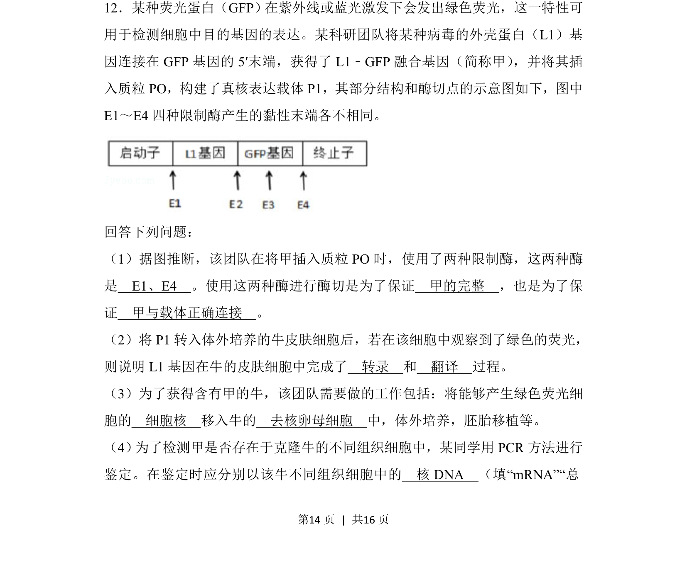

## 题面

## 摘要

该题考查基因工程中载体构建、基因表达检测及克隆技术的应用。

## 关联考点

- [[422-限制性核酸内切酶|限制酶]]
- [[基因表达]]
- [[细胞核移植]]
- [[PCR鉴定]]

## 答案与解析

> 📄 原 PDF 第 14 页：`素材/真题/吉林/2008-2024·（吉林）生物高考真题/2018年高考生物试卷（新课标Ⅱ）（解析卷）.pdf`
