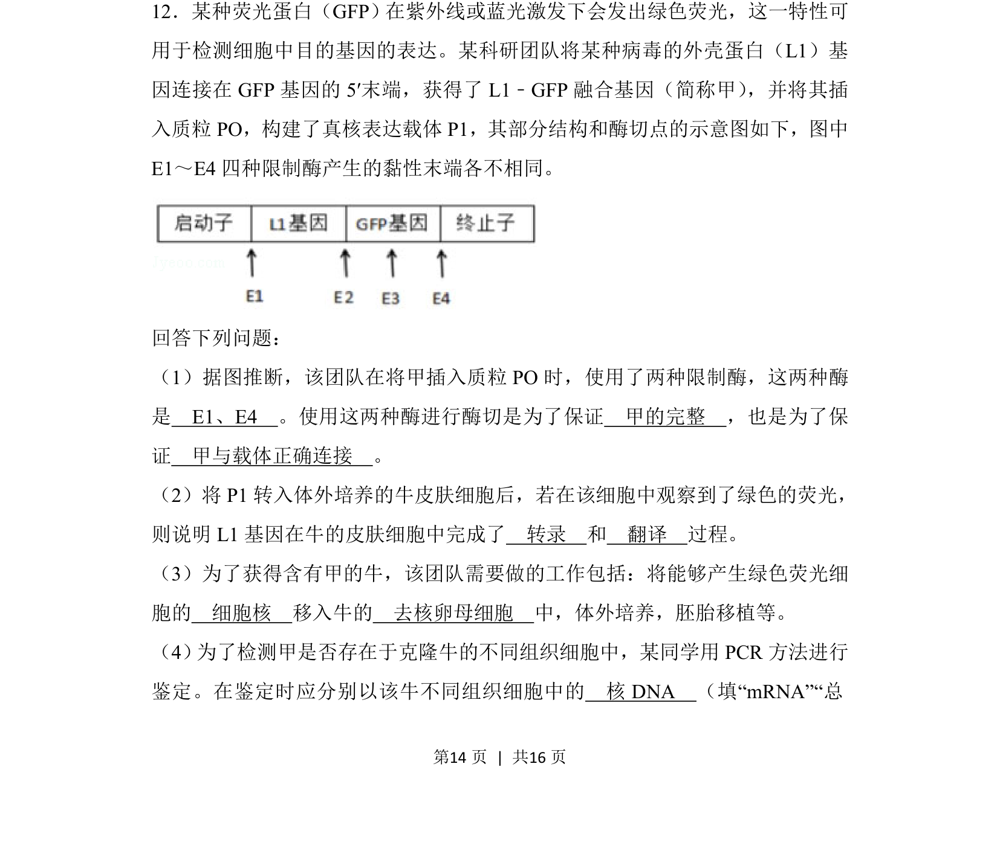
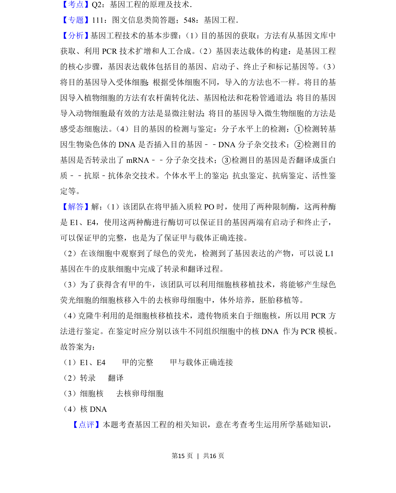

## 题面

## 摘要

该题考查基因工程中载体构建、基因表达检测及克隆技术的应用。

## 关联考点

- [[422-限制性核酸内切酶|限制酶]]
- [[843-基因的表达|基因表达]]
- [[680-细胞核移植|细胞核移植]]
- [[529-PCR鉴定|PCR鉴定]]

## 答案与解析

> 📄 原 PDF 第 14 页：`素材/真题/吉林/2008-2024·（吉林）生物高考真题/2018年高考生物试卷（新课标Ⅱ）（解析卷）.pdf`

<!-- 题干文本-start -->
## 题干文本
12．某种荧光蛋白（GFP）在紫外线或蓝光激发下会发出绿色荧光，这一特性可
用于检测细胞中目的基因的表达。某科研团队将某种病毒的外壳蛋白（L1）基
因连接在GFP基因的5′末端，获得了L1﹣GFP融合基因（简称甲） ，并将其插
入质粒PO，构建了真核表达载体P1，其部分结构和酶切点的示意图如下，图中
E1～E4四种限制酶产生的黏性末端各不相同。
回答下列问题：
（1）据图推断，该团队在将甲插入质粒PO时，使用了两种限制酶，这两种酶
是　E1、E4　。使用这两种酶进行酶切是为了保证　甲的完整　，也是为了保
证　甲与载体正确连接　。
（2）将P1转入体外培养的牛皮肤细胞后，若在该细胞中观察到了绿色的荧光，
则说明L1基因在牛的皮肤细胞中完成了　转录　和　翻译　过程。
（3）为了获得含有甲的牛，该团队需要做的工作包括：将能够产生绿色荧光细
胞的　细胞核　移入牛的　去核卵母细胞　中，体外培养，胚胎移植等。
（4） 为了检测甲是否存在于克隆牛的不同组织细胞中，某同学用PCR方法进行
鉴定。在鉴定时应分别以该牛不同组织细胞中的　核DNA　（填“mRNA”“总
<!-- 题干文本-end -->

<!-- 解析文本-start -->
## 解析文本

<!-- 解析文本-end -->
