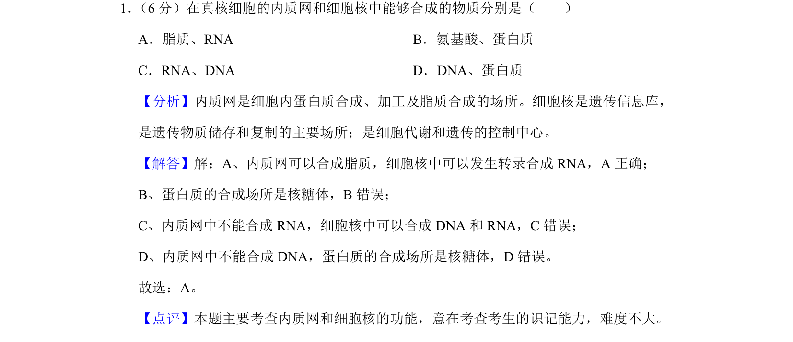
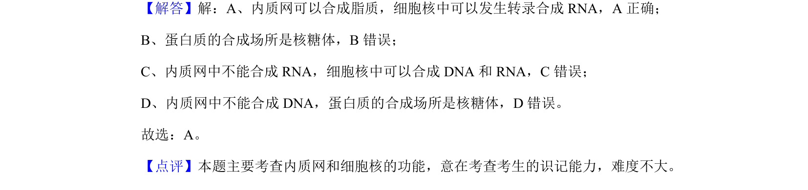

## 题面

## 摘要

本题通过辨析内质网与细胞核的合成产物，考查细胞器的功能分工。

## 关联考点

- [[682-细胞结构|细胞结构]]
- [[678-细胞器功能|细胞器功能]]
- [[634-物质合成场所|物质合成场所]]

## 答案与解析

> 📄 原 PDF 第 1 页：`素材/真题/吉林/2008-2024·（吉林）生物高考真题/2019年高考生物试卷（新课标Ⅱ）（解析卷）.pdf`
