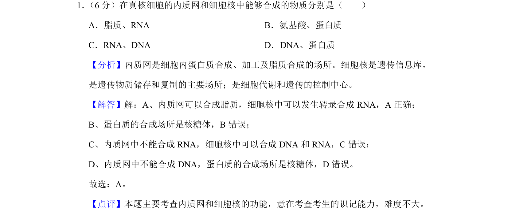
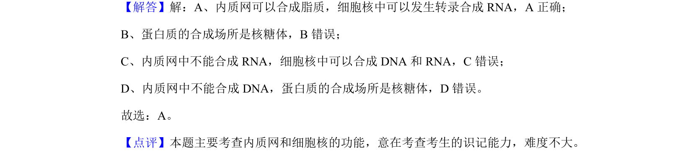

## 题面

## 摘要

本题通过辨析内质网与细胞核的合成产物，考查细胞器的功能分工。

## 关联考点

- [[682-细胞结构|细胞结构]]
- [[678-细胞器功能|细胞器功能]]
- [[634-物质合成场所|物质合成场所]]

## 答案与解析

> 📄 原 PDF 第 1 页：`素材/真题/吉林/2008-2024·（吉林）生物高考真题/2019年高考生物试卷（新课标Ⅱ）（解析卷）.pdf`

<!-- 题干文本-start -->
## 题干文本
1． （6分）在真核细胞的内质网和细胞核中能够合成的物质分别是（　　）
A．脂质、RNA B．氨基酸、蛋白质
C．RNA、DNA D．DNA、蛋白质
<!-- 题干文本-end -->

<!-- 解析文本-start -->
## 解析文本
【分析】内质网是细胞内蛋白质合成、加工及脂质合成的场所。细胞核是遗传信息库，
是遗传物质储存和复制的主要场所；是细胞代谢和遗传的控制中心。
【解答】解：A、内质网可以合成脂质，细胞核中可以发生转录合成RNA，A正确；
B、蛋白质的合成场所是核糖体，B错误；
C、内质网中不能合成RNA，细胞核中可以合成DNA和RNA，C错误；
D、内质网中不能合成DNA，蛋白质的合成场所是核糖体，D错误。
故选：A。
【点评】本题主要考查内质网和细胞核的功能，意在考查考生的识记能力，难度不大。
<!-- 解析文本-end -->
