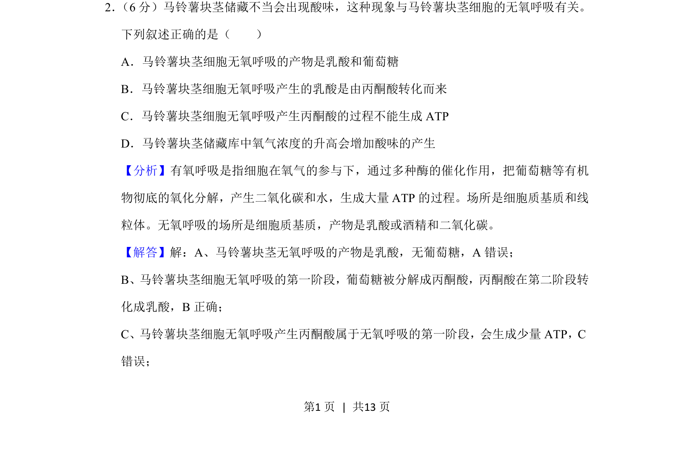

## 题面

## 摘要

本题考查马铃薯块茎细胞无氧呼吸的过程及产物，辨析相关叙述的正误。

## 关联考点

- [[238-无氧呼吸|无氧呼吸]]
- [[乳酸发酵]]
- [[丙酮酸转化]]
- [[ATP生成]]

## 答案与解析

> 📄 原 PDF 第 1 页：`素材/真题/吉林/2008-2024·（吉林）生物高考真题/2019年高考生物试卷（新课标Ⅱ）（解析卷）.pdf`
