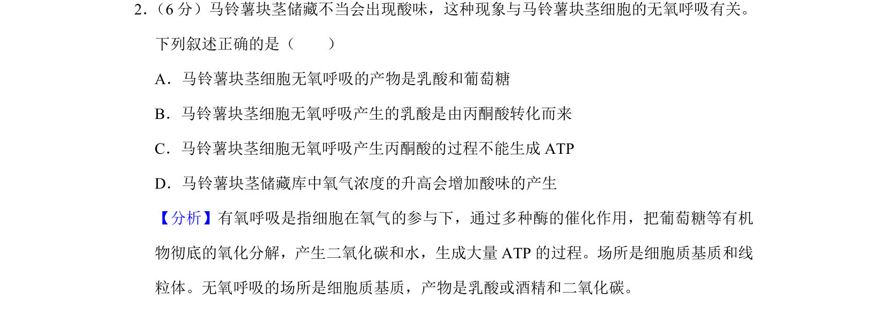
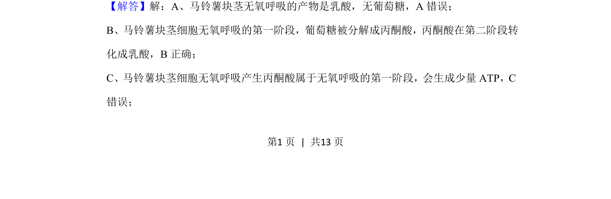
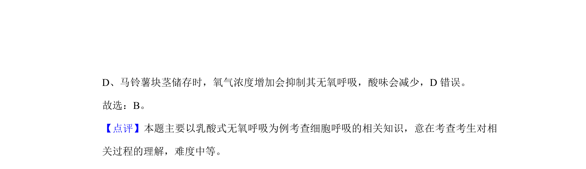

## 题面

## 摘要

本题考查马铃薯块茎细胞无氧呼吸的过程及产物，辨析相关叙述的正误。

## 关联考点

- [[238-无氧呼吸|无氧呼吸]]
- [[794-乳酸发酵|乳酸发酵]]
- [[536-丙酮酸转化|丙酮酸转化]]
- [[522-ATP生成|ATP生成]]

## 答案与解析

> 📄 原 PDF 第 1 页：`素材/真题/吉林/2008-2024·（吉林）生物高考真题/2019年高考生物试卷（新课标Ⅱ）（解析卷）.pdf`

<!-- 题干文本-start -->
## 题干文本
2． （6分）马铃薯块茎储藏不当会出现酸味，这种现象与马铃薯块茎细胞的无氧呼吸有关。
下列叙述正确的是（　　）
A．马铃薯块茎细胞无氧呼吸的产物是乳酸和葡萄糖
B．马铃薯块茎细胞无氧呼吸产生的乳酸是由丙酮酸转化而来
C．马铃薯块茎细胞无氧呼吸产生丙酮酸的过程不能生成ATP
D．马铃薯块茎储藏库中氧气浓度的升高会增加酸味的产生
<!-- 题干文本-end -->

<!-- 解析文本-start -->
## 解析文本
【分析】有氧呼吸是指细胞在氧气的参与下，通过多种酶的催化作用，把葡萄糖等有机
物彻底的氧化分解，产生二氧化碳和水，生成大量ATP的过程。场所是细胞质基质和线
粒体。无氧呼吸的场所是细胞质基质，产物是乳酸或酒精和二氧化碳。
【解答】解：A、马铃薯块茎无氧呼吸的产物是乳酸，无葡萄糖，A错误；
B、马铃薯块茎细胞无氧呼吸的第一阶段，葡萄糖被分解成丙酮酸，丙酮酸在第二阶段转
化成乳酸，B正确；
C、马铃薯块茎细胞无氧呼吸产生丙酮酸属于无氧呼吸的第一阶段，会生成少量ATP，C
错误；
<!-- 解析文本-end -->
