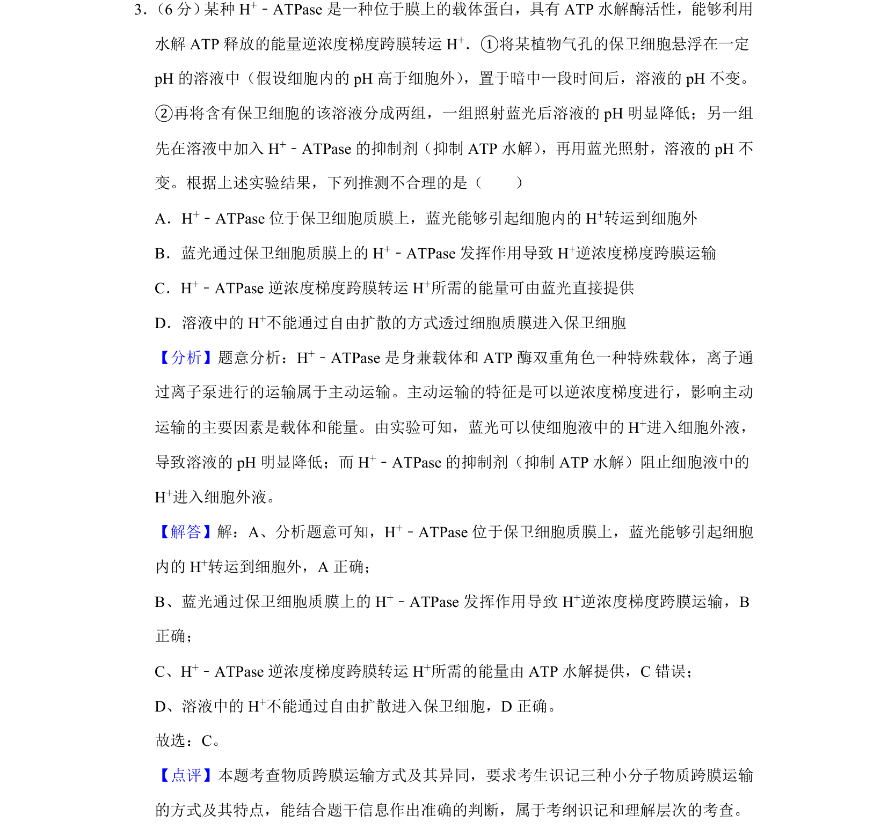
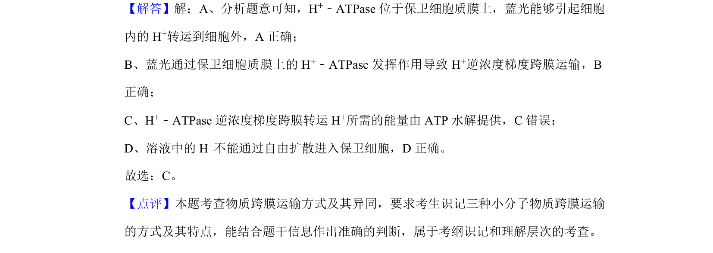

## 题面

## 摘要

考查 H+-ATPase 介导的主动运输机制及实验推理分析

## 关联考点

- [[635-物质跨膜运输|物质跨膜运输]]
- [[256-主动运输|主动运输]]
- [[666-实验分析|实验分析]]
- [[714-逆浓度梯度|逆浓度梯度]]

## 答案与解析

> 📄 原 PDF 第 2 页：`素材/真题/吉林/2008-2024·（吉林）生物高考真题/2019年高考生物试卷（新课标Ⅱ）（解析卷）.pdf`
