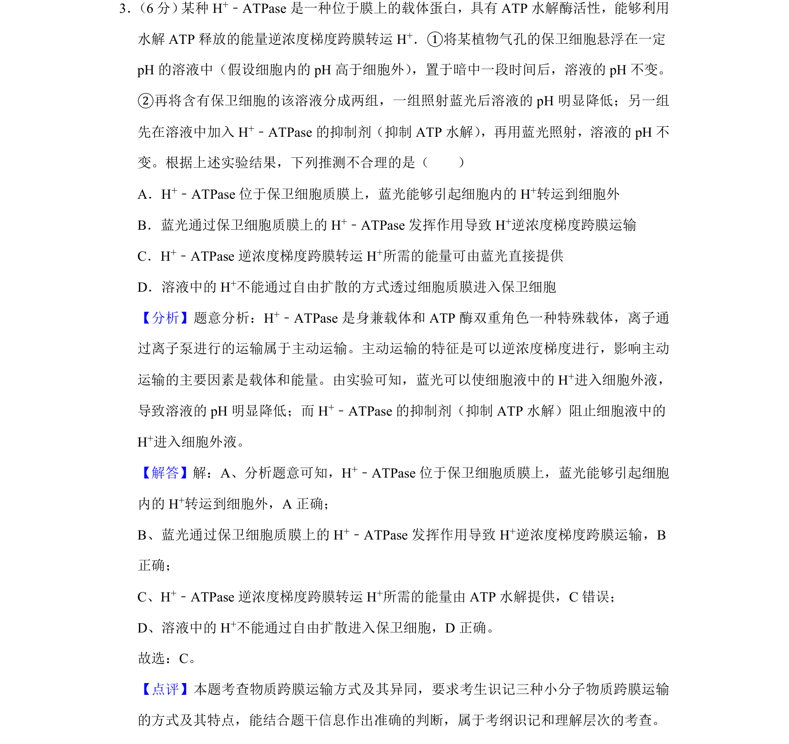
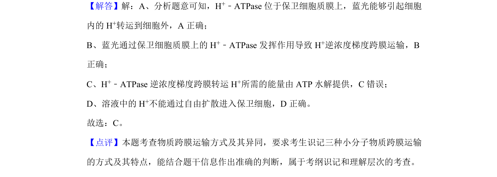

## 题面

## 摘要

考查 H+-ATPase 介导的主动运输机制及实验推理分析

## 关联考点

- [[635-物质跨膜运输|物质跨膜运输]]
- [[256-主动运输|主动运输]]
- [[666-实验分析|实验分析]]
- [[714-逆浓度梯度|逆浓度梯度]]

## 答案与解析

> 📄 原 PDF 第 2 页：`素材/真题/吉林/2008-2024·（吉林）生物高考真题/2019年高考生物试卷（新课标Ⅱ）（解析卷）.pdf`

<!-- 题干文本-start -->
## 题干文本
3． （6分） 某种H+﹣ATPase是一种位于膜上的载体蛋白，具有ATP水解酶活性，能够利用
水解ATP释放的能量逆浓度梯度跨膜转运H +．①将某植物气孔的保卫细胞悬浮在一定
pH的溶液中（假设细胞内的pH高于细胞外） ，置于暗中一段时间后，溶液的pH不变。
②再将含有保卫细胞的该溶液分成两组，一组照射蓝光后溶液的pH明显降低；另一组
先在溶液中加入H +﹣ATPase的抑制剂（抑制ATP水解） ，再用蓝光照射，溶液的pH不
变。根据上述实验结果，下列推测不合理的是（　　）
A．H+﹣ATPase位于保卫细胞质膜上，蓝光能够引起细胞内的H +转运到细胞外
B．蓝光通过保卫细胞质膜上的H +﹣ATPase发挥作用导致H +逆浓度梯度跨膜运输
C．H+﹣ATPase逆浓度梯度跨膜转运H +所需的能量可由蓝光直接提供
D．溶液中的H +不能通过自由扩散的方式透过细胞质膜进入保卫细胞
<!-- 题干文本-end -->

<!-- 解析文本-start -->
## 解析文本
【分析】题意分析：H+﹣ATPase是身兼载体和ATP酶双重角色一种特殊载体，离子通
过离子泵进行的运输属于主动运输。主动运输的特征是可以逆浓度梯度进行，影响主动
运输的主要因素是载体和能量。由实验可知，蓝光可以使细胞液中的H +进入细胞外液，
导致溶液的pH明显降低；而H +﹣ATPase的抑制剂（抑制ATP水解）阻止细胞液中的
H+进入细胞外液。
【解答】解：A、分析题意可知，H+﹣ATPase位于保卫细胞质膜上，蓝光能够引起细胞
内的H +转运到细胞外，A正确；
B、蓝光通过保卫细胞质膜上的H +﹣ATPase发挥作用导致H +逆浓度梯度跨膜运输，B
正确；
C、H+﹣ATPase逆浓度梯度跨膜转运H +所需的能量由ATP水解提供，C错误；
D、溶液中的H +不能通过自由扩散进入保卫细胞，D正确。
故选：C。
【点评】本题考查物质跨膜运输方式及其异同，要求考生识记三种小分子物质跨膜运输
的方式及其特点，能结合题干信息作出准确的判断，属于考纲识记和理解层次的考查。
<!-- 解析文本-end -->
