## 题面

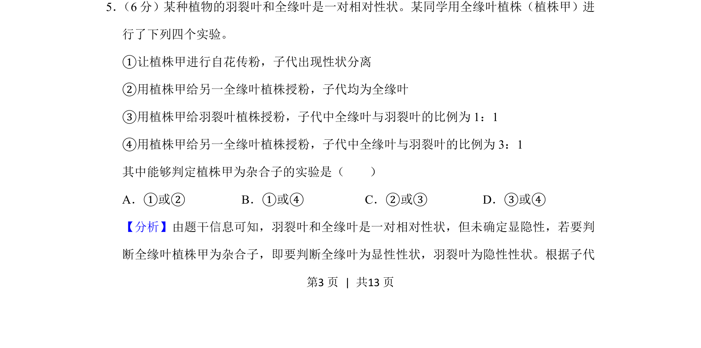
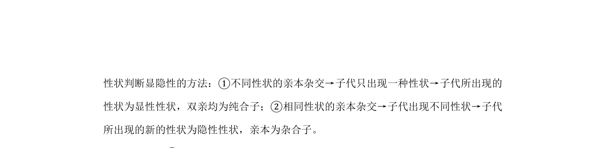

## 摘要

本实验通过分析杂交结果判断植株的基因型，需理解性状显隐性与杂合子判定依据

## 关联考点

- [[杂交实验]]
- [[性状分离]]
- [[271-自交|自交]]
- [[270-测交|测交]]
- [[杂合子]]

## 答案与解析

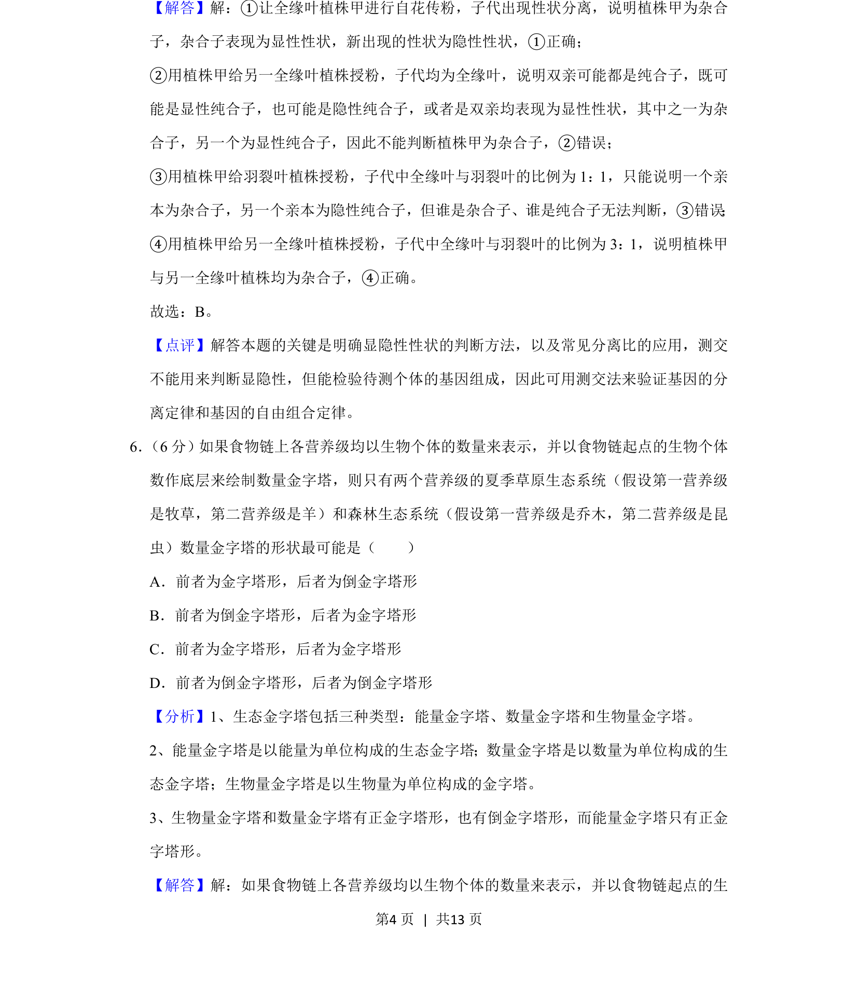
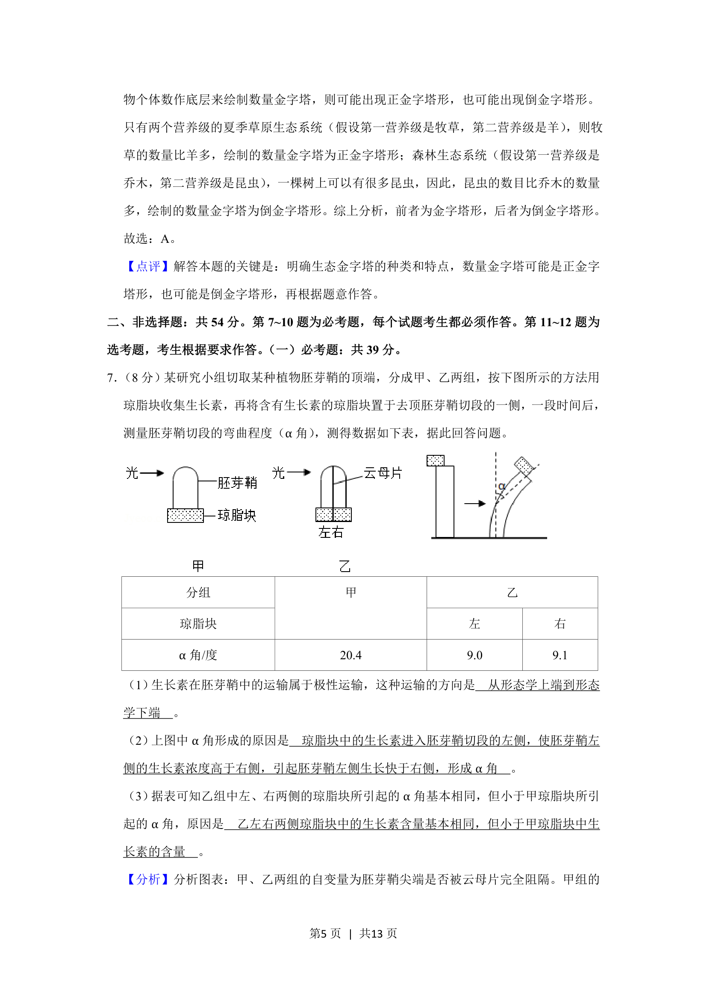
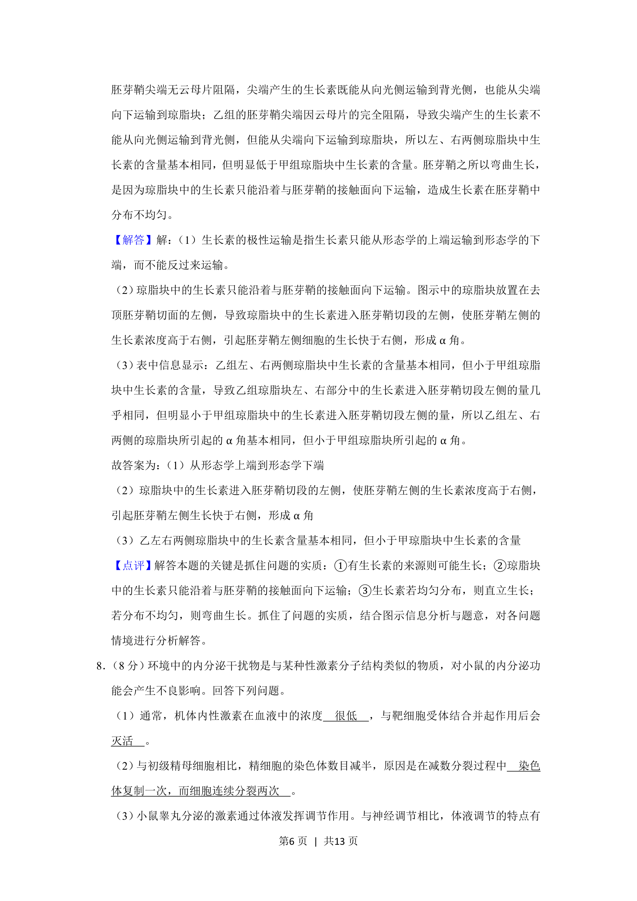
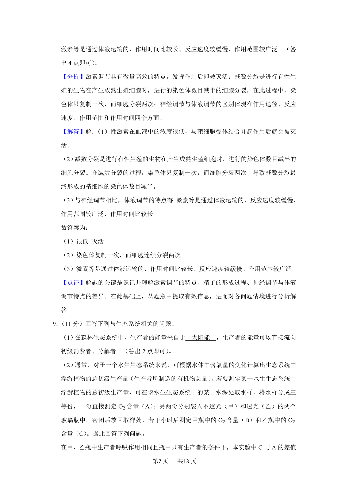
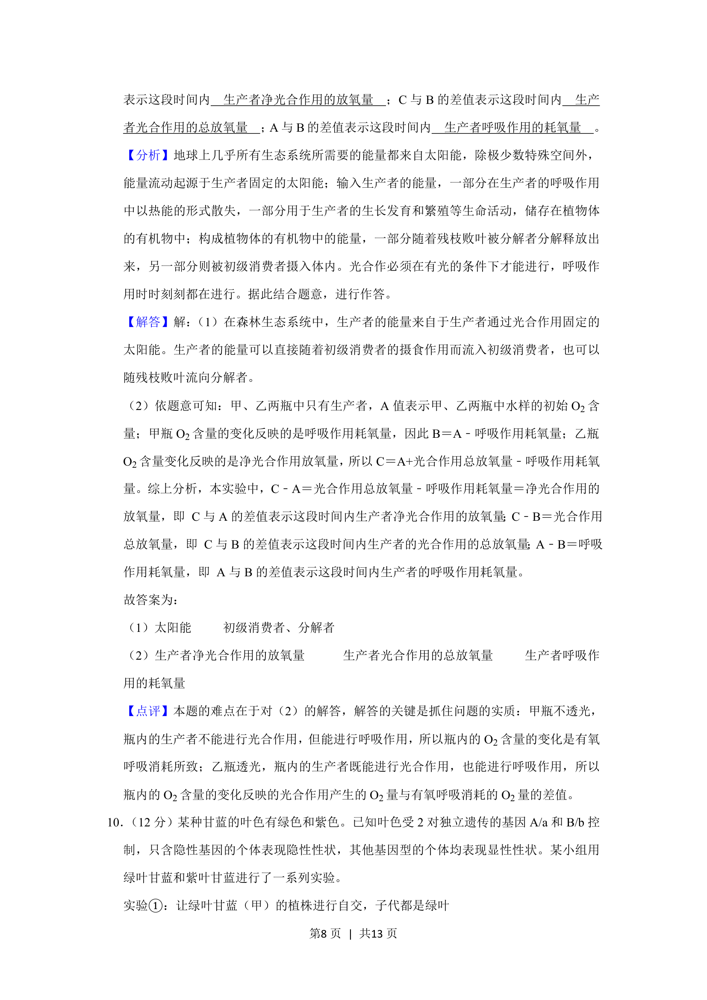
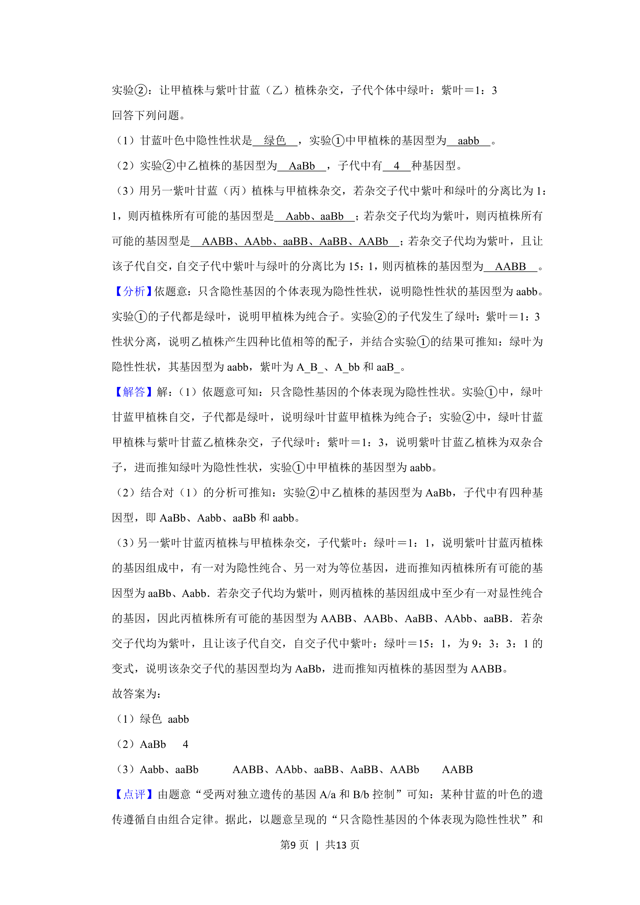
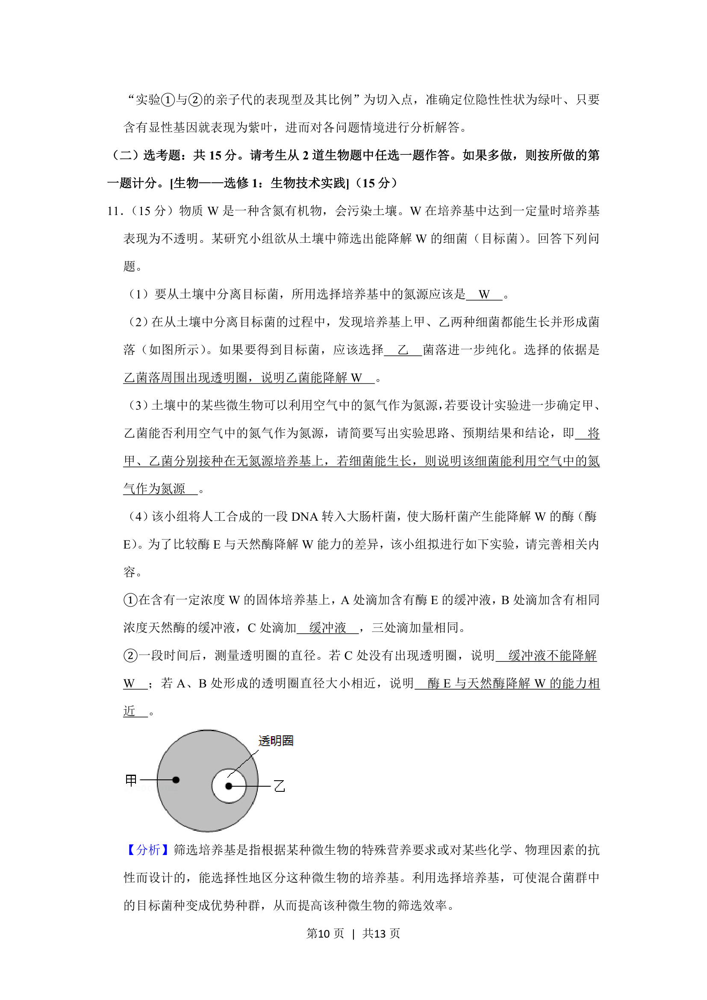
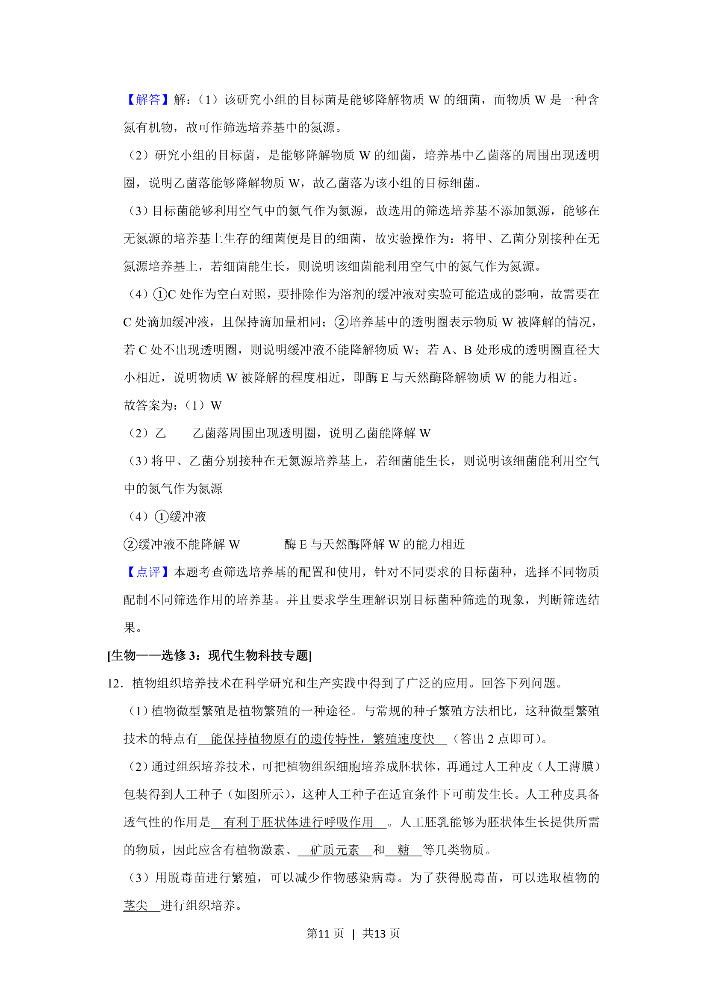
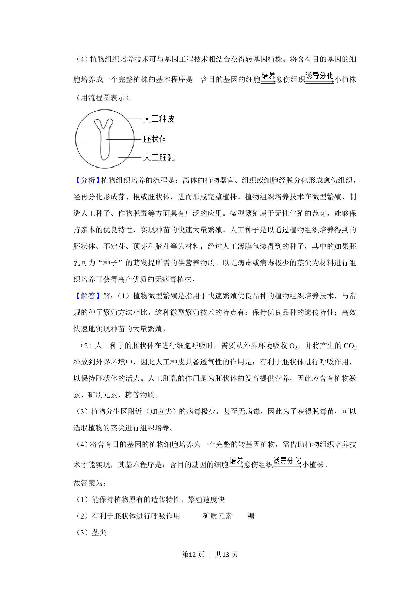

> 📄 原 PDF 第 3 页：`素材/真题/吉林/2008-2024·（吉林）生物高考真题/2019年高考生物试卷（新课标Ⅱ）（解析卷）.pdf`
