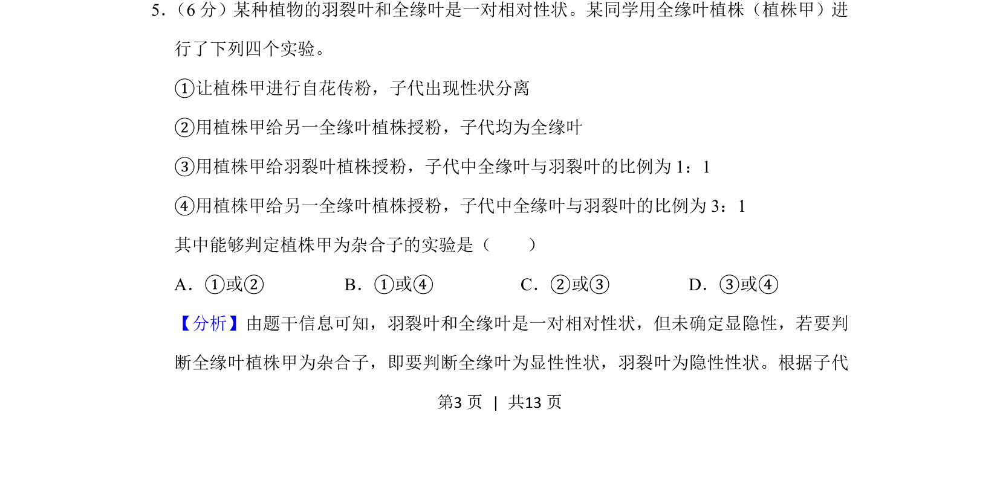
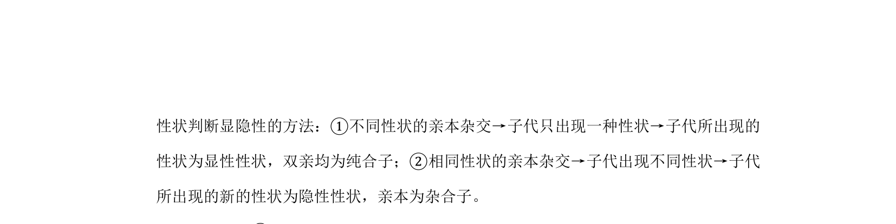
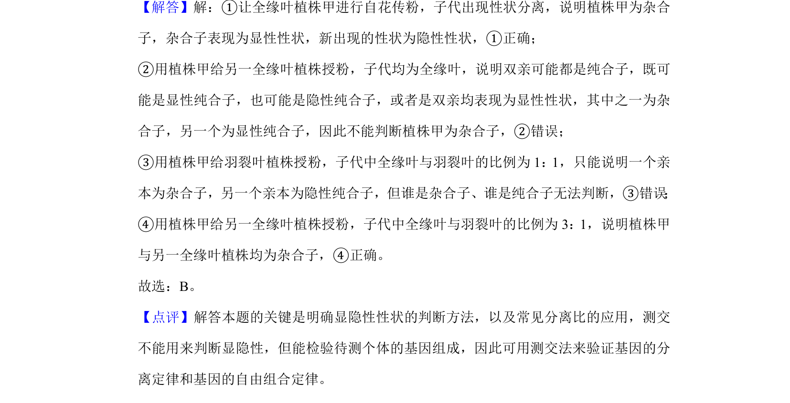

## 题面

## 摘要

本实验通过分析杂交结果判断植株的基因型，需理解性状显隐性与杂合子判定依据

## 关联考点

- [[492-杂交实验|杂交实验]]
- [[600-性状分离|性状分离]]
- [[271-自交|自交]]
- [[270-测交|测交]]
- [[614-杂合子|杂合子]]

## 答案与解析

> 📄 原 PDF 第 3 页：`素材/真题/吉林/2008-2024·（吉林）生物高考真题/2019年高考生物试卷（新课标Ⅱ）（解析卷）.pdf`

<!-- 题干文本-start -->
## 题干文本
5． （6分）某种植物的羽裂叶和全缘叶是一对相对性状。某同学用全缘叶植株（植株甲）进
行了下列四个实验。
①让植株甲进行自花传粉，子代出现性状分离
②用植株甲给另一全缘叶植株授粉，子代均为全缘叶
③用植株甲给羽裂叶植株授粉，子代中全缘叶与羽裂叶的比例为1：1
④用植株甲给另一全缘叶植株授粉，子代中全缘叶与羽裂叶的比例为3：1
其中能够判定植株甲为杂合子的实验是（　　）
A．①或②B．①或④C．②或③D．③或④
<!-- 题干文本-end -->

<!-- 解析文本-start -->
## 解析文本
【分析】由题干信息可知，羽裂叶和全缘叶是一对相对性状，但未确定显隐性，若要判
断全缘叶植株甲为杂合子，即要判断全缘叶为显性性状，羽裂叶为隐性性状。根据子代
<!-- 解析文本-end -->
