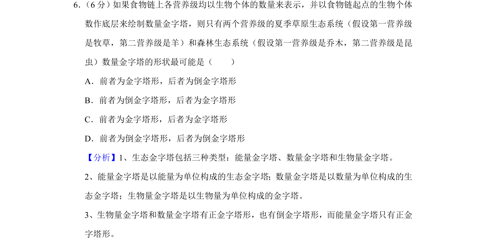
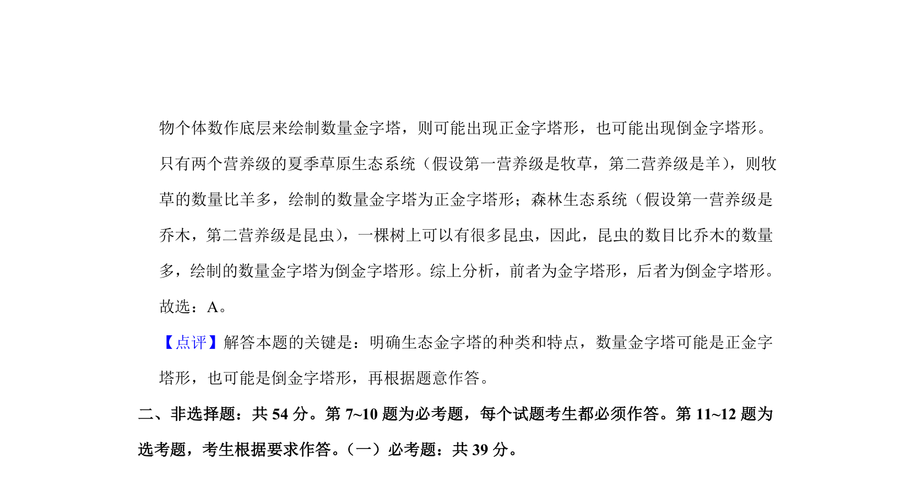

## 题面

## 摘要

该题考查以个体数量构建生态金字塔时，草原与森林生态系统的数量金字塔形态差异。

## 关联考点

- [[767-数量金字塔|数量金字塔]]
- [[388-能量金字塔|生态金字塔]]
- [[389-营养级|营养级]]

## 答案与解析

> 📄 原 PDF 第 4 页：`素材/真题/吉林/2008-2024·（吉林）生物高考真题/2019年高考生物试卷（新课标Ⅱ）（解析卷）.pdf`

<!-- 题干文本-start -->
## 题干文本
6． （6分）如果食物链上各营养级均以生物个体的数量来表示，并以食物链起点的生物个体
数作底层来绘制数量金字塔，则只有两个营养级的夏季草原生态系统（假设第一营养级
是牧草，第二营养级是羊）和森林生态系统（假设第一营养级是乔木，第二营养级是昆
虫）数量金字塔的形状最可能是（　　）
A．前者为金字塔形，后者为倒金字塔形
B．前者为倒金字塔形，后者为金字塔形
C．前者为金字塔形，后者为金字塔形
D．前者为倒金字塔形，后者为倒金字塔形
<!-- 题干文本-end -->

<!-- 解析文本-start -->
## 解析文本
【分析】1、生态金字塔包括三种类型：能量金字塔、数量金字塔和生物量金字塔。
2、能量金字塔是以能量为单位构成的生态金字塔；数量金字塔是以数量为单位构成的生
态金字塔；生物量金字塔是以生物量为单位构成的金字塔。
3、生物量金字塔和数量金字塔有正金字塔形，也有倒金字塔形，而能量金字塔只有正金
字塔形。
【解答】解：如果食物链上各营养级均以生物个体的数量来表示，并以食物链起点的生
<!-- 解析文本-end -->
