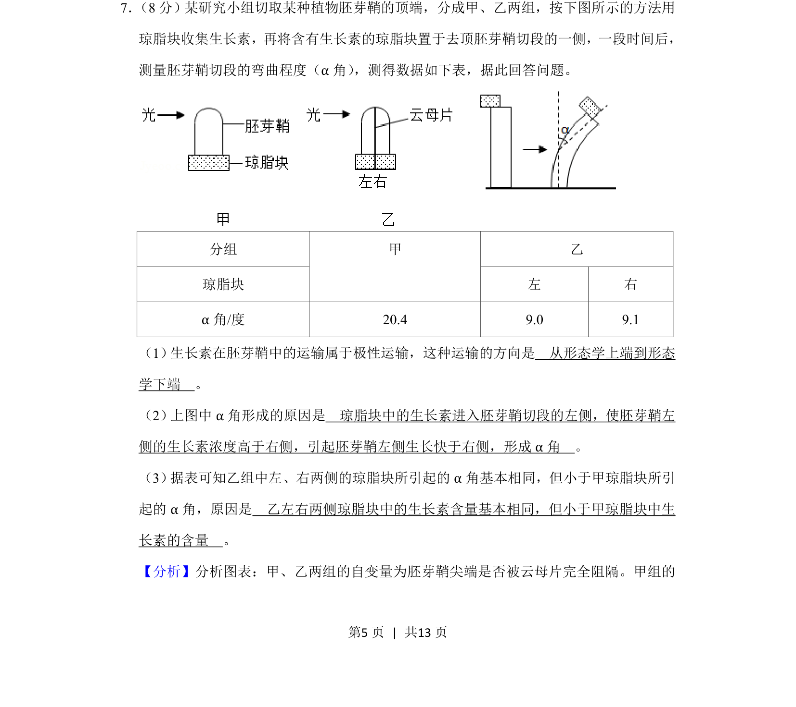
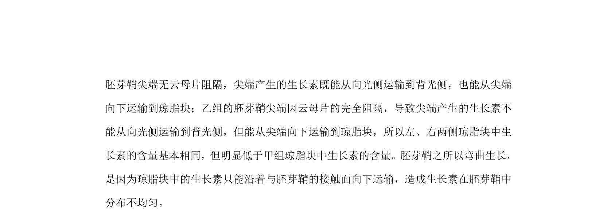
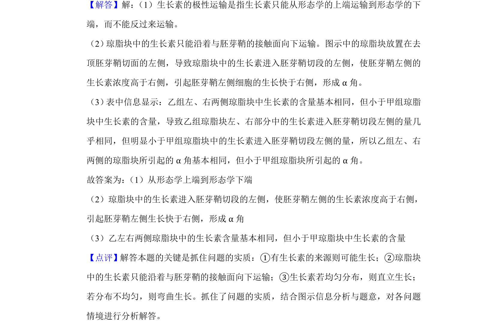

## 题面

## 摘要

考查生长素极性运输和琼脂块收集法的实验分析，涉及α角成因及云母片影响。

## 关联考点

- [[347-生长素|生长素]]
- [[极性运输]]
- [[琼脂块法]]
- [[胚芽鞘向光性]]

## 答案与解析

> 📄 原 PDF 第 5 页：`素材/真题/吉林/2008-2024·（吉林）生物高考真题/2019年高考生物试卷（新课标Ⅱ）（解析卷）.pdf`
