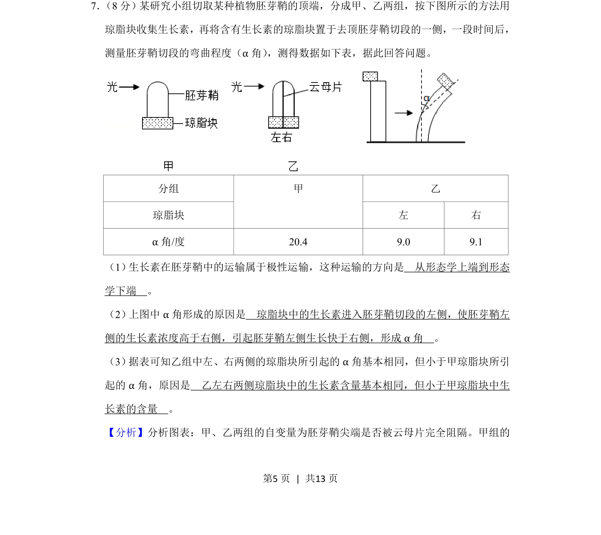
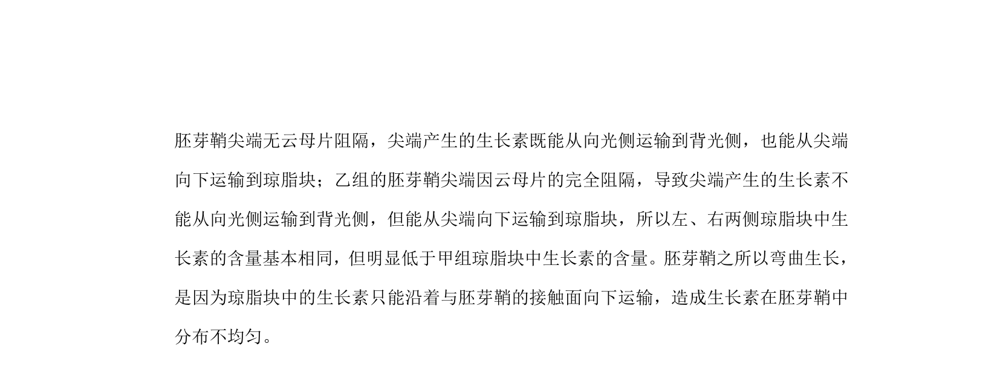
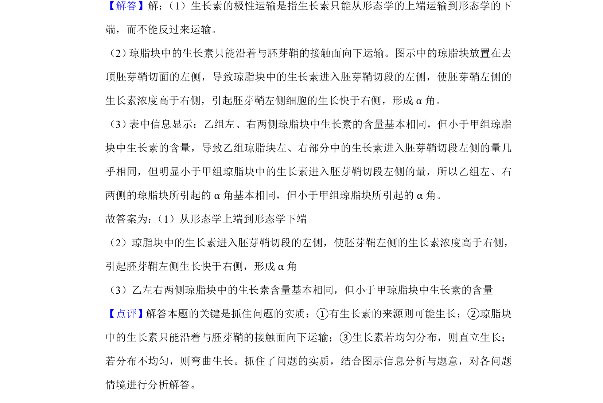

## 题面

## 摘要

考查生长素极性运输和琼脂块收集法的实验分析，涉及α角成因及云母片影响。

## 关联考点

- [[347-生长素|生长素]]
- [[615-极性运输|极性运输]]
- [[640-琼脂块法|琼脂块法]]
- [[508-胚芽鞘向光性|胚芽鞘向光性]]

## 答案与解析

> 📄 原 PDF 第 5 页：`素材/真题/吉林/2008-2024·（吉林）生物高考真题/2019年高考生物试卷（新课标Ⅱ）（解析卷）.pdf`

<!-- 题干文本-start -->
## 题干文本
7． （8分）某研究小组切取某种植物胚芽鞘的顶端，分成甲、乙两组，按下图所示的方法用
琼脂块收集生长素，再将含有生长素的琼脂块置于去顶胚芽鞘切段的一侧，一段时间后，
测量胚芽鞘切段的弯曲程度（α角） ，测得数据如下表，据此回答问题。
分组 乙
琼脂块
甲
左 右
α角/度 20.4 9.0 9.1
（1） 生长素在胚芽鞘中的运输属于极性运输，这种运输的方向是　从形态学上端到形态
学下端　。
（2） 上图中α角形成的原因是　琼脂块中的生长素进入胚芽鞘切段的左侧，使胚芽鞘左
侧的生长素浓度高于右侧，引起胚芽鞘左侧生长快于右侧，形成α角　。
（3） 据表可知乙组中左、右两侧的琼脂块所引起的α角基本相同，但小于甲琼脂块所引
起的α角，原因是　乙左右两侧琼脂块中的生长素含量基本相同，但小于甲琼脂块中生
长素的含量　。
<!-- 题干文本-end -->

<!-- 解析文本-start -->
## 解析文本
【分析】分析图表：甲、乙两组的自变量为胚芽鞘尖端是否被云母片完全阻隔。甲组的
<!-- 解析文本-end -->
