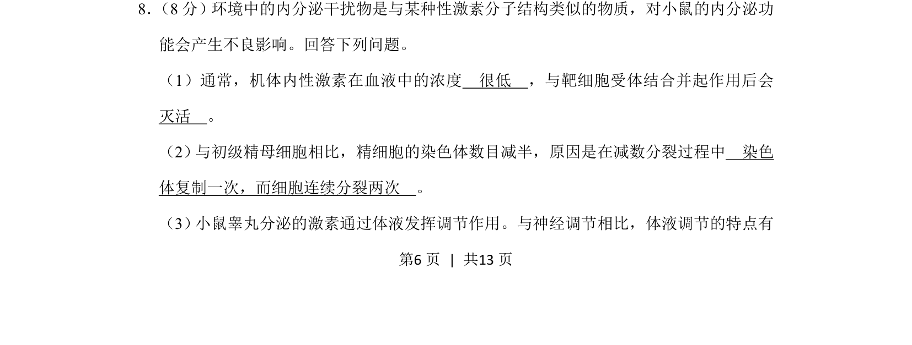
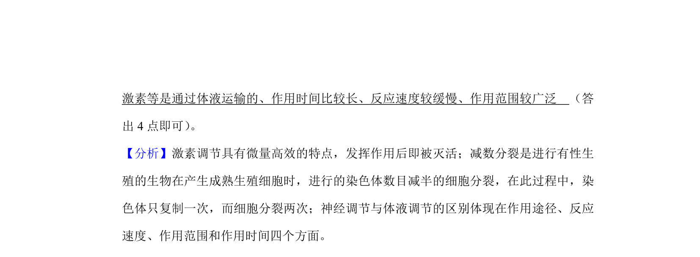
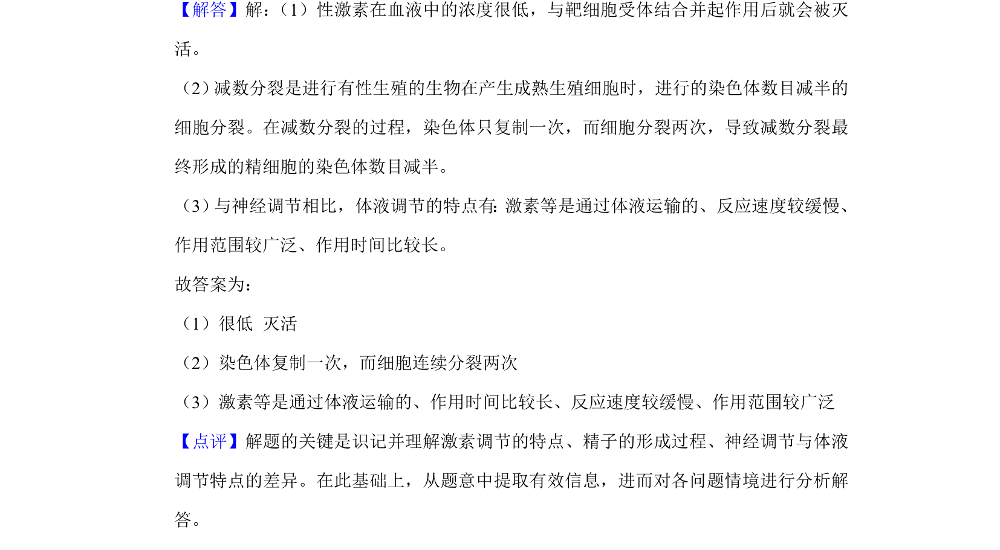

## 题面

## 摘要

性激素的作用特点及体液调节特点，结合减数分裂染色体数目减半原因

## 关联考点

- [[336-性激素|性激素]]
- [[330-体液调节|体液调节]]
- [[277-减数分裂（高中必二）|减数分裂]]
- [[630-激素作用特点|激素作用特点]]

## 答案与解析

> 📄 原 PDF 第 6 页：`素材/真题/吉林/2008-2024·（吉林）生物高考真题/2019年高考生物试卷（新课标Ⅱ）（解析卷）.pdf`

<!-- 题干文本-start -->
## 题干文本
8． （8分）环境中的内分泌干扰物是与某种性激素分子结构类似的物质，对小鼠的内分泌功
能会产生不良影响。回答下列问题。
（1）通常，机体内性激素在血液中的浓度　很低　，与靶细胞受体结合并起作用后会　
灭活　。
（2） 与初级精母细胞相比，精细胞的染色体数目减半，原因是在减数分裂过程中　染色
体复制一次，而细胞连续分裂两次　。
（3） 小鼠睾丸分泌的激素通过体液发挥调节作用。与神经调节相比，体液调节的特点有
<!-- 题干文本-end -->

<!-- 解析文本-start -->
## 解析文本

<!-- 解析文本-end -->
