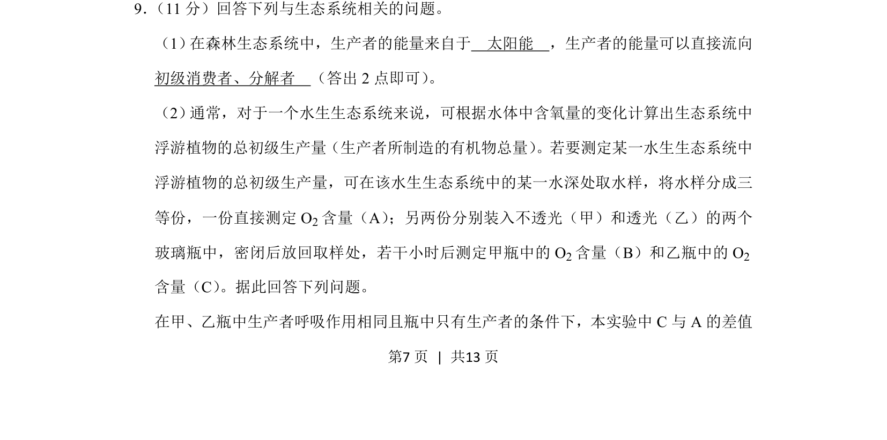
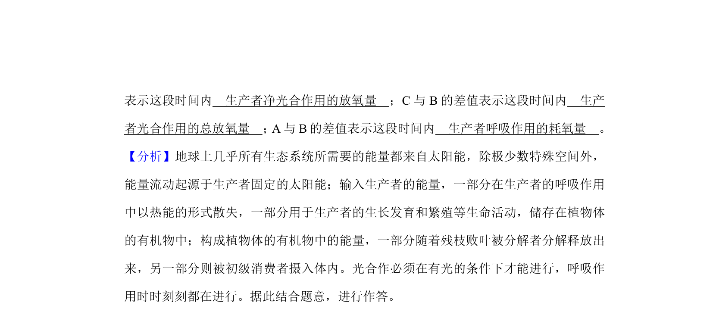
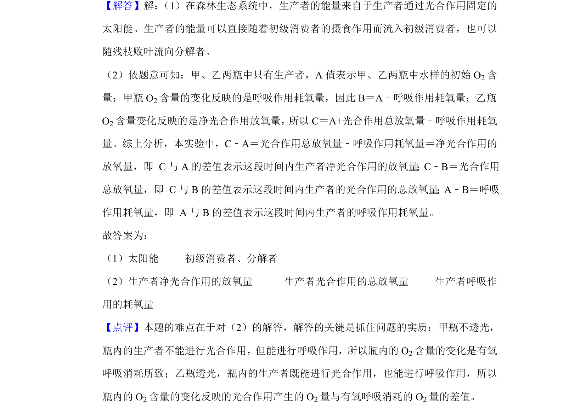

## 题面

## 摘要

考查生态系统能量来源与流向，以及利用黑白瓶法测定水生浮游植物总初级生产量。

## 关联考点

- [[020-生态系统|生态系统]]
- [[385-生态系统能量流动|能量流动]]
- [[初级生产量]]
- [[黑白瓶法]]

## 答案与解析

> 📄 原 PDF 第 7 页：`素材/真题/吉林/2008-2024·（吉林）生物高考真题/2019年高考生物试卷（新课标Ⅱ）（解析卷）.pdf`
