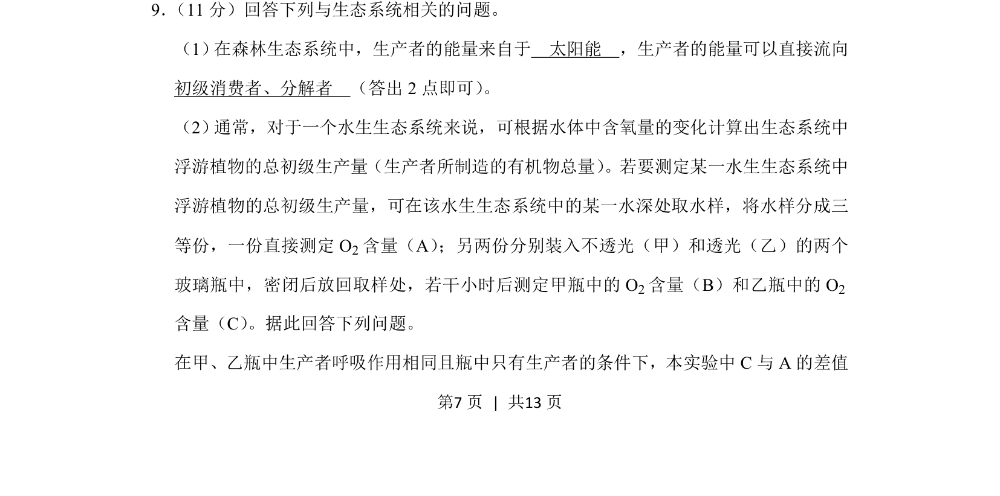
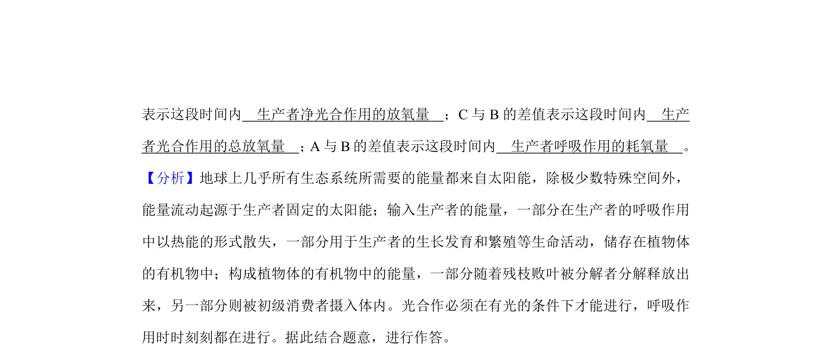
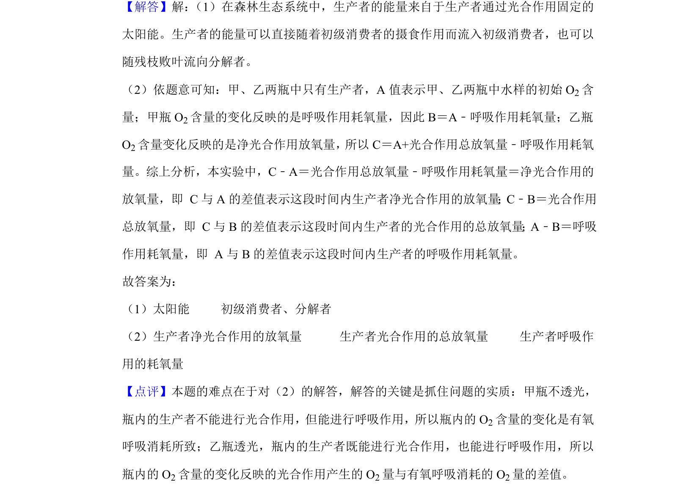

## 题面

## 摘要

考查生态系统能量来源与流向，以及利用黑白瓶法测定水生浮游植物总初级生产量。

## 关联考点

- [[020-生态系统|生态系统]]
- [[385-生态系统能量流动|能量流动]]
- [[555-初级生产量|初级生产量]]
- [[734-黑白瓶法|黑白瓶法]]

## 答案与解析

> 📄 原 PDF 第 7 页：`素材/真题/吉林/2008-2024·（吉林）生物高考真题/2019年高考生物试卷（新课标Ⅱ）（解析卷）.pdf`

<!-- 题干文本-start -->
## 题干文本
9． （11分）回答下列与生态系统相关的问题。
（1） 在森林生态系统中，生产者的能量来自于　太阳能　，生产者的能量可以直接流向　
初级消费者、分解者　（答出2点即可） 。
（2） 通常，对于一个水生生态系统来说，可根据水体中含氧量的变化计算出生态系统中
浮游植物的总初级生产量（生产者所制造的有机物总量） 。若要测定某一水生生态系统中
浮游植物的总初级生产量，可在该水生生态系统中的某一水深处取水样，将水样分成三
等份，一份直接测定O 2含量（A） ；另两份分别装入不透光（甲）和透光（乙）的两个
玻璃瓶中，密闭后放回取样处，若干小时后测定甲瓶中的O 2含量（B）和乙瓶中的O 2
含量（C） 。据此回答下列问题。
在甲、乙瓶中生产者呼吸作用相同且瓶中只有生产者的条件下，本实验中C与A的差值
<!-- 题干文本-end -->

<!-- 解析文本-start -->
## 解析文本

<!-- 解析文本-end -->
