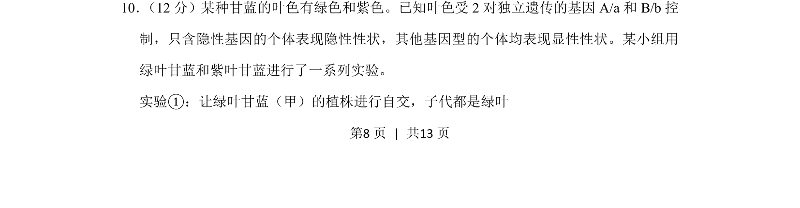
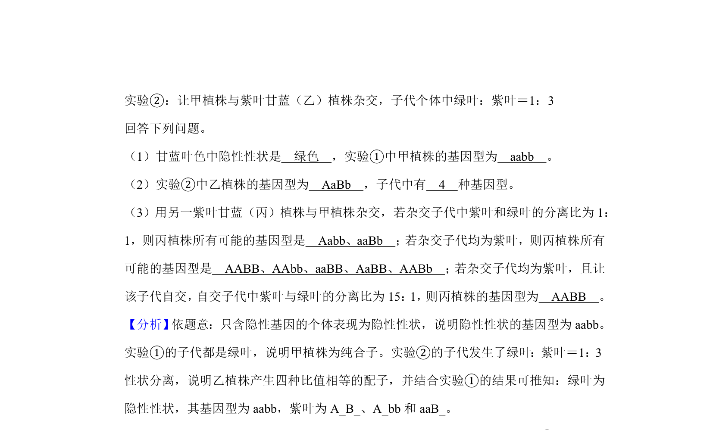
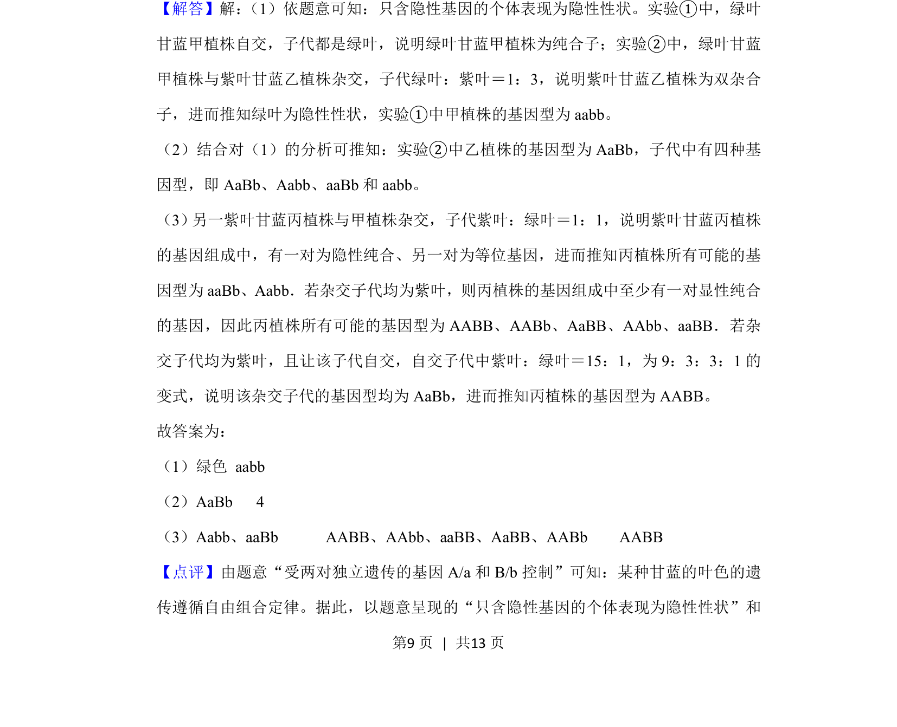
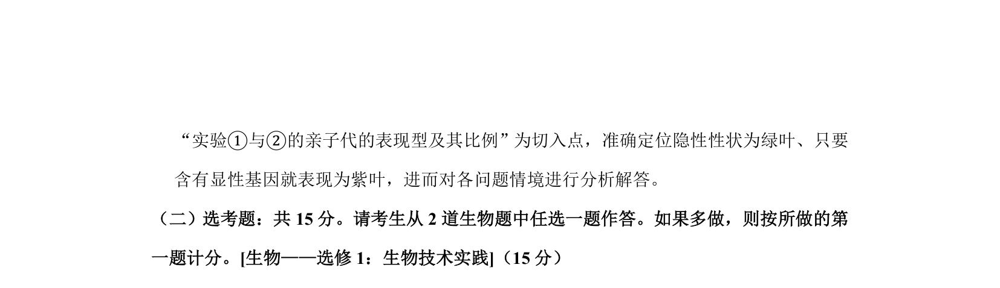

## 题面

## 摘要

甘蓝叶色遗传实验中，基于基因型与表现型关系及自交结果推断性状显隐性和亲本基因型。

## 关联考点

- [[266-分离定律|基因的分离定律]]
- [[611-显隐性性状|显隐性性状]]
- [[271-自交|自交]]

## 答案与解析

> 📄 原 PDF 第 8 页：`素材/真题/吉林/2008-2024·（吉林）生物高考真题/2019年高考生物试卷（新课标Ⅱ）（解析卷）.pdf`

<!-- 题干文本-start -->
## 题干文本
10． （12分）某种甘蓝的叶色有绿色和紫色。已知叶色受2对独立遗传的基因A/a和B/b控
制，只含隐性基因的个体表现隐性性状，其他基因型的个体均表现显性性状。某小组用
绿叶甘蓝和紫叶甘蓝进行了一系列实验。
实验①：让绿叶甘蓝（甲）的植株进行自交，子代都是绿叶
<!-- 题干文本-end -->

<!-- 解析文本-start -->
## 解析文本

<!-- 解析文本-end -->
