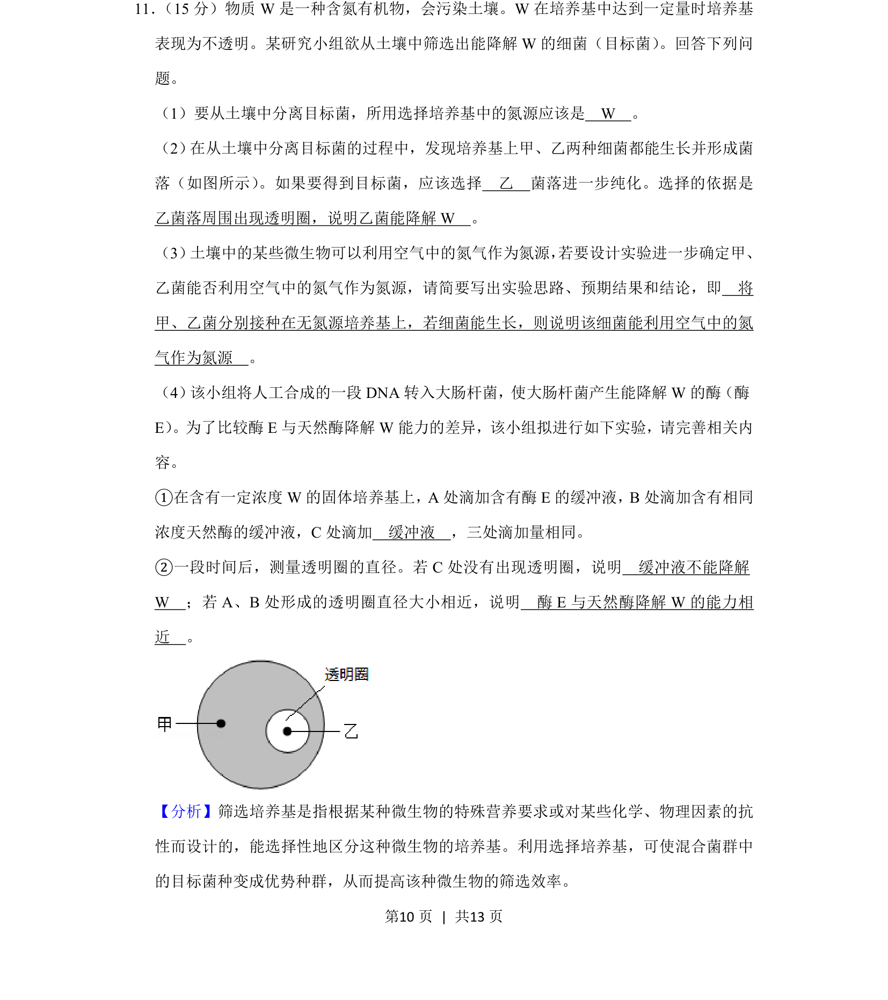
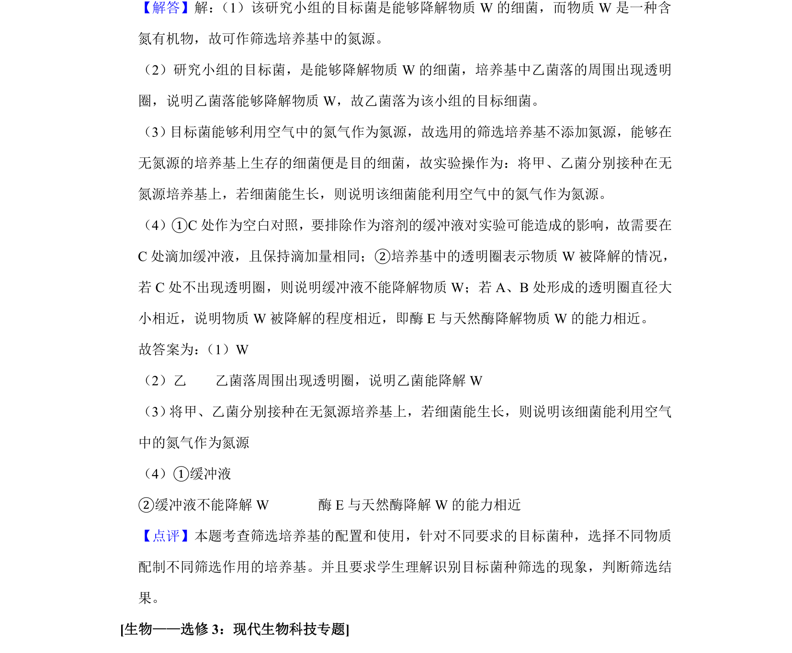

## 题面

## 摘要

该题考查微生物选择培养基的配制、目标菌筛选原理及酶活性比较实验设计。

## 关联考点

- [[428-微生物培养|微生物培养]]
- [[427-培养基|选择培养基]]
- [[酶活性检测]]

## 答案与解析

> 📄 原 PDF 第 10 页：`素材/真题/吉林/2008-2024·（吉林）生物高考真题/2019年高考生物试卷（新课标Ⅱ）（解析卷）.pdf`
