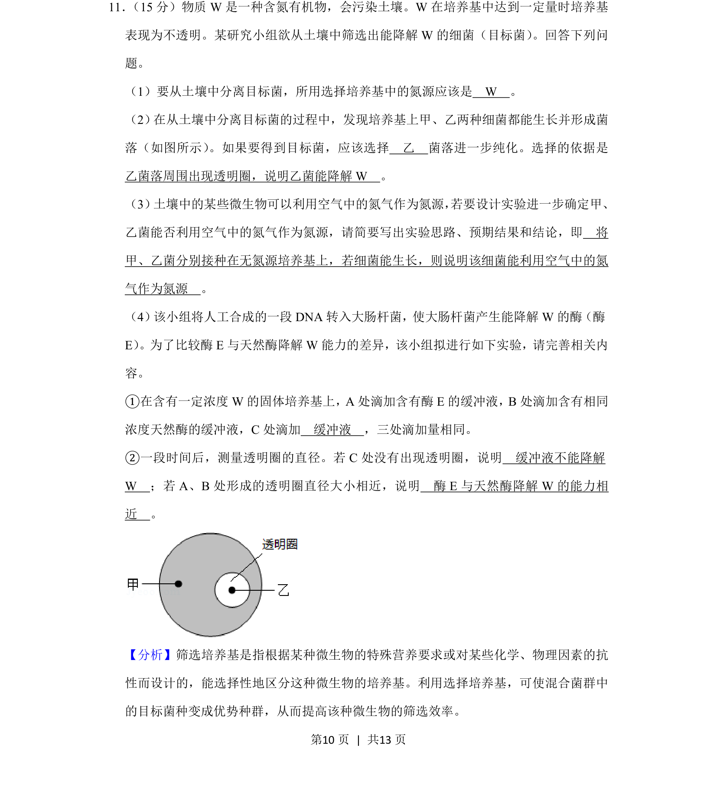
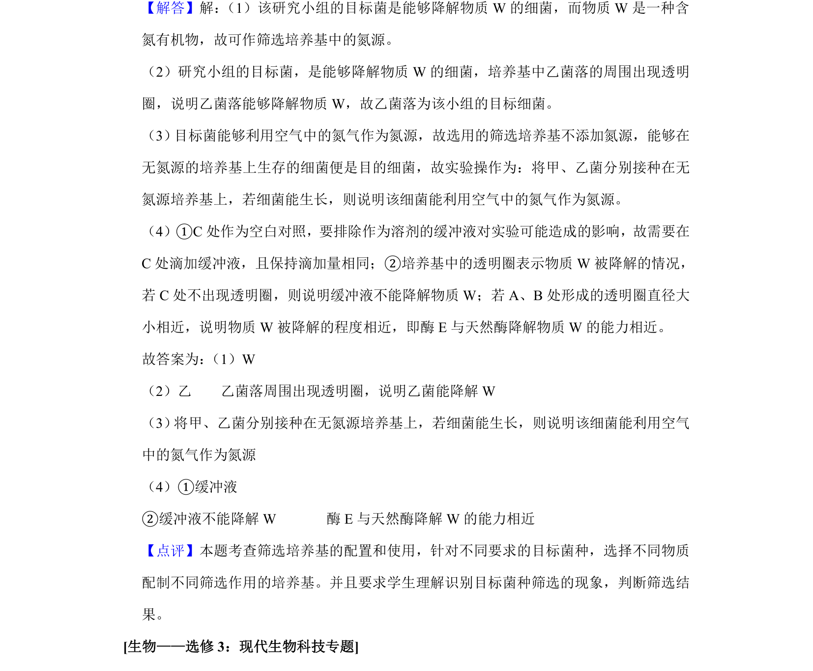

## 题面

## 摘要

该题考查从土壤中筛选降解W细菌的方法及酶活性比较实验设计。

## 关联考点

- [[427-培养基|选择培养基]]
- [[487-微生物分离|微生物分离]]
- [[514-透明圈|透明圈]]
- [[725-酶活性比较|酶活性比较]]

## 答案与解析

> 📄 原 PDF 第 10 页：`素材/真题/吉林/2008-2024·（吉林）生物高考真题/2019年高考生物试卷（新课标Ⅱ）（解析卷）.pdf`

<!-- 题干文本-start -->
## 题干文本
11． （15分）物质W是一种含氮有机物，会污染土壤。W在培养基中达到一定量时培养基
表现为不透明。某研究小组欲从土壤中筛选出能降解W的细菌（目标菌） 。回答下列问
题。
（1）要从土壤中分离目标菌，所用选择培养基中的氮源应该是　W　。
（2） 在从土壤中分离目标菌的过程中，发现培养基上甲、乙两种细菌都能生长并形成菌
落（如图所示） 。如果要得到目标菌，应该选择　乙　菌落进一步纯化。选择的依据是　
乙菌落周围出现透明圈，说明乙菌能降解W　。
（3） 土壤中的某些微生物可以利用空气中的氮气作为氮源， 若要设计实验进一步确定甲、
乙菌能否利用空气中的氮气作为氮源，请简要写出实验思路、预期结果和结论，即　将
甲、乙菌分别接种在无氮源培养基上，若细菌能生长，则说明该细菌能利用空气中的氮
气作为氮源　。
（4） 该小组将人工合成的一段DNA转入大肠杆菌，使大肠杆菌产生能降解W的酶（酶
E） 。为了比较酶E与天然酶降解W能力的差异，该小组拟进行如下实验，请完善相关内
容。
①在含有一定浓度W的固体培养基上，A处滴加含有酶E的缓冲液，B处滴加含有相同
浓度天然酶的缓冲液，C处滴加　缓冲液　，三处滴加量相同。
②一段时间后，测量透明圈的直径。若C处没有出现透明圈，说明　缓冲液不能降解
W　；若A、B处形成的透明圈直径大小相近，说明　酶E与天然酶降解W的能力相
近　。
<!-- 题干文本-end -->

<!-- 解析文本-start -->
## 解析文本
【分析】筛选培养基是指根据某种微生物的特殊营养要求或对某些化学、物理因素的抗
性而设计的，能选择性地区分这种微生物的培养基。利用选择培养基，可使混合菌群中
的目标菌种变成优势种群，从而提高该种微生物的筛选效率。
<!-- 解析文本-end -->
