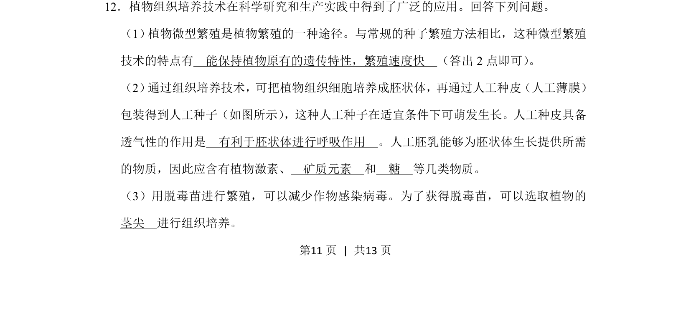
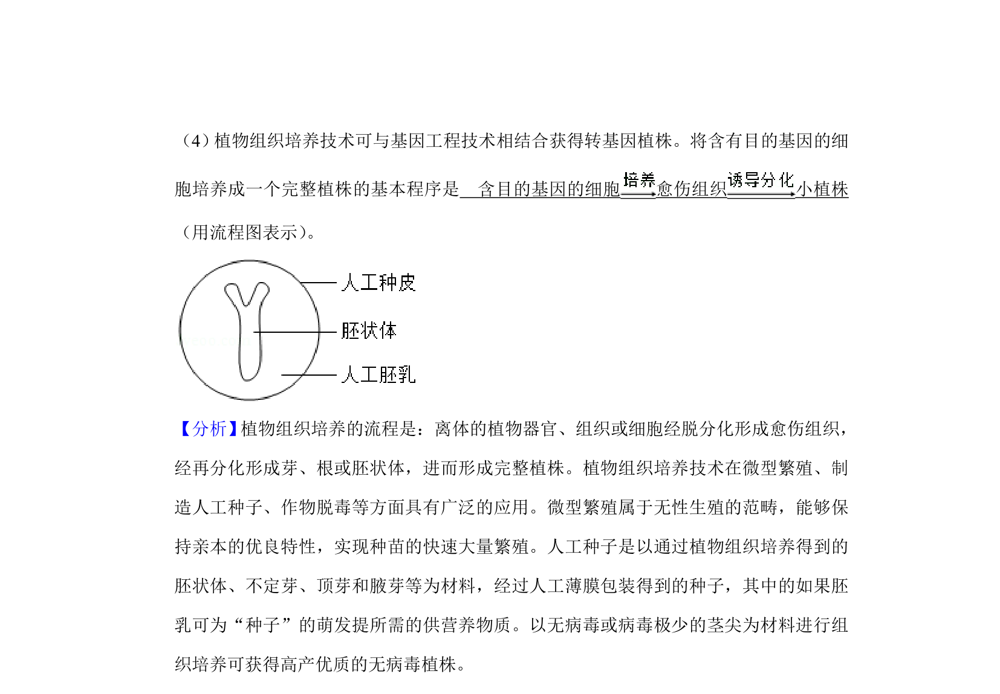
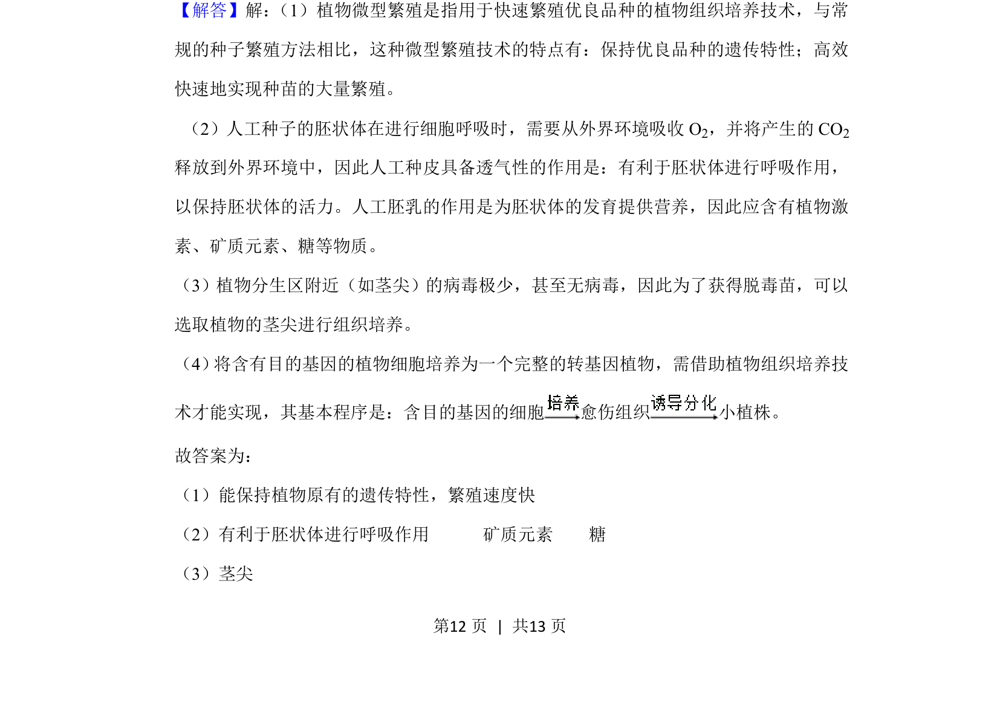
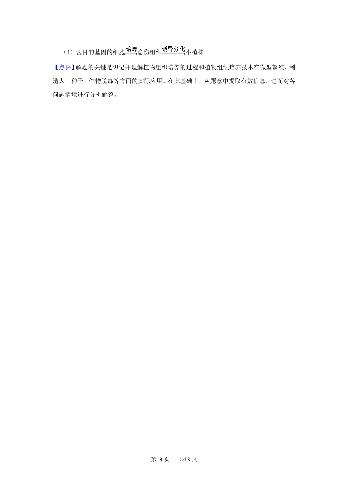

## 题面

## 摘要

考查植物组织培养的应用，包括微型繁殖特点、人工种子成分及脱毒苗取材。

## 关联考点

- [[437-植物组织培养|植物组织培养]]
- [[597-微型繁殖|微型繁殖]]
- [[466-人工种子|人工种子]]
- [[690-脱毒苗|脱毒苗]]

## 答案与解析

> 📄 原 PDF 第 11 页：`素材/真题/吉林/2008-2024·（吉林）生物高考真题/2019年高考生物试卷（新课标Ⅱ）（解析卷）.pdf`
