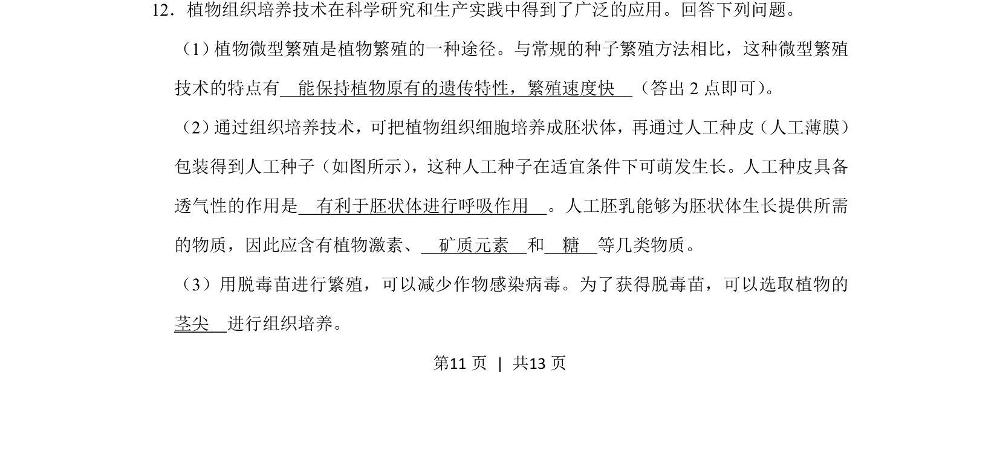
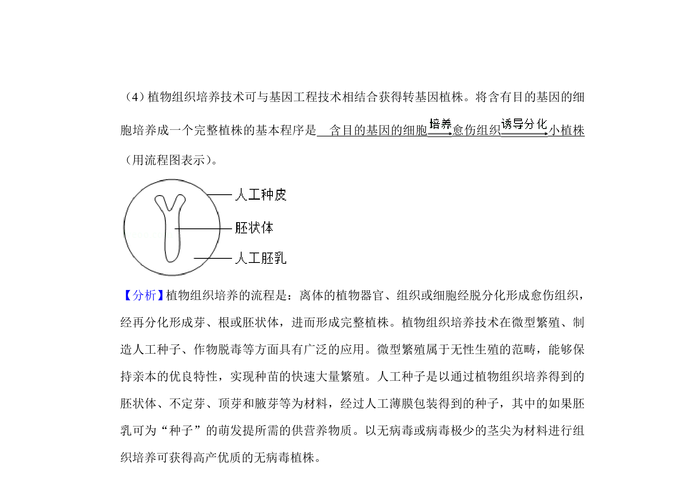
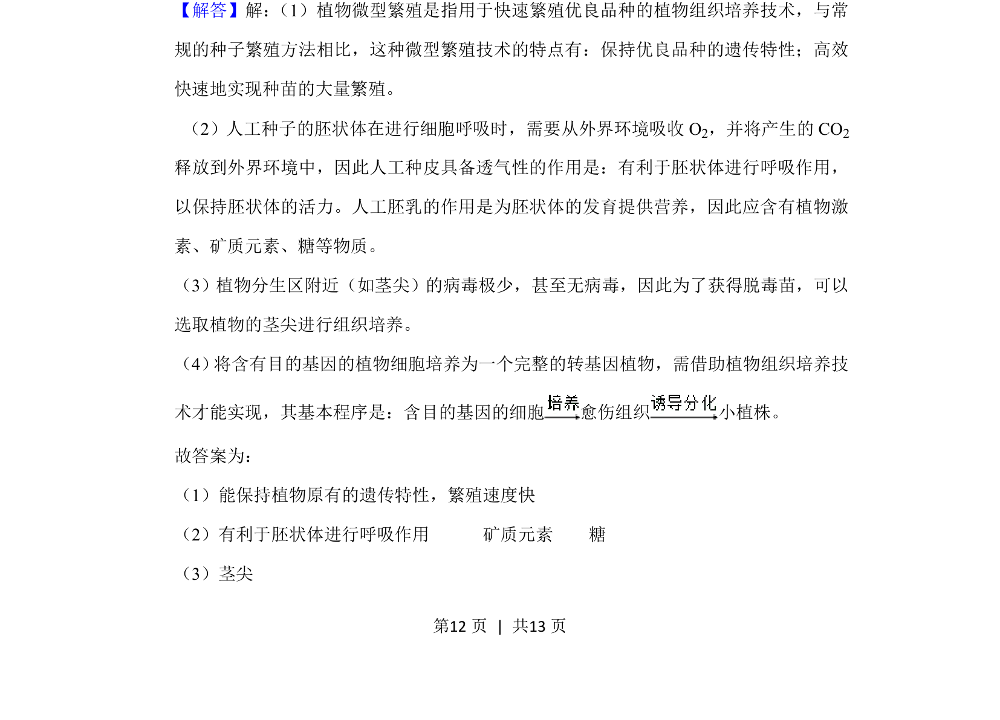

## 题面

## 摘要

考查植物组织培养的应用，包括微型繁殖特点、人工种子成分及脱毒苗取材。

## 关联考点

- [[437-植物组织培养|植物组织培养]]
- [[597-微型繁殖|微型繁殖]]
- [[466-人工种子|人工种子]]
- [[690-脱毒苗|脱毒苗]]

## 答案与解析

> 📄 原 PDF 第 11 页：`素材/真题/吉林/2008-2024·（吉林）生物高考真题/2019年高考生物试卷（新课标Ⅱ）（解析卷）.pdf`

<!-- 题干文本-start -->
## 题干文本
12．植物组织培养技术在科学研究和生产实践中得到了广泛的应用。回答下列问题。
（1） 植物微型繁殖是植物繁殖的一种途径。与常规的种子繁殖方法相比，这种微型繁殖
技术的特点有　能保持植物原有的遗传特性，繁殖速度快　（答出2点即可） 。
（2） 通过组织培养技术，可把植物组织细胞培养成胚状体，再通过人工种皮（人工薄膜）
包装得到人工种子（如图所示） ，这种人工种子在适宜条件下可萌发生长。人工种皮具备
透气性的作用是　有利于胚状体进行呼吸作用　。人工胚乳能够为胚状体生长提供所需
的物质，因此应含有植物激素、　矿质元素　和　糖　等几类物质。
（3）用脱毒苗进行繁殖，可以减少作物感染病毒。为了获得脱毒苗，可以选取植物的　
茎尖　进行组织培养。
<!-- 题干文本-end -->

<!-- 解析文本-start -->
## 解析文本

<!-- 解析文本-end -->
