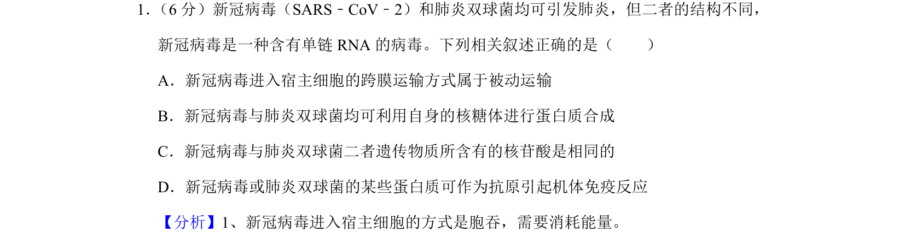
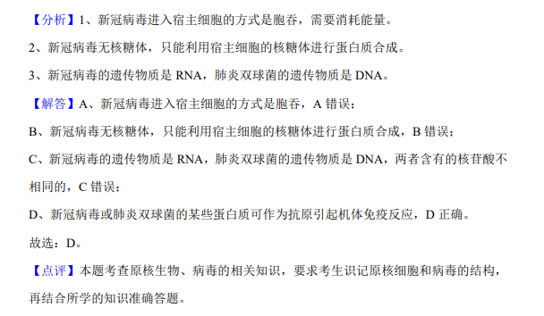

## 题面

## 摘要

比较新冠病毒与肺炎双球菌的结构、遗传物质及免疫相关叙述的正误。

## 关联考点

- [[653-病毒结构|病毒结构]]
- [[635-物质跨膜运输|物质跨膜运输]]
- [[721-遗传物质比较|遗传物质比较]]
- [[156-免疫|免疫]]

## 答案与解析

> 📄 原 PDF 第 1 页：`素材/真题/吉林/2008-2024·（吉林）生物高考真题/2020年高考生物试卷（新课标Ⅱ）（解析卷）.pdf`

<!-- 题干文本-start -->
## 题干文本
1． （6分）新冠病毒（SARS﹣CoV﹣2）和肺炎双球菌均可引发肺炎，但二者的结构不同，
新冠病毒是一种含有单链RNA的病毒。下列相关叙述正确的是（　　）
A．新冠病毒进入宿主细胞的跨膜运输方式属于被动运输
B．新冠病毒与肺炎双球菌均可利用自身的核糖体进行蛋白质合成
C．新冠病毒与肺炎双球菌二者遗传物质所含有的核苷酸是相同的
D．新冠病毒或肺炎双球菌的某些蛋白质可作为抗原引起机体免疫反应
<!-- 题干文本-end -->

<!-- 解析文本-start -->
## 解析文本
【分析】1、新冠病毒进入宿主细胞的方式是胞吞，需要消耗能量。
<!-- 解析文本-end -->
