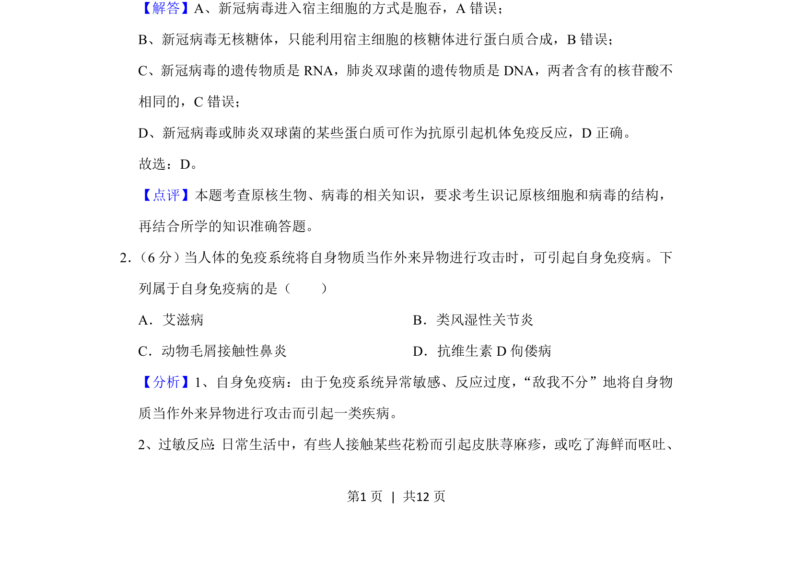
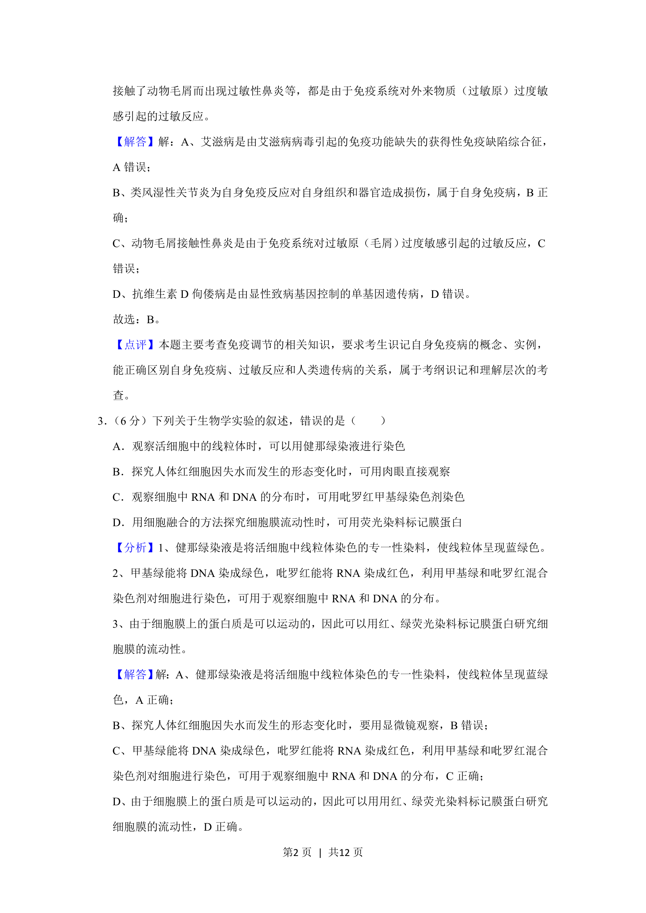
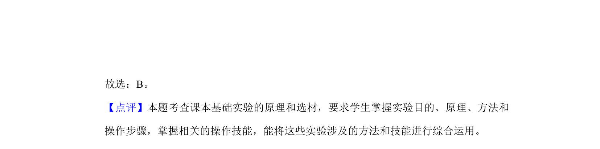

## 题面

## 摘要

该题考查新冠病毒与肺炎双球菌的遗传物质种类及免疫反应。

## 关联考点

- [[653-病毒结构|病毒结构]]
- [[156-免疫|免疫]]
- [[719-遗传物质|遗传物质]]
- [[561-原核生物|原核生物]]

## 答案与解析

> 📄 原 PDF 第 1 页：`素材/真题/吉林/2008-2024·（吉林）生物高考真题/2020年高考生物试卷（新课标Ⅱ）（解析卷）.pdf`

<!-- 题干文本-start -->
## 题干文本
3、新冠病毒的遗传物质是RNA，肺炎双球菌的遗传物质是DNA。
<!-- 题干文本-end -->

<!-- 解析文本-start -->
## 解析文本
【解答】A、新冠病毒进入宿主细胞的方式是胞吞，A错误；
B、新冠病毒无核糖体，只能利用宿主细胞的核糖体进行蛋白质合成，B错误；
C、新冠病毒的遗传物质是RNA，肺炎双球菌的遗传物质是DNA，两者含有的核苷酸不
相同的，C错误；
D、新冠病毒或肺炎双球菌的某些蛋白质可作为抗原引起机体免疫反应，D正确。
故选：D。
【点评】本题考查原核生物、病毒的相关知识，要求考生识记原核细胞和病毒的结构，
再结合所学的知识准确答题。
2． （6分）当人体的免疫系统将自身物质当作外来异物进行攻击时，可引起自身免疫病。下
列属于自身免疫病的是（　　）
A．艾滋病B．类风湿性关节炎
C．动物毛屑接触性鼻炎D．抗维生素D佝偻病
【分析】1、自身免疫病：由于免疫系统异常敏感、反应过度，“敌我不分”地将自身物
质当作外来异物进行攻击而引起一类疾病。
2、过敏反应 ： 日常生活中，有些人接触某些花粉而引起皮肤荨麻疹，或吃了海鲜而呕吐、
<!-- 解析文本-end -->
