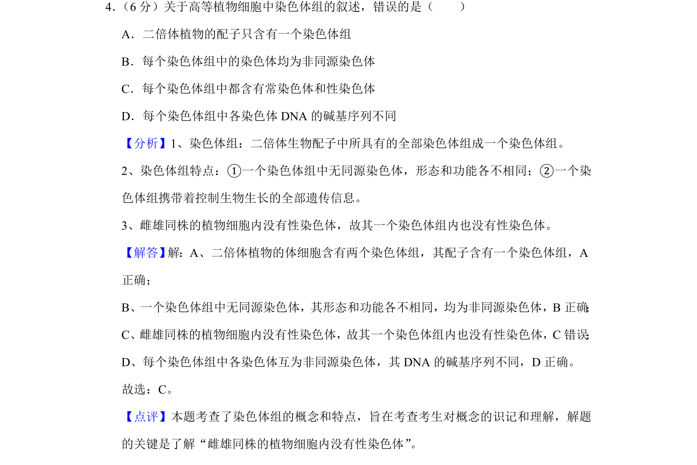
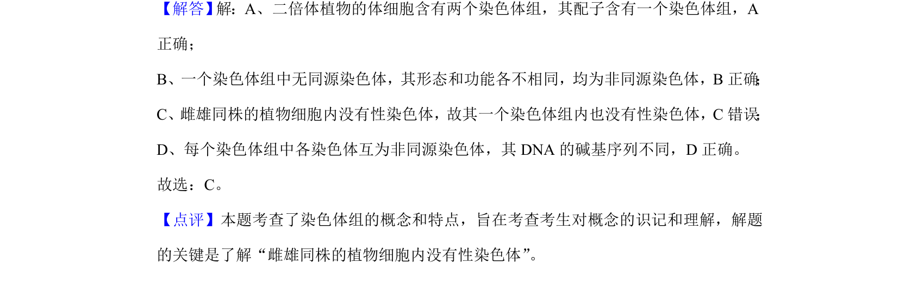

## 题面

## 摘要

考查染色体组概念、特点及其在高等植物细胞中的应用，重点涉及雌雄同株植物无性染色体。

## 关联考点

- [[807-染色体组|染色体组]]
- [[732-非同源染色体|非同源染色体]]
- [[197-性染色体|性染色体]]
- [[538-二倍体植物配子|二倍体植物配子]]

## 答案与解析

> 📄 原 PDF 第 3 页：`素材/真题/吉林/2008-2024·（吉林）生物高考真题/2020年高考生物试卷（新课标Ⅱ）（解析卷）.pdf`

<!-- 题干文本-start -->
## 题干文本
4． （6分）关于高等植物细胞中染色体组的叙述，错误的是（　　）
A．二倍体植物的配子只含有一个染色体组
B．每个染色体组中的染色体均为非同源染色体
C．每个染色体组中都含有常染色体和性染色体
D．每个染色体组中各染色体DNA的碱基序列不同
<!-- 题干文本-end -->

<!-- 解析文本-start -->
## 解析文本
【分析】1、染色体组：二倍体生物配子中所具有的全部染色体组成一个染色体组。
2、染色体组特点：①一个染色体组中无同源染色体，形态和功能各不相同；②一个染
色体组携带着控制生物生长的全部遗传信息。
3、雌雄同株的植物细胞内没有性染色体，故其一个染色体组内也没有性染色体。
【解答】 解：A、二倍体植物的体细胞含有两个染色体组，其配子含有一个染色体组，A
正确；
B、一个染色体组中无同源染色体，其形态和功能各不相同，均为非同源染色体，B正确 ；
C、雌雄同株的植物细胞内没有性染色体，故其一个染色体组内也没有性染色体，C错误 ；
D、每个染色体组中各染色体互为非同源染色体，其DNA的碱基序列不同，D正确。
故选：C。
【点评】本题考查了染色体组的概念和特点，旨在考查考生对概念的识记和理解，解题
的关键是了解“雌雄同株的植物细胞内没有性染色体”。
<!-- 解析文本-end -->
