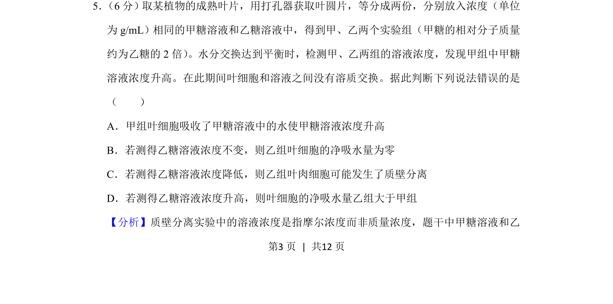
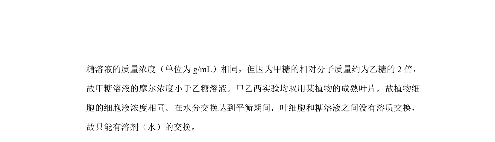
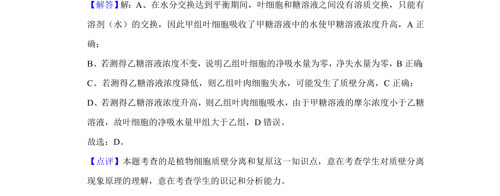

## 题面

## 摘要

甲糖与乙糖溶液质量浓度相同但摩尔浓度不同，通过溶液浓度变化判断植物细胞渗透吸水与质壁分离情况

## 关联考点

- [[258-渗透作用|渗透作用]]
- [[262-质壁分离|质壁分离]]
- [[711-质量浓度与摩尔浓度|质量浓度与摩尔浓度]]
- [[676-细胞吸水与失水|细胞吸水与失水]]

## 答案与解析

> 📄 原 PDF 第 3 页：`素材/真题/吉林/2008-2024·（吉林）生物高考真题/2020年高考生物试卷（新课标Ⅱ）（解析卷）.pdf`
