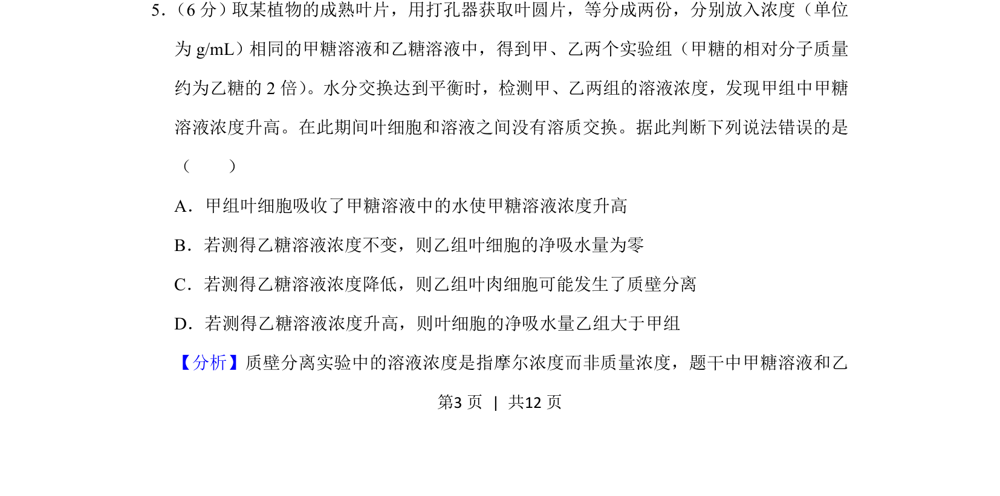
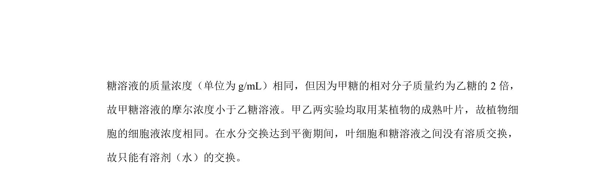
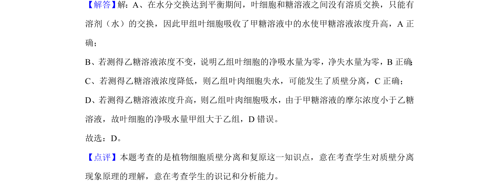

## 题面

## 摘要

甲糖与乙糖溶液质量浓度相同但摩尔浓度不同，通过溶液浓度变化判断植物细胞渗透吸水与质壁分离情况

## 关联考点

- [[258-渗透作用|渗透作用]]
- [[262-质壁分离|质壁分离]]
- [[711-质量浓度与摩尔浓度|质量浓度与摩尔浓度]]
- [[676-细胞吸水与失水|细胞吸水与失水]]

## 答案与解析

> 📄 原 PDF 第 3 页：`素材/真题/吉林/2008-2024·（吉林）生物高考真题/2020年高考生物试卷（新课标Ⅱ）（解析卷）.pdf`

<!-- 题干文本-start -->
## 题干文本
5． （6分）取某植物的成熟叶片，用打孔器获取叶圆片，等分成两份，分别放入浓度（单位
为g/mL）相同的甲糖溶液和乙糖溶液中，得到甲、乙两个实验组（甲糖的相对分子质量
约为乙糖的2倍） 。水分交换达到平衡时，检测甲、乙两组的溶液浓度，发现甲组中甲糖
溶液浓度升高。在此期间叶细胞和溶液之间没有溶质交换。据此判断下列说法错误的是
（　　）
A．甲组叶细胞吸收了甲糖溶液中的水使甲糖溶液浓度升高
B．若测得乙糖溶液浓度不变，则乙组叶细胞的净吸水量为零
C．若测得乙糖溶液浓度降低，则乙组叶肉细胞可能发生了质壁分离
D．若测得乙糖溶液浓度升高，则叶细胞的净吸水量乙组大于甲组
<!-- 题干文本-end -->

<!-- 解析文本-start -->
## 解析文本
【分析】质壁分离实验中的溶液浓度是指摩尔浓度而非质量浓度，题干中甲糖溶液和乙
<!-- 解析文本-end -->
