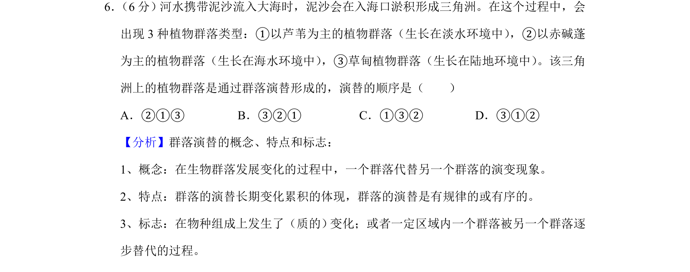
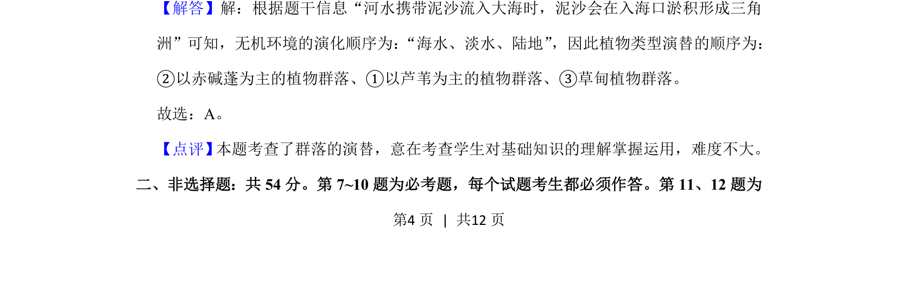

## 题面

## 摘要

群落演替顺序判断，基于无机环境变化推演植物群落类型更替

## 关联考点

- [[407-群落演替|群落演替]]
- [[407-群落演替|生态演替]]
- [[500-环境梯度|环境梯度]]

## 答案与解析

> 📄 原 PDF 第 4 页：`素材/真题/吉林/2008-2024·（吉林）生物高考真题/2020年高考生物试卷（新课标Ⅱ）（解析卷）.pdf`
