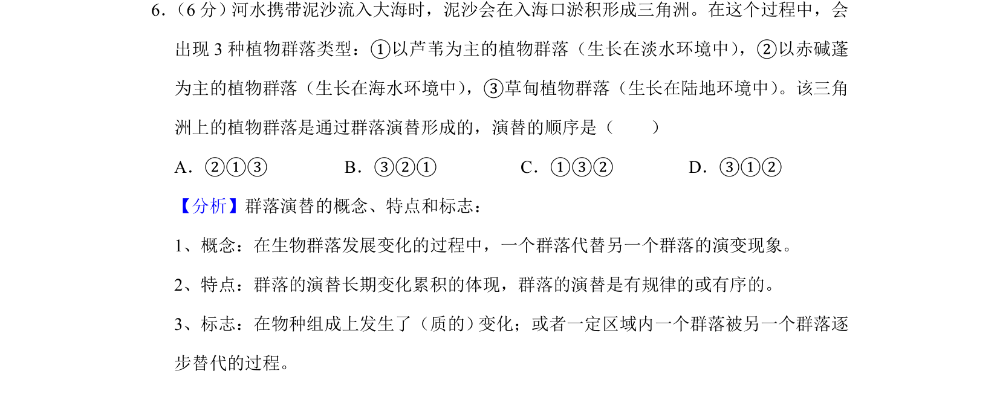
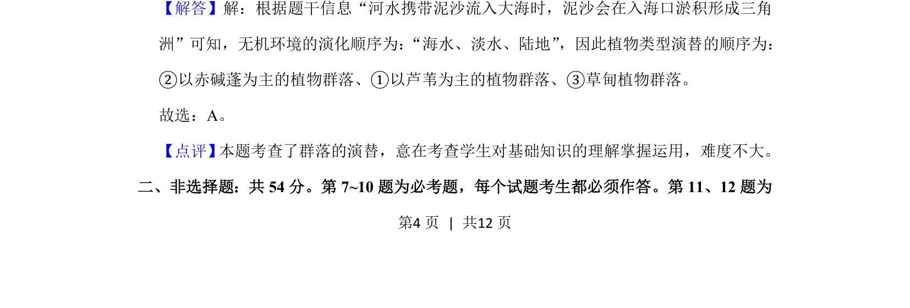

## 题面

## 摘要

群落演替顺序判断，基于无机环境变化推演植物群落类型更替

## 关联考点

- [[407-群落演替|群落演替]]
- [[407-群落演替|生态演替]]
- [[500-环境梯度|环境梯度]]

## 答案与解析

> 📄 原 PDF 第 4 页：`素材/真题/吉林/2008-2024·（吉林）生物高考真题/2020年高考生物试卷（新课标Ⅱ）（解析卷）.pdf`

<!-- 题干文本-start -->
## 题干文本
6． （6分）河水携带泥沙流入大海时，泥沙会在入海口淤积形成三角洲。在这个过程中，会
出现3种植物群落类型：①以芦苇为主的植物群落（生长在淡水环境中） ，②以赤碱蓬
为主的植物群落（生长在海水环境中） ，③草甸植物群落（生长在陆地环境中） 。该三角
洲上的植物群落是通过群落演替形成的，演替的顺序是（　　）
A．②①③B．③②①C．①③②D．③①②
<!-- 题干文本-end -->

<!-- 解析文本-start -->
## 解析文本
【分析】群落演替的概念、特点和标志：
1、概念：在生物群落发展变化的过程中，一个群落代替另一个群落的演变现象。
2、特点：群落的演替长期变化累积的体现，群落的演替是有规律的或有序的。
3、标志：在物种组成上发生了（质的） 变化；或者一定区域内一个群落被另一个群落逐
步替代的过程。
【解答】解：根据题干信息“河水携带泥沙流入大海时，泥沙会在入海口淤积形成三角
洲”可知，无机环境的演化顺序为：“海水、淡水、陆地”，因此植物类型演替的顺序为：
②以赤碱蓬为主的植物群落、①以芦苇为主的植物群落、③草甸植物群落。
故选：A。
【点评】 本题考查了群落的演替，意在考查学生对基础知识的理解掌握运用，难度不大。
二、非选择题：共54分。第7~10题为必考题，每个试题考生都必须作答。第11、12题为
<!-- 解析文本-end -->
