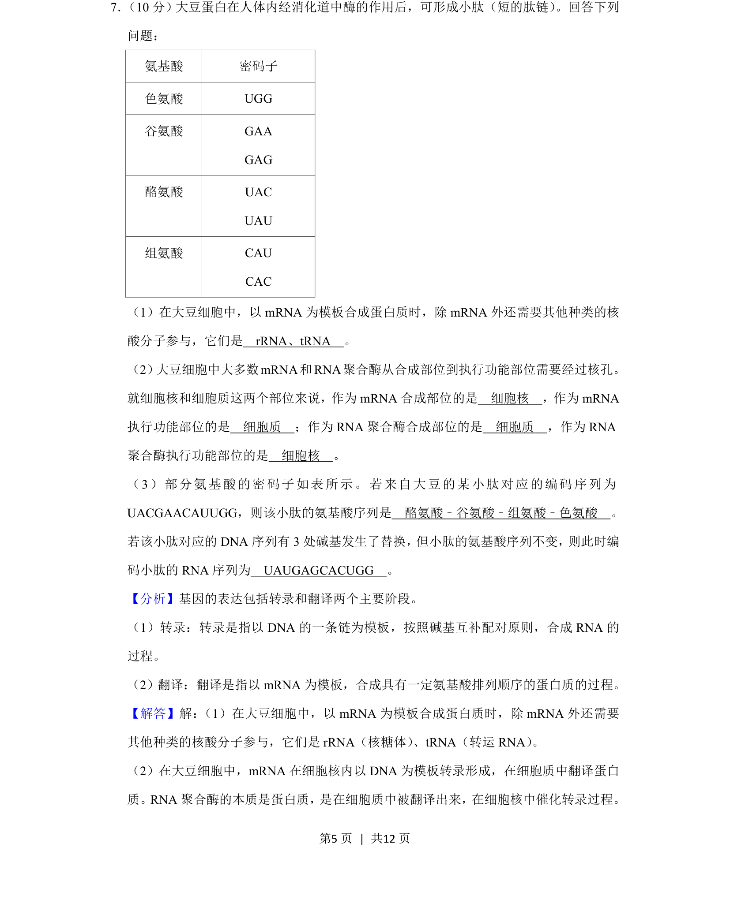
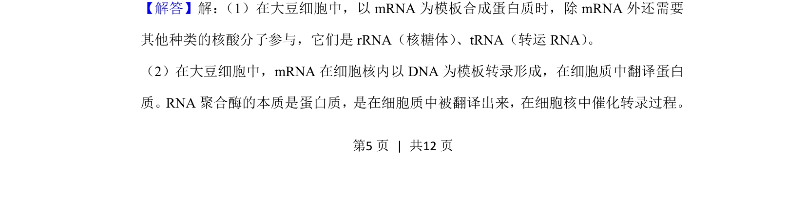
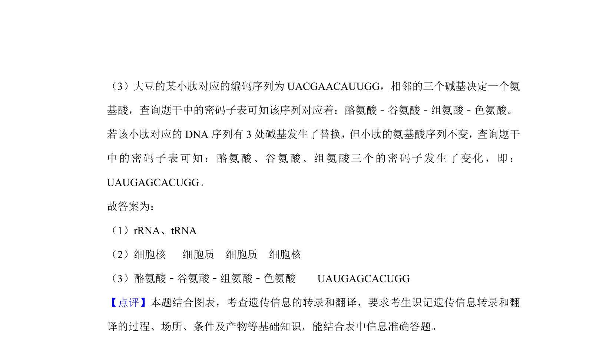

## 题面

## 摘要

本题以大豆蛋白为背景，考查基因表达中转录、翻译过程及密码子应用。

## 关联考点

- [[298-转录|转录]]
- [[466-interpret|翻译]]
- [[296-密码子|密码子]]
- [[基因表达]]

## 答案与解析

> 📄 原 PDF 第 5 页：`素材/真题/吉林/2008-2024·（吉林）生物高考真题/2020年高考生物试卷（新课标Ⅱ）（解析卷）.pdf`
