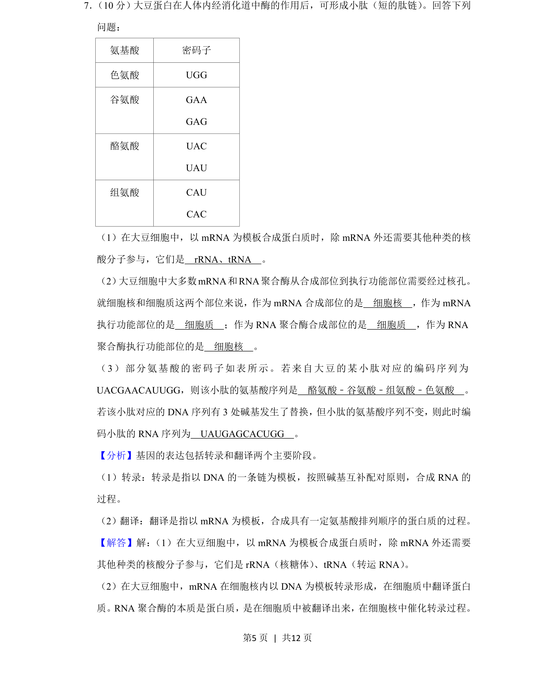
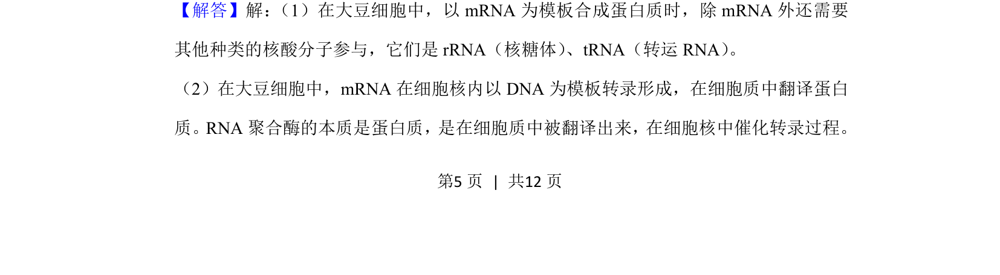
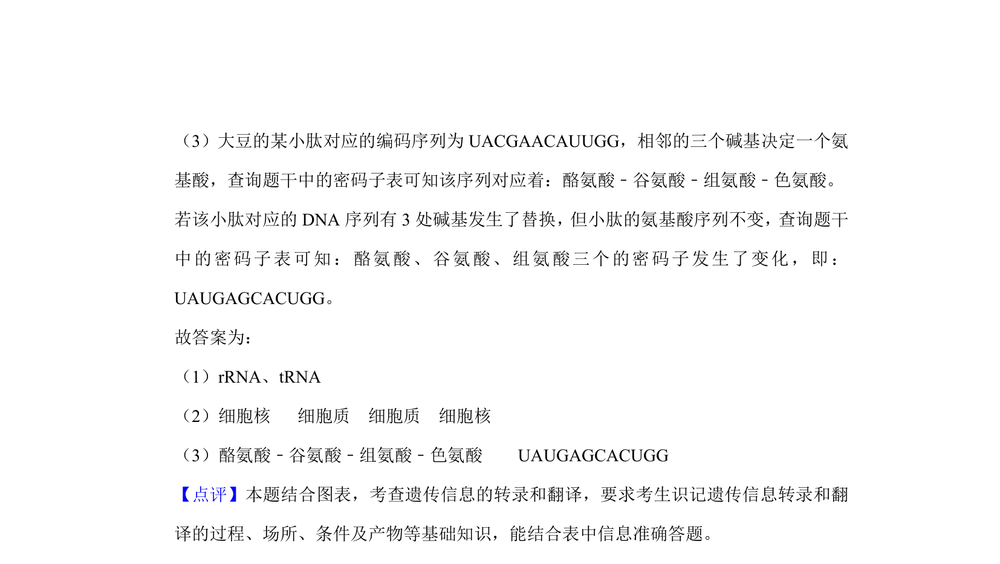

## 题面

## 摘要

本题以大豆蛋白为背景，考查基因表达中转录、翻译过程及密码子应用。

## 关联考点

- [[298-转录|转录]]
- [[466-interpret|翻译]]
- [[296-密码子|密码子]]
- [[843-基因的表达|基因表达]]

## 答案与解析

> 📄 原 PDF 第 5 页：`素材/真题/吉林/2008-2024·（吉林）生物高考真题/2020年高考生物试卷（新课标Ⅱ）（解析卷）.pdf`

<!-- 题干文本-start -->
## 题干文本
7． （10分）大豆蛋白在人体内经消化道中酶的作用后，可形成小肽（短的肽链） 。回答下列
问题：
氨基酸 密码子
色氨酸 UGG
谷氨酸 GAA
GAG
酪氨酸 UAC
UAU
组氨酸 CAU
CAC
（1）在大豆细胞中，以mRNA为模板合成蛋白质时，除mRNA外还需要其他种类的核
酸分子参与，它们是　rRNA、tRNA　。
（2） 大豆细胞中大多数mRNA和RNA聚合酶从合成部位到执行功能部位需要经过核孔。
就细胞核和细胞质这两个部位来说，作为mRNA合成部位的是　细胞核　，作为mRNA
执行功能部位的是　细胞质　；作为RNA聚合酶合成部位的是　细胞质　，作为RNA
聚合酶执行功能部位的是　细胞核　。
（3）部分氨基酸的密码子如表所示。若来自大豆的某小肽对应的编码序列为
UACGAACAUUGG，则该小肽的氨基酸序列是　酪氨酸﹣谷氨酸﹣组氨酸﹣色氨酸　。
若该小肽对应的DNA序列有3处碱基发生了替换，但小肽的氨基酸序列不变，则此时编
码小肽的RNA序列为　UAUGAGCACUGG　。
<!-- 题干文本-end -->

<!-- 解析文本-start -->
## 解析文本
【分析】基因的表达包括转录和翻译两个主要阶段。
（1）转录：转录是指以DNA的一条链为模板，按照碱基互补配对原则，合成RNA的
过程。
（2）翻译：翻译是指以mRNA为模板，合成具有一定氨基酸排列顺序的蛋白质的过程。
【解答】解： （1）在大豆细胞中，以mRNA为模板合成蛋白质时，除mRNA外还需要
其他种类的核酸分子参与，它们是rRNA（核糖体） 、tRNA（转运RNA） 。
（2）在大豆细胞中，mRNA在细胞核内以DNA为模板转录形成，在细胞质中翻译蛋白
质。RNA聚合酶的本质是蛋白质，是在细胞质中被翻译出来，在细胞核中催化转录过程。
<!-- 解析文本-end -->
