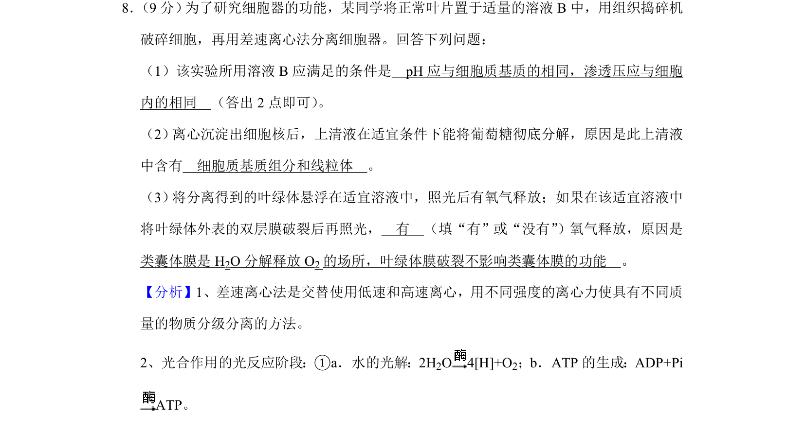
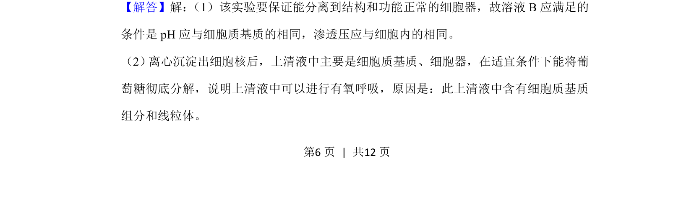
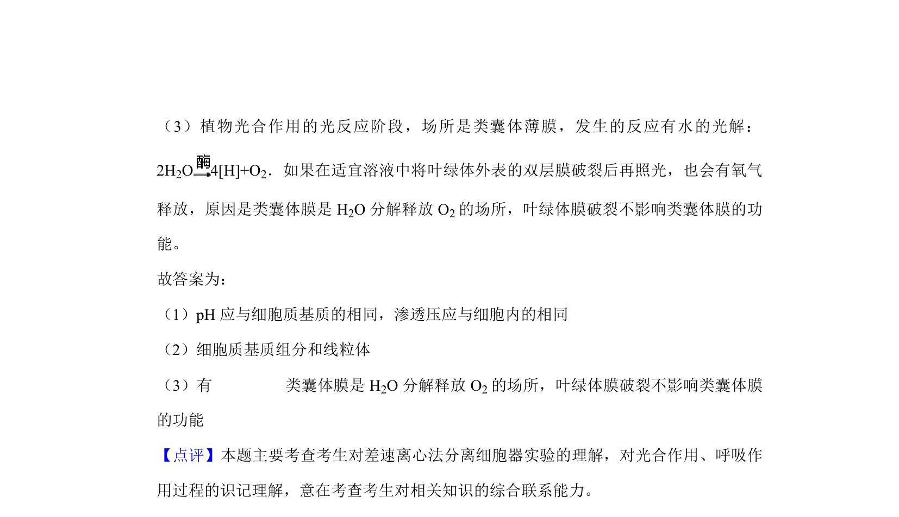

## 题面

## 摘要

该题考查差速离心法分离细胞器及验证有氧呼吸、光合作用相关功能。

## 关联考点

- [[591-差速离心法|差速离心法]]
- [[240-有氧呼吸|有氧呼吸]]
- [[033-光合作用|光合作用]]

## 答案与解析

> 📄 原 PDF 第 6 页：`素材/真题/吉林/2008-2024·（吉林）生物高考真题/2020年高考生物试卷（新课标Ⅱ）（解析卷）.pdf`
