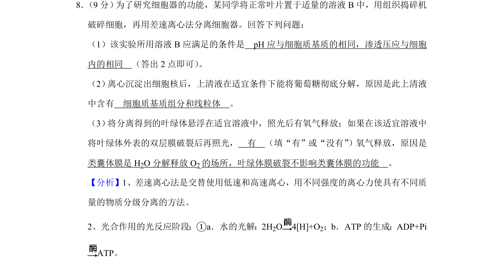
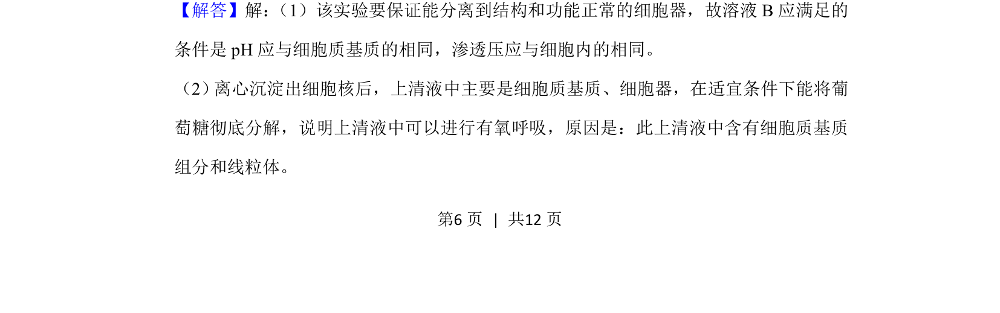
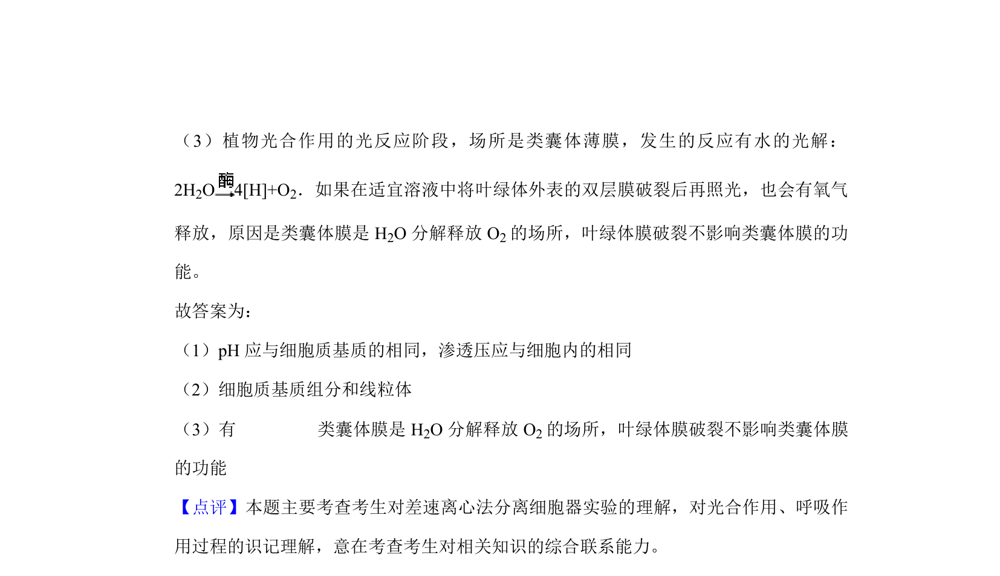

## 题面

## 摘要

该题考查差速离心法分离细胞器及验证有氧呼吸、光合作用相关功能。

## 关联考点

- [[591-差速离心法|差速离心法]]
- [[240-有氧呼吸|有氧呼吸]]
- [[033-光合作用|光合作用]]

## 答案与解析

> 📄 原 PDF 第 6 页：`素材/真题/吉林/2008-2024·（吉林）生物高考真题/2020年高考生物试卷（新课标Ⅱ）（解析卷）.pdf`

<!-- 题干文本-start -->
## 题干文本
8． （9分） 为了研究细胞器的功能，某同学将正常叶片置于适量的溶液B中，用组织捣碎机
破碎细胞，再用差速离心法分离细胞器。回答下列问题：
（1）该实验所用溶液B应满足的条件是　pH应与细胞质基质的相同，渗透压应与细胞
内的相同　（答出2点即可） 。
（2） 离心沉淀出细胞核后，上清液在适宜条件下能将葡萄糖彻底分解，原因是此上清液
中含有　细胞质基质组分和线粒体　。
（3） 将分离得到的叶绿体悬浮在适宜溶液中，照光后有氧气释放；如果在该适宜溶液中
将叶绿体外表的双层膜破裂后再照光，　有　（填“有”或“没有”）氧气释放，原因是　
类囊体膜是H 2O分解释放O 2的场所，叶绿体膜破裂不影响类囊体膜的功能　。
<!-- 题干文本-end -->

<!-- 解析文本-start -->
## 解析文本
【分析】1、差速离心法是交替使用低速和高速离心，用不同强度的离心力使具有不同质
量的物质分级分离的方法。
2、光合作用的光反应阶段：①a．水的光解：2H2O 4[H]+O 2；b．ATP的生成：ADP+Pi
ATP。
【解答】解： （1）该实验要保证能分离到结构和功能正常的细胞器，故溶液B应满足的
条件是pH应与细胞质基质的相同，渗透压应与细胞内的相同。
（2） 离心沉淀出细胞核后，上清液中主要是细胞质基质、细胞器，在适宜条件下能将葡
萄糖彻底分解，说明上清液中可以进行有氧呼吸，原因是：此上清液中含有细胞质基质
组分和线粒体。
<!-- 解析文本-end -->
