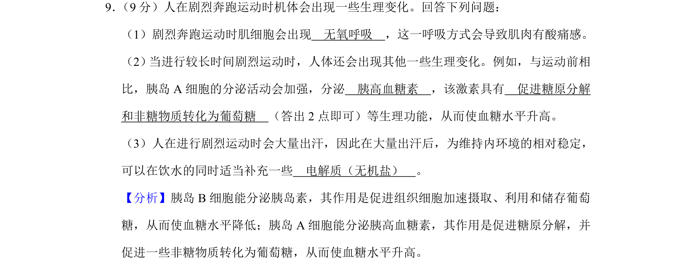
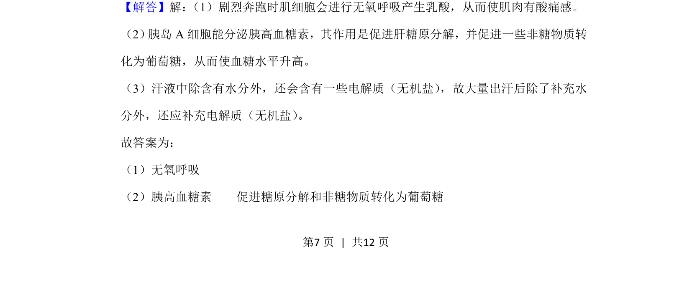
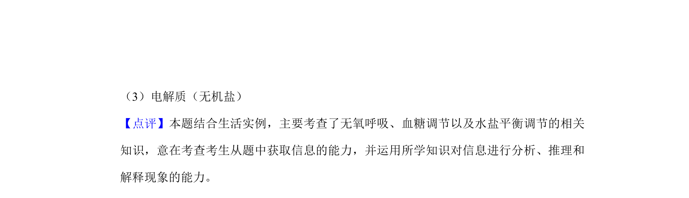

## 题面

## 摘要

本题考查剧烈运动时的无氧呼吸、血糖调节及水盐平衡补充。

## 关联考点

- [[238-无氧呼吸|无氧呼吸]]
- [[341-胰高血糖素|胰高血糖素]]
- [[512-血糖调节|血糖调节]]
- [[605-无机盐补充|无机盐补充]]

## 答案与解析

> 📄 原 PDF 第 7 页：`素材/真题/吉林/2008-2024·（吉林）生物高考真题/2020年高考生物试卷（新课标Ⅱ）（解析卷）.pdf`

<!-- 题干文本-start -->
## 题干文本
9． （9分）人在剧烈奔跑运动时机体会出现一些生理变化。回答下列问题：
（1）剧烈奔跑运动时肌细胞会出现　无氧呼吸　，这一呼吸方式会导致肌肉有酸痛感。
（2） 当进行较长时间剧烈运动时，人体还会出现其他一些生理变化。例如，与运动前相
比，胰岛A细胞的分泌活动会加强，分泌　胰高血糖素　，该激素具有　促进糖原分解
和非糖物质转化为葡萄糖　（答出2点即可）等生理功能，从而使血糖水平升高。
（3）人在进行剧烈运动时会大量出汗，因此在大量出汗后，为维持内环境的相对稳定，
可以在饮水的同时适当补充一些　电解质（无机盐）　。
<!-- 题干文本-end -->

<!-- 解析文本-start -->
## 解析文本
【分析】胰岛B细胞能分泌胰岛素，其作用是促进组织细胞加速摄取、利用和储存葡萄
糖，从而使血糖水平降低；胰岛A细胞能分泌胰高血糖素，其作用是促进糖原分解，并
促进一些非糖物质转化为葡萄糖，从而使血糖水平升高。
【解答】解： （1）剧烈奔跑时肌细胞会进行无氧呼吸产生乳酸，从而使肌肉有酸痛感。
（2） 胰岛A细胞能分泌胰高血糖素，其作用是促进肝糖原分解，并促进一些非糖物质转
化为葡萄糖，从而使血糖水平升高。
（3）汗液中除含有水分外，还会含有一些电解质（无机盐） ，故大量出汗后除了补充水
分外，还应补充电解质（无机盐） 。
故答案为：
（1）无氧呼吸
（2）胰高血糖素    促进糖原分解和非糖物质转化为葡萄糖
<!-- 解析文本-end -->
