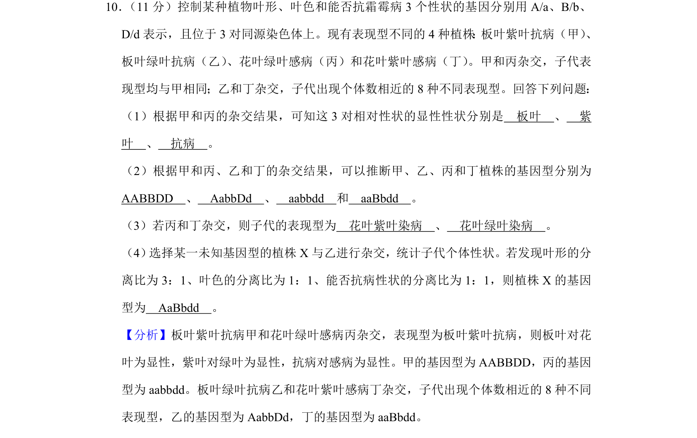
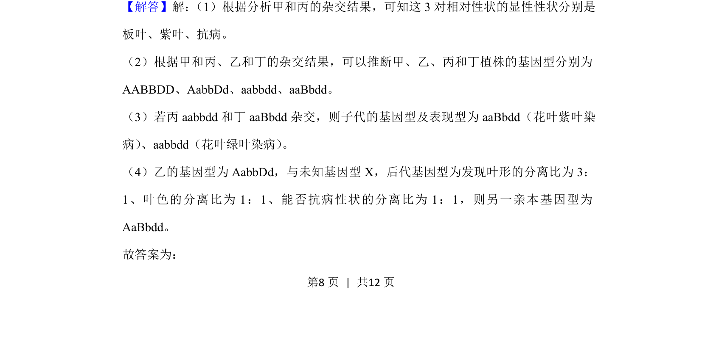
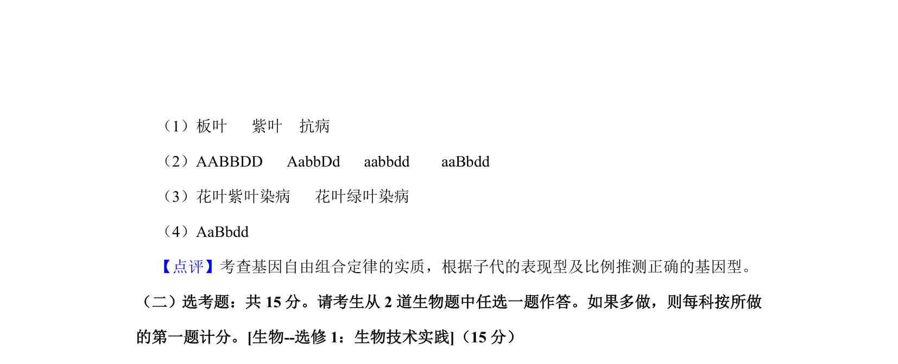

## 题面

## 摘要

本题考查基因显隐性关系判断、基因型推导及杂交后代比例计算。

## 关联考点

- [[477-基因分离定律|基因分离定律]]
- [[580-基因自由组合定律|基因自由组合定律]]
- [[610-显隐性判断|显隐性判断]]
- [[492-杂交实验|杂交实验]]

## 答案与解析

> 📄 原 PDF 第 8 页：`素材/真题/吉林/2008-2024·（吉林）生物高考真题/2020年高考生物试卷（新课标Ⅱ）（解析卷）.pdf`
