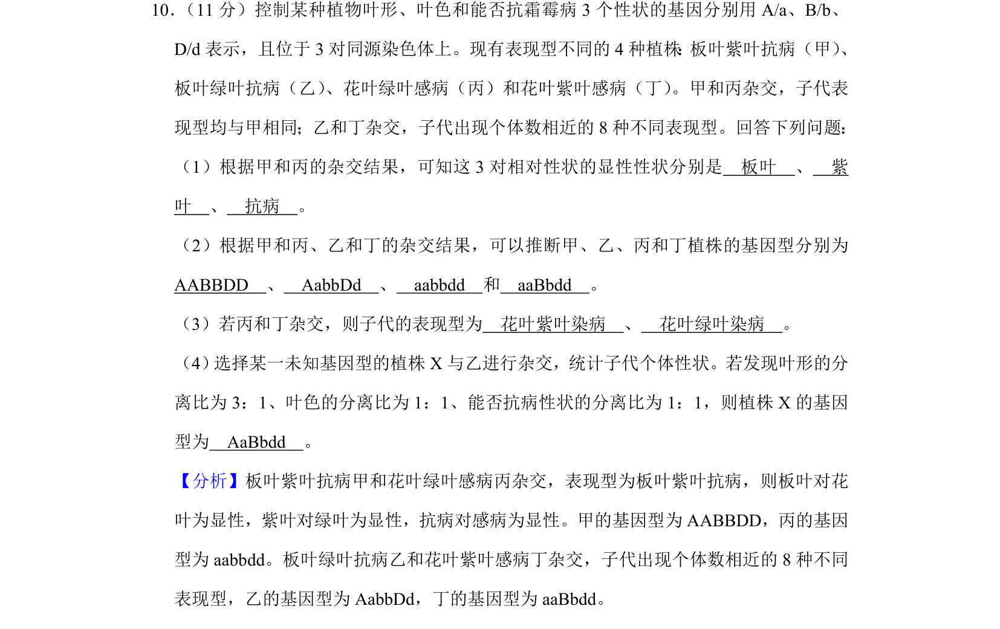
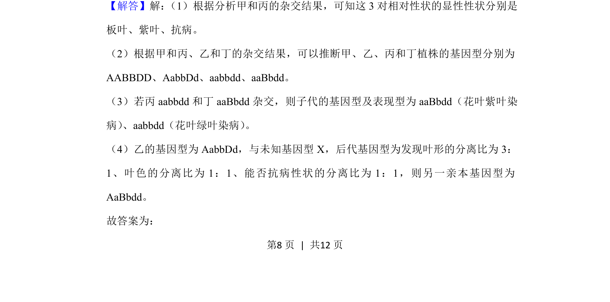
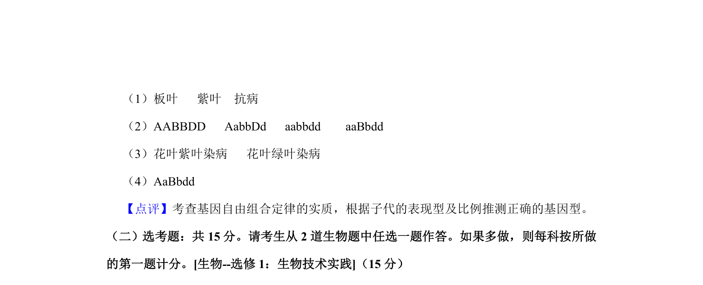

## 题面

## 摘要

本题考查基因显隐性关系判断、基因型推导及杂交后代比例计算。

## 关联考点

- [[477-基因分离定律|基因分离定律]]
- [[580-基因自由组合定律|基因自由组合定律]]
- [[610-显隐性判断|显隐性判断]]
- [[492-杂交实验|杂交实验]]

## 答案与解析

> 📄 原 PDF 第 8 页：`素材/真题/吉林/2008-2024·（吉林）生物高考真题/2020年高考生物试卷（新课标Ⅱ）（解析卷）.pdf`

<!-- 题干文本-start -->
## 题干文本
10． （11分）控制某种植物叶形、叶色和能否抗霜霉病3个性状的基因分别用A/a、B/b、
D/d表示，且位于3对同源染色体上。现有表现型不同的4种植株 ： 板叶紫叶抗病（甲） 、
板叶绿叶抗病（乙） 、花叶绿叶感病（丙）和花叶紫叶感病（丁） 。甲和丙杂交，子代表
现型均与甲相同；乙和丁杂交，子代出现个体数相近的8种不同表现型。回答下列问题：
（1）根据甲和丙的杂交结果，可知这3对相对性状的显性性状分别是　板叶　、　紫
叶　、　抗病　。
（2）根据甲和丙、乙和丁的杂交结果，可以推断甲、乙、丙和丁植株的基因型分别为　
AABBDD　、　AabbDd　、　aabbdd　和　aaBbdd　。
（3）若丙和丁杂交，则子代的表现型为　花叶紫叶染病　、　花叶绿叶染病　。
（4） 选择某一未知基因型的植株X与乙进行杂交，统计子代个体性状。若发现叶形的分
离比为3：1、叶色的分离比为1：1、能否抗病性状的分离比为1：1，则植株X的基因
型为　AaBbdd　。
<!-- 题干文本-end -->

<!-- 解析文本-start -->
## 解析文本
【分析】板叶紫叶抗病甲和花叶绿叶感病丙杂交，表现型为板叶紫叶抗病，则板叶对花
叶为显性，紫叶对绿叶为显性，抗病对感病为显性。甲的基因型为AABBDD，丙的基因
型为aabbdd。板叶绿叶抗病乙和花叶紫叶感病丁杂交，子代出现个体数相近的8种不同
表现型，乙的基因型为AabbDd，丁的基因型为aaBbdd。
【解答】解： （1）根据分析甲和丙的杂交结果，可知这3对相对性状的显性性状分别是
板叶、紫叶、抗病。
（2）根据甲和丙、乙和丁的杂交结果，可以推断甲、乙、丙和丁植株的基因型分别为
AABBDD、AabbDd、aabbdd、aaBbdd。
（3）若丙aabbdd和丁aaBbdd杂交，则子代的基因型及表现型为aaBbdd（花叶紫叶染
病） 、aabbdd（花叶绿叶染病） 。
（4）乙的基因型为AabbDd，与未知基因型X，后代基因型为发现叶形的分离比为3：
1、叶色的分离比为1：1、能否抗病性状的分离比为1：1，则另一亲本基因型为
AaBbdd。
故答案为：
<!-- 解析文本-end -->
