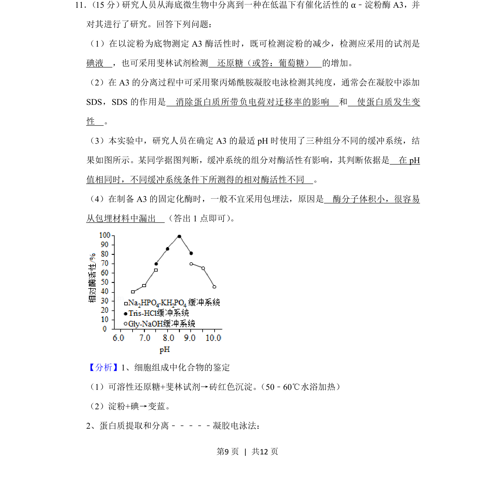
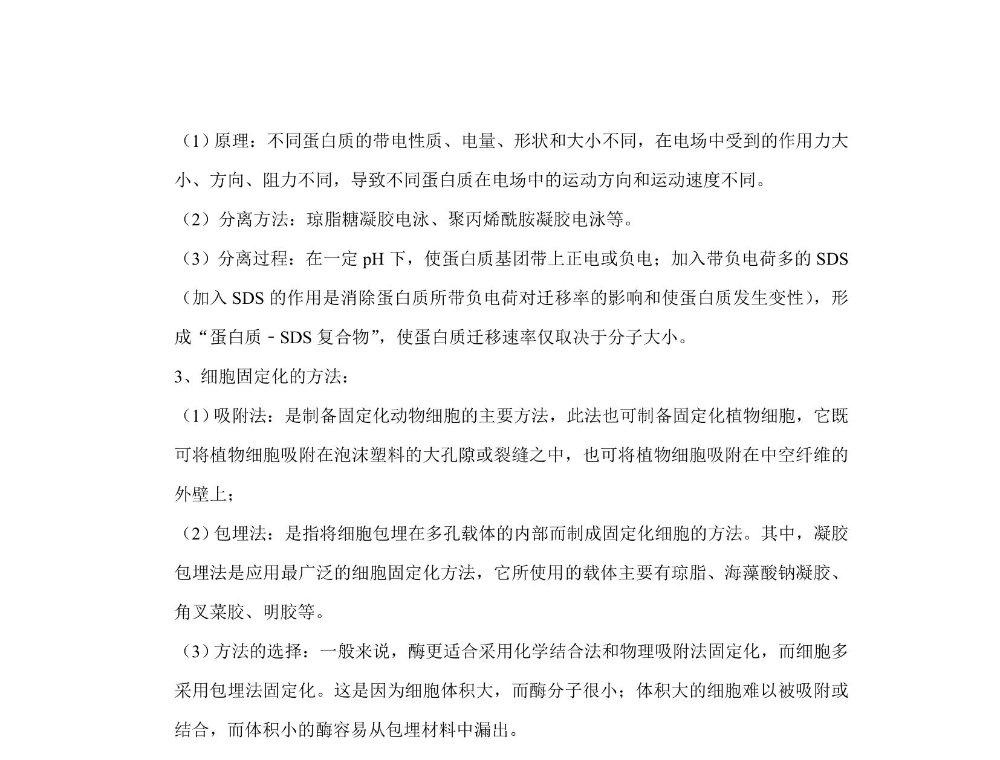
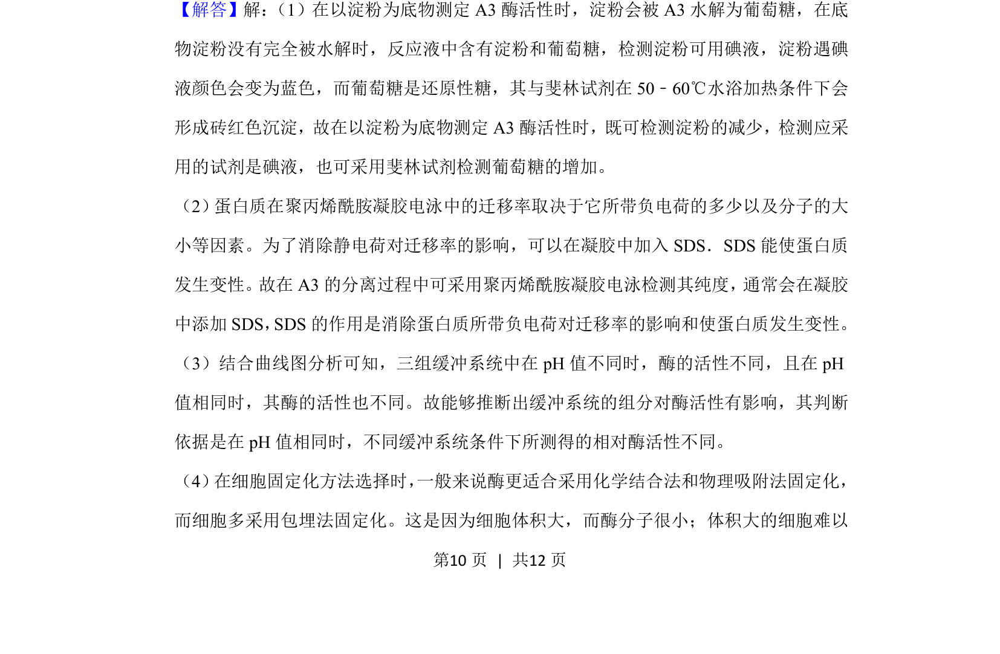
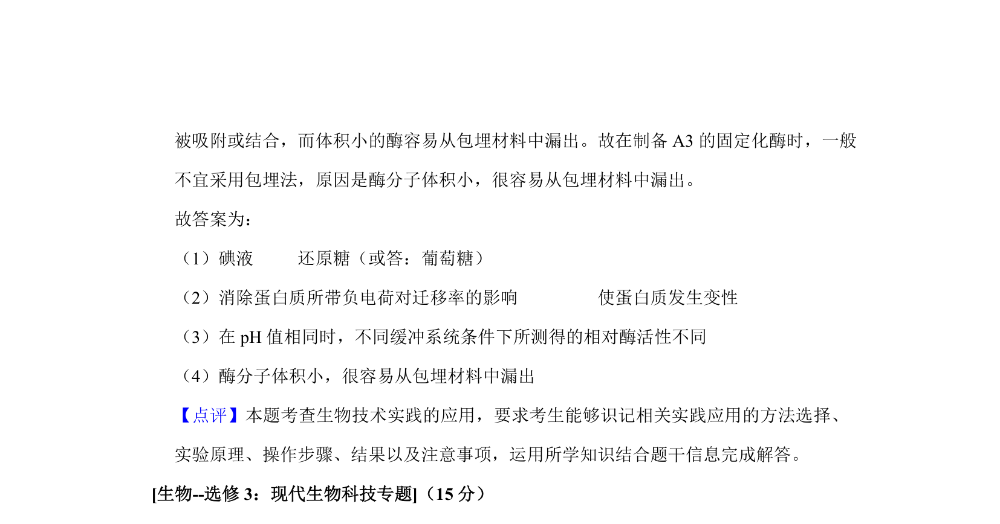

## 题面

## 摘要

该题考查酶活性测定、蛋白质电泳、最适pH及固定化酶等综合实验分析。

## 关联考点

- [[724-酶活性检测|酶活性检测]]
- [[532-SDS-聚丙烯酰胺凝胶电泳|SDS-聚丙烯酰胺凝胶电泳]]
- [[519-酶的最适pH|酶的最适pH]]
- [[570-固定化酶|固定化酶]]

## 答案与解析

> 📄 原 PDF 第 9 页：`素材/真题/吉林/2008-2024·（吉林）生物高考真题/2020年高考生物试卷（新课标Ⅱ）（解析卷）.pdf`

<!-- 题干文本-start -->
## 题干文本
11． （15分） 研究人员从海底微生物中分离到一种在低温下有催化活性的α﹣淀粉酶A3，并
对其进行了研究。回答下列问题：
（1）在以淀粉为底物测定A3酶活性时，既可检测淀粉的减少，检测应采用的试剂是　
碘液　，也可采用斐林试剂检测　还原糖（或答：葡萄糖）　的增加。
（2）在A3的分离过程中可采用聚丙烯酰胺凝胶电泳检测其纯度，通常会在凝胶中添加
SDS，SDS的作用是　消除蛋白质所带负电荷对迁移率的影响　和　使蛋白质发生变
性　。
（3）本实验中，研究人员在确定A3的最适pH时使用了三种组分不同的缓冲系统，结
果如图所示。某同学据图判断，缓冲系统的组分对酶活性有影响，其判断依据是　在pH
值相同时，不同缓冲系统条件下所测得的相对酶活性不同　。
（4）在制备A3的固定化酶时，一般不宜采用包埋法，原因是　酶分子体积小，很容易
从包埋材料中漏出　（答出1点即可） 。
<!-- 题干文本-end -->

<!-- 解析文本-start -->
## 解析文本
【分析】1、细胞组成中化合物的鉴定
（1）可溶性还原糖+斐林试剂→砖红色沉淀。 （50﹣60℃水浴加热）
（2）淀粉+碘→变蓝。
2、蛋白质提取和分离﹣﹣﹣﹣﹣凝胶电泳法：
<!-- 解析文本-end -->
