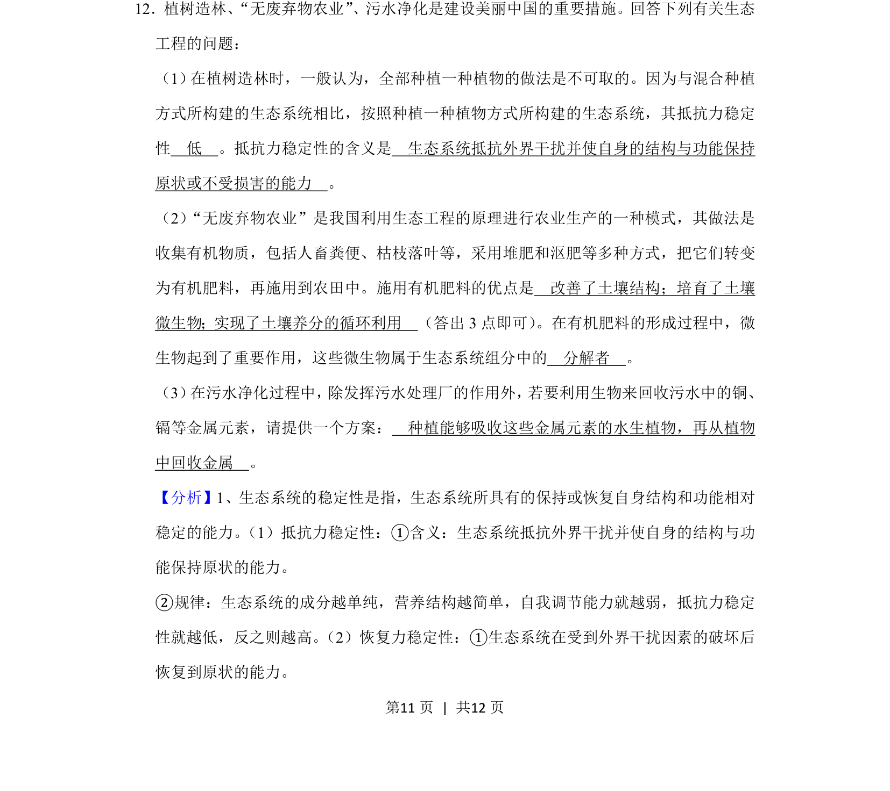
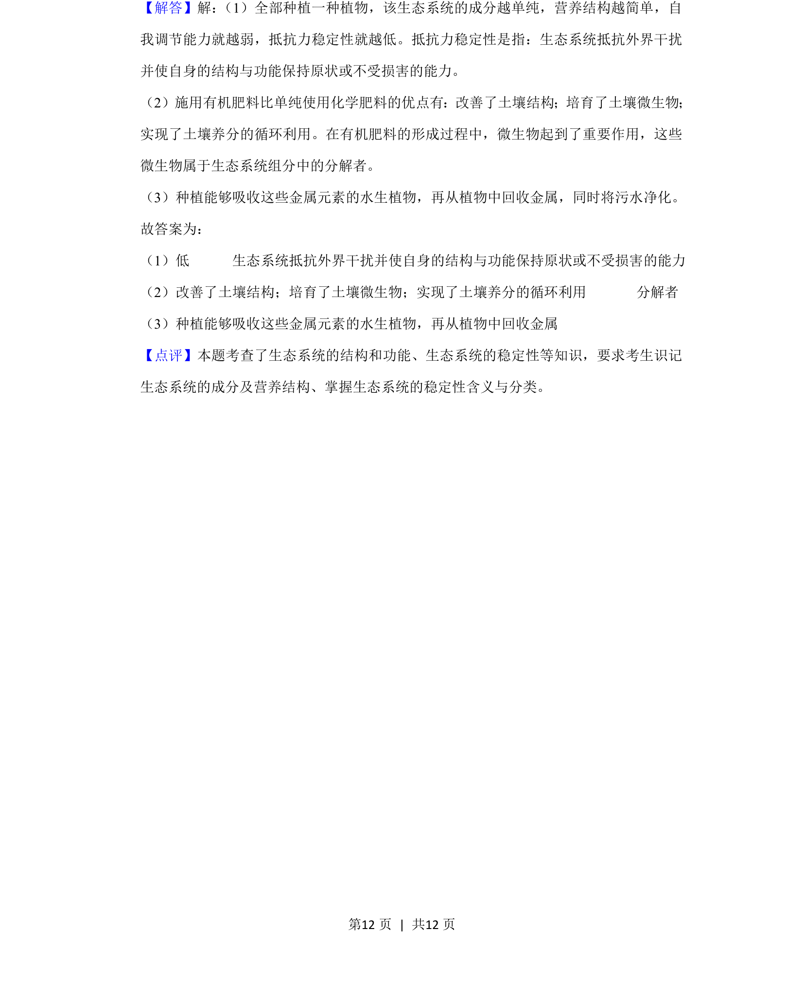

## 题面

## 摘要

考查生态系统稳定性、有机肥料优点、微生物分解者作用及污水净化的生物回收方案。

## 关联考点

- [[399-生态系统稳定性|生态系统稳定性]]
- [[396-抵抗力稳定性|抵抗力稳定性]]
- [[145-分解者|分解者]]
- [[402-生物富集|生物富集]]

## 答案与解析

> 📄 原 PDF 第 11 页：`素材/真题/吉林/2008-2024·（吉林）生物高考真题/2020年高考生物试卷（新课标Ⅱ）（解析卷）.pdf`
