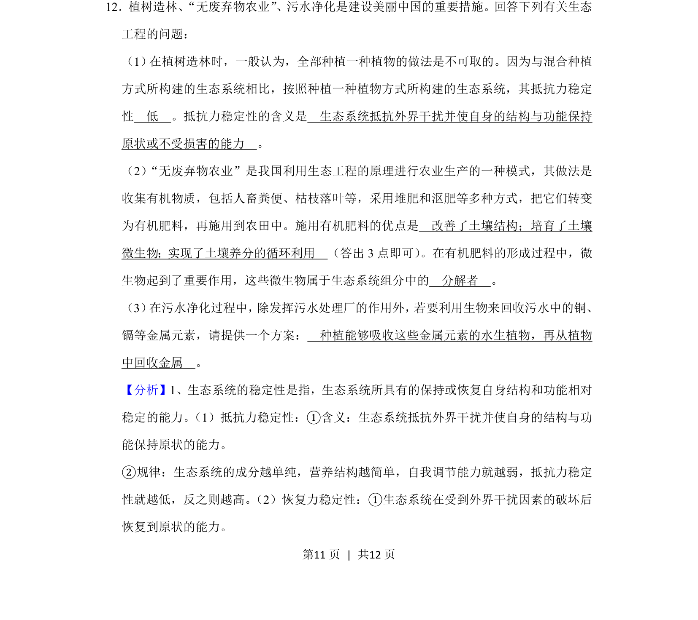
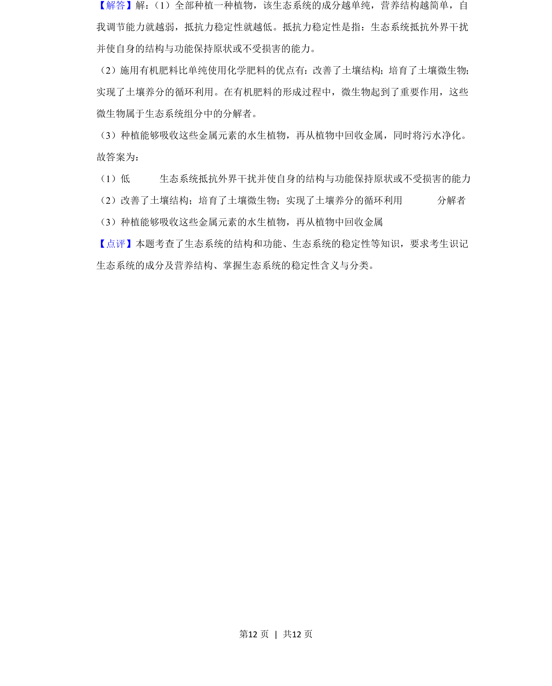

## 题面

## 摘要

考查生态系统稳定性、有机肥料优点、微生物分解者作用及污水净化的生物回收方案。

## 关联考点

- [[855-生态系统的稳定性|生态系统稳定性]]
- [[396-抵抗力稳定性|抵抗力稳定性]]
- [[145-分解者|分解者]]
- [[402-生物富集|生物富集]]

## 答案与解析

> 📄 原 PDF 第 11 页：`素材/真题/吉林/2008-2024·（吉林）生物高考真题/2020年高考生物试卷（新课标Ⅱ）（解析卷）.pdf`

<!-- 题干文本-start -->
## 题干文本
12．植树造林、“无废弃物农业”、污水净化是建设美丽中国的重要措施。回答下列有关生态
工程的问题：
（1） 在植树造林时，一般认为，全部种植一种植物的做法是不可取的。因为与混合种植
方式所构建的生态系统相比，按照种植一种植物方式所构建的生态系统，其抵抗力稳定
性　低　。抵抗力稳定性的含义是　生态系统抵抗外界干扰并使自身的结构与功能保持
原状或不受损害的能力　。
（2）“无废弃物农业”是我国利用生态工程的原理进行农业生产的一种模式，其做法是
收集有机物质，包括人畜粪便、枯枝落叶等，采用堆肥和沤肥等多种方式，把它们转变
为有机肥料，再施用到农田中。施用有机肥料的优点是　改善了土壤结构；培育了土壤
微生物；实现了土壤养分的循环利用　（答出3点即可） 。在有机肥料的形成过程中，微
生物起到了重要作用，这些微生物属于生态系统组分中的　分解者　。
（3） 在污水净化过程中， 除发挥污水处理厂的作用外， 若要利用生物来回收污水中的铜、
镉等金属元素，请提供一个方案：　种植能够吸收这些金属元素的水生植物，再从植物
中回收金属　。
<!-- 题干文本-end -->

<!-- 解析文本-start -->
## 解析文本
【分析】1、生态系统的稳定性是指，生态系统所具有的保持或恢复自身结构和功能相对
稳定的能力。 （1）抵抗力稳定性：①含义：生态系统抵抗外界干扰并使自身的结构与功
能保持原状的能力。
②规律：生态系统的成分越单纯，营养结构越简单，自我调节能力就越弱，抵抗力稳定
性就越低，反之则越高。 （2）恢复力稳定性：①生态系统在受到外界干扰因素的破坏后
恢复到原状的能力。
<!-- 解析文本-end -->
