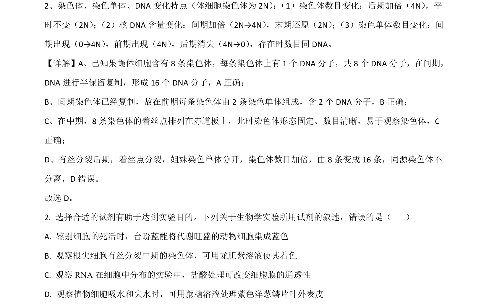
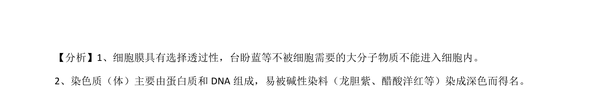

## 题面

## 摘要

考查有丝分裂染色体和DNA数量变化及生物学实验试剂选择。

## 关联考点

- [[046-细胞分裂|有丝分裂]]
- [[染色体数目]]
- [[285-DNA复制|DNA复制]]
- [[实验试剂]]

## 答案与解析

> 📄 原 PDF 第 1 页：`素材/真题/吉林/2008-2024·（吉林）生物高考真题/2021年高考生物试卷（全国乙卷）（解析卷）.pdf`
