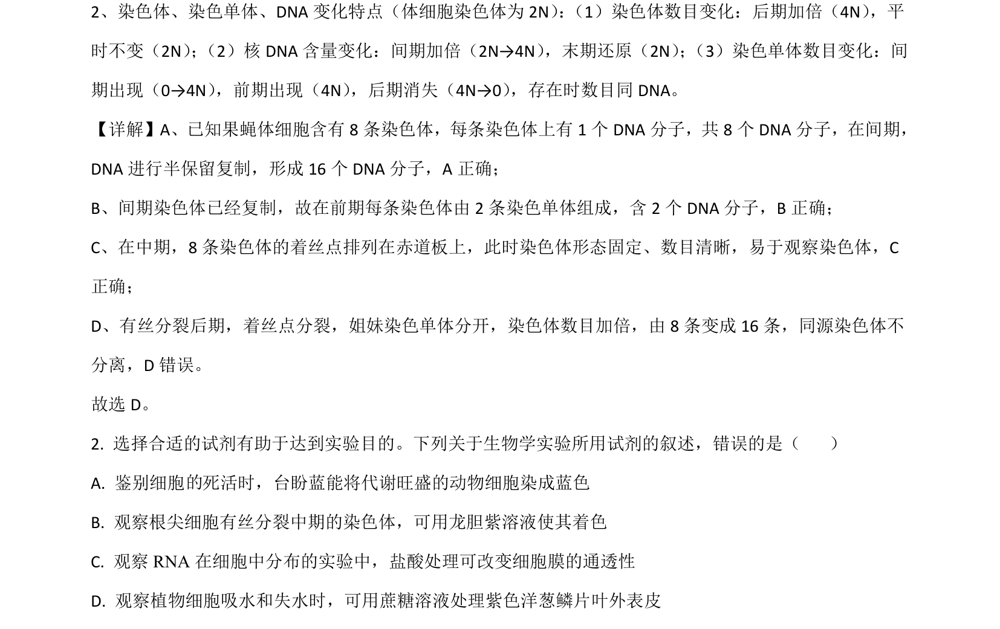
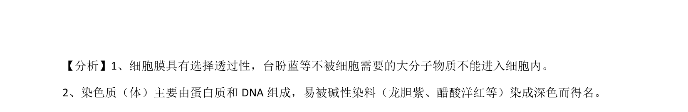

## 题面

## 摘要

考查有丝分裂染色体和DNA数量变化及生物学实验试剂选择。

## 关联考点

- [[046-细胞分裂|有丝分裂]]
- [[616-染色体数目|染色体数目]]
- [[285-DNA复制|DNA复制]]
- [[483-实验试剂|实验试剂]]

## 答案与解析

> 📄 原 PDF 第 1 页：`素材/真题/吉林/2008-2024·（吉林）生物高考真题/2021年高考生物试卷（全国乙卷）（解析卷）.pdf`

<!-- 题干文本-start -->
## 题干文本
2、染色体、染色单体、DNA变化特点（体细胞染色体为 2N） ： （1）染色体数目变化：后期加倍（4N） ，平
时不变（2N） ； （2）核 DNA含量变化：间期加倍（2N→4N） ，末期还原（2N） ； （3）染色单体数目变化：间
期出现（0→4N） ，前期出现（4N） ，后期消失（4N→0） ，存在时数目同DNA。
<!-- 题干文本-end -->

<!-- 解析文本-start -->
## 解析文本
【详解】A、已知果蝇体细胞含有 8条染色体，每条染色体上有 1个 DNA分子，共 8个 DNA分子，在间期，
DNA进行半保留复制，形成 16个 DNA分子，A正确；
B、间期染色体已经复制，故在前期每条染色体由 2条染色单体组成，含 2个 DNA分子，B正确；
C、在中期，8条染色体的着丝点排列在赤道板上，此时染色体形态固定、数目清晰，易于观察染色体，C
正确；
D、有丝分裂后期，着丝点分裂，姐妹染色单体分开，染色体数目加倍，由 8条变成 16条，同源染色体不
分离，D 错误。
故选 D。
2. 选择合适的试剂有助于达到实验目的。下列关于生物学实验所用试剂的叙述，错误的是（    ）
A. 鉴别细胞 死活时，台盼蓝能将代谢旺盛的动物细胞染成蓝色
B. 观察根尖细胞有丝分裂中期的染色体，可用龙胆紫溶液使其着色
C. 观察 RNA 在细胞中分布的实验中，盐酸处理可改变细胞膜的通透性
D. 观察植物细胞吸水和失水时，可用蔗糖溶液处理紫色洋葱鳞片叶外表皮
【答案】A
【解析】
的
<!-- 解析文本-end -->
