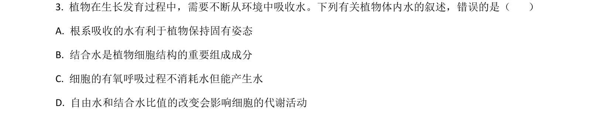
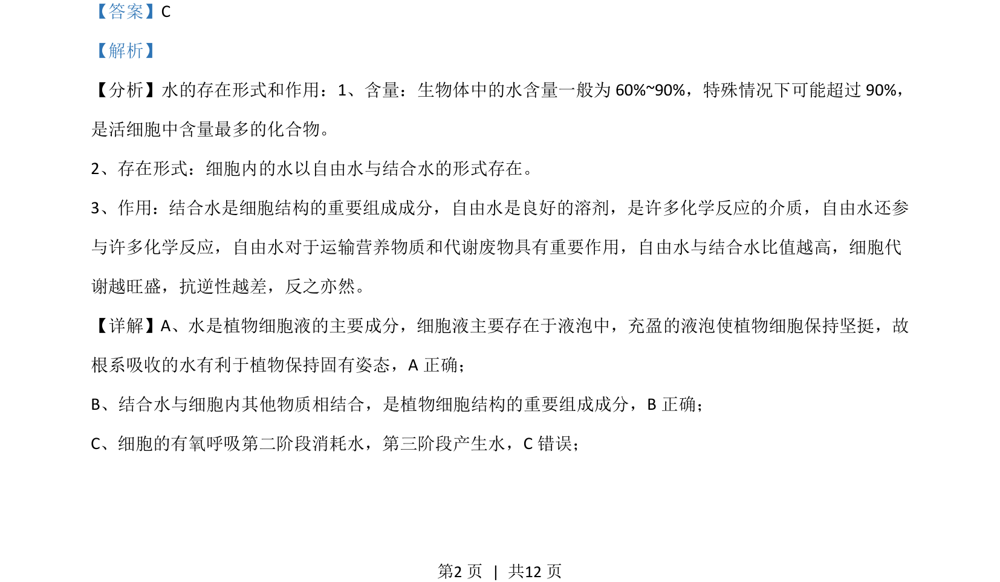
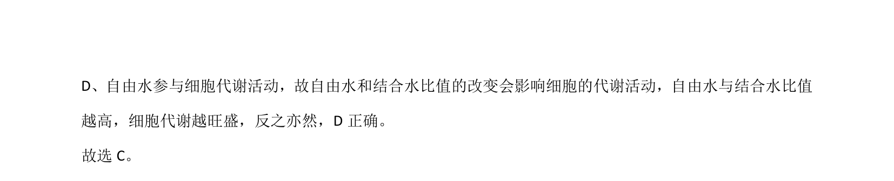

## 题面

## 摘要

该题考查“观察DNA和RNA在细胞中的分布”实验中关键试剂的作用和原理。

## 关联考点

- [[647-甲基绿-吡罗红染色|甲基绿-吡罗红染色]]
- [[656-盐酸作用|盐酸作用]]
- [[684-细胞通透性|细胞通透性]]
- [[524-DNA与蛋白质分离|DNA与蛋白质分离]]

## 答案与解析

> 📄 原 PDF 第 2 页：`素材/真题/吉林/2008-2024·（吉林）生物高考真题/2021年高考生物试卷（全国乙卷）（解析卷）.pdf`
