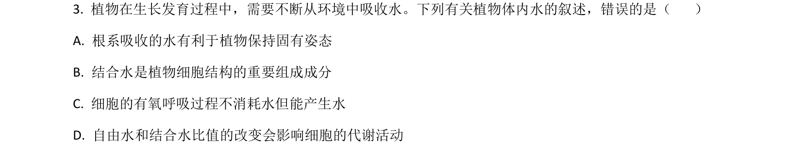
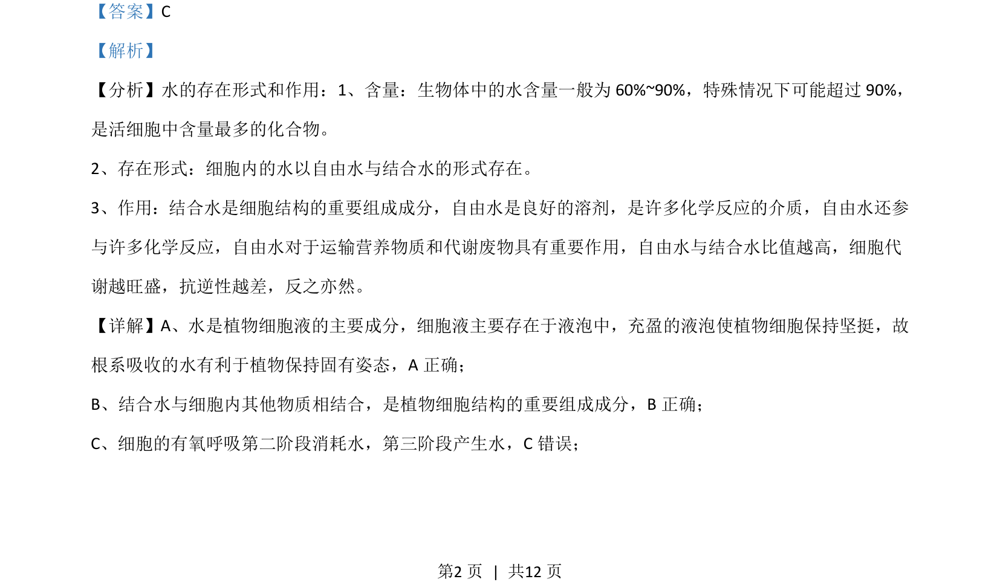
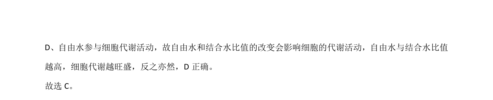

## 题面

## 摘要

该题考查“观察DNA和RNA在细胞中的分布”实验中关键试剂的作用和原理。

## 关联考点

- [[647-甲基绿-吡罗红染色|甲基绿-吡罗红染色]]
- [[656-盐酸作用|盐酸作用]]
- [[684-细胞通透性|细胞通透性]]
- [[524-DNA与蛋白质分离|DNA与蛋白质分离]]

## 答案与解析

> 📄 原 PDF 第 2 页：`素材/真题/吉林/2008-2024·（吉林）生物高考真题/2021年高考生物试卷（全国乙卷）（解析卷）.pdf`

<!-- 题干文本-start -->
## 题干文本
3. 植物在生长发育过程中，需要不断从环境中吸收水。下列有关植物体内水的叙述，错误的是（    ）
A. 根系吸收的水有利于植物保持固有姿态
B. 结合水是植物细胞结构的重要组成成分
C. 细胞的有氧呼吸过程不消耗水但能产生水
D. 自由水和结合水比值的改变会影响细胞的代谢活动
<!-- 题干文本-end -->

<!-- 解析文本-start -->
## 解析文本
【答案】C
【解析】
【分析】水的存在形式和作用：1、含量：生物体中的水含量一般为 60%~90%，特殊情况下可能超过 90%，
是活细胞中含量最多的化合物。
2、存在形式：细胞内的水以自由水与结合水的形式存在。
3、作用：结合水是细胞结构的重要组成成分，自由水是良好的溶剂，是许多化学反应的介质，自由水还参
与许多化学反应，自由水对于运输营养物质和代谢废物具有重要作用，自由水与结合水比值越高，细胞代
谢越旺盛，抗逆性越差，反之亦然。
【详解】A、水是植物细胞液的主要成分，细胞液主要存在于液泡中，充盈的液泡使植物细胞保持坚挺，故
根系吸收的水有利于植物保持固有姿态，A正确；
B、结合水与细胞内其他物质相结合，是植物细胞结构的重要组成成分，B正确；
C、细胞的有氧呼吸第二阶段消耗水，第三阶段产生水，C 错误；
<!-- 解析文本-end -->
