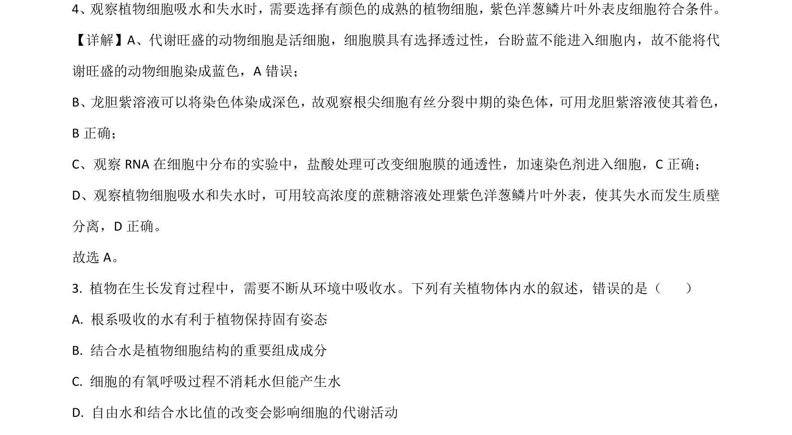
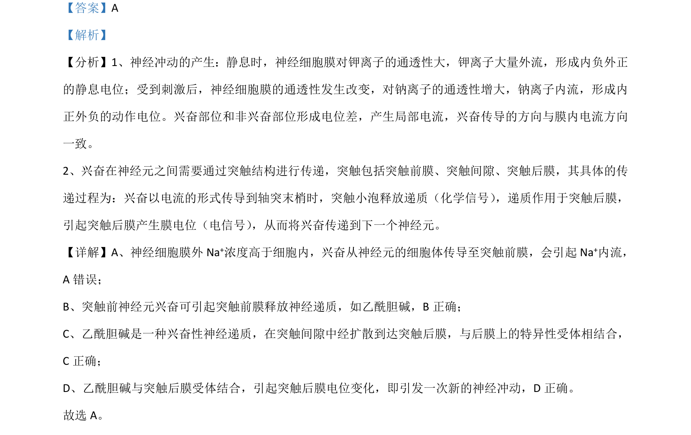

## 题面

## 摘要

该题考查观察植物细胞吸水和失水的实验选材及植物体内水的存在形式与有氧呼吸中水的代谢

## 关联考点

- [[262-质壁分离|质壁分离]]
- [[691-自由水与结合水|自由水与结合水]]
- [[240-有氧呼吸|有氧呼吸]]
- [[791-植物细胞吸水和失水|植物细胞吸水和失水]]

## 答案与解析

> 📄 原 PDF 第 3 页：`素材/真题/吉林/2008-2024·（吉林）生物高考真题/2021年高考生物试卷（全国乙卷）（解析卷）.pdf`

<!-- 题干文本-start -->
## 题干文本
4. 在神经调节过程中，兴奋会在神经纤维上传导和神经元之间传递。下列有关叙述错误 是（     ）
A. 兴奋从神经元的细胞体传导至突触前膜，会引起 Na+外流
B. 突触前神经元兴奋可引起突触前膜释放乙酰胆碱
C. 乙酰胆碱是一种神经递质，在突触间隙中经扩散到达突触后膜
D. 乙酰胆碱与突触后膜受体结合，引起突触后膜电位变化
<!-- 题干文本-end -->

<!-- 解析文本-start -->
## 解析文本
【答案】A
【解析】
【分析】1、神经冲动的产生：静息时，神经细胞膜对钾离子的通透性大，钾离子大量外流，形成内负外正
的静息电位；受到刺激后，神经细胞膜的通透性发生改变，对钠离子的通透性增大，钠离子内流，形成内
正外负的动作电位。兴奋部位和非兴奋部位形成电位差，产生局部电流，兴奋传导的方向与膜内电流方向
一致。
2、兴奋在神经元之间需要通过突触结构进行传递，突触包括突触前膜、突触间隙、突触后膜，其具体的传
递过程为：兴奋以电流的形式传导到轴突末梢时，突触小泡释放递质（化学信号） ，递质作用于突触后膜，
引起突触后膜产生膜电位（电信号） ，从而将兴奋传递到下一个神经元。
【详解】A、神经细胞膜外 Na+浓度高于细胞内，兴奋从神经元的细胞体传导至突触前膜，会引起 Na+内流，
A错误；
B、突触前神经元兴奋可引起突触前膜释放神经递质，如乙酰胆碱，B正确；
C、乙酰胆碱是一种兴奋性神经递质，在突触间隙中经扩散到达突触后膜，与后膜上的特异性受体相结合，
C 正确；
D、乙酰胆碱与突触后膜受体结合，引起突触后膜电位变化，即引发一次新的神经冲动，D 正确。
故选 A。
<!-- 解析文本-end -->
