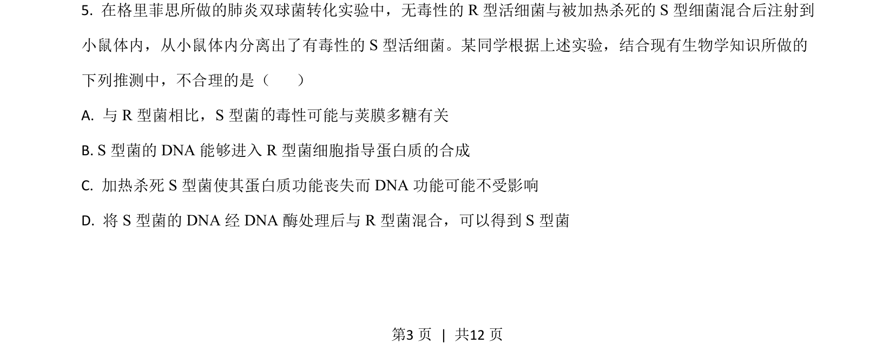
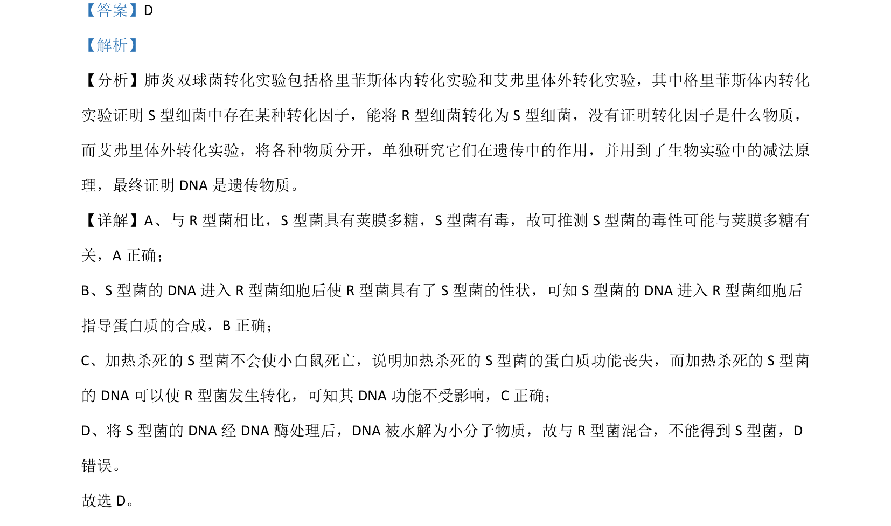

## 题面

## 摘要

该题通过肺炎双球菌转化实验考查遗传物质本质的推理判断

## 关联考点

- [[463-DNA是遗传物质|DNA是遗传物质]]
- [[695-蛋白质不是遗传物质|蛋白质不是遗传物质]]
- [[588-实验设计分析|实验设计分析]]

## 答案与解析

> 📄 原 PDF 第 3 页：`素材/真题/吉林/2008-2024·（吉林）生物高考真题/2021年高考生物试卷（全国乙卷）（解析卷）.pdf`

<!-- 题干文本-start -->
## 题干文本
5. 在格里菲思所做的肺炎双球菌转化实验中，无毒性的 R型活细菌与被加热杀死的 S 型细菌混合后注射到
小鼠体内，从小鼠体内分离出了有毒性的 S 型活细菌。某同学根据上述实验，结合现有生物学知识所做的
下列推测中，不合理的是（    ）
A. 与 R型菌相比，S 型菌 毒性可能与荚膜多糖有关
B. S 型菌的 DNA 能够进入 R型菌细胞指导蛋白质的合成
C. 加热杀死 S 型菌使其蛋白质功能丧失而 DNA 功能可能不受影响
D. 将 S 型菌的 DNA 经 DNA 酶处理后与 R型菌混合，可以得到 S 型菌
的
的
<!-- 题干文本-end -->

<!-- 解析文本-start -->
## 解析文本

<!-- 解析文本-end -->
